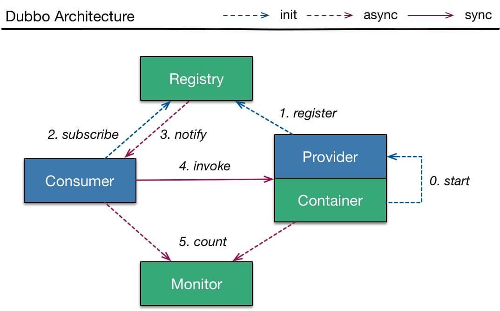
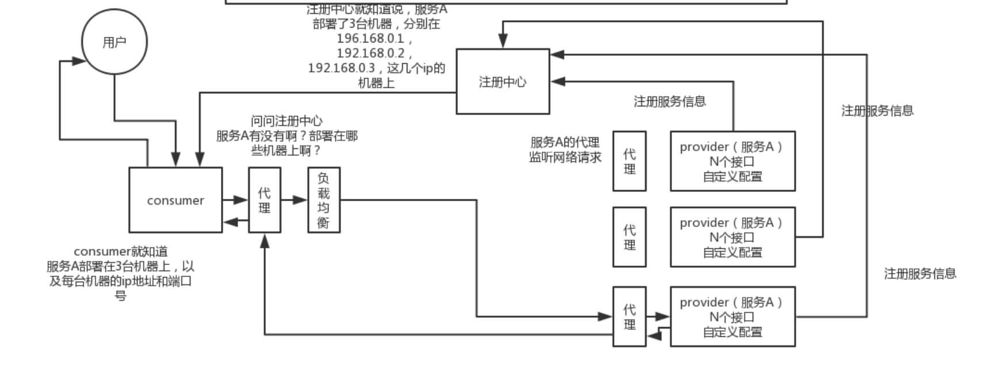
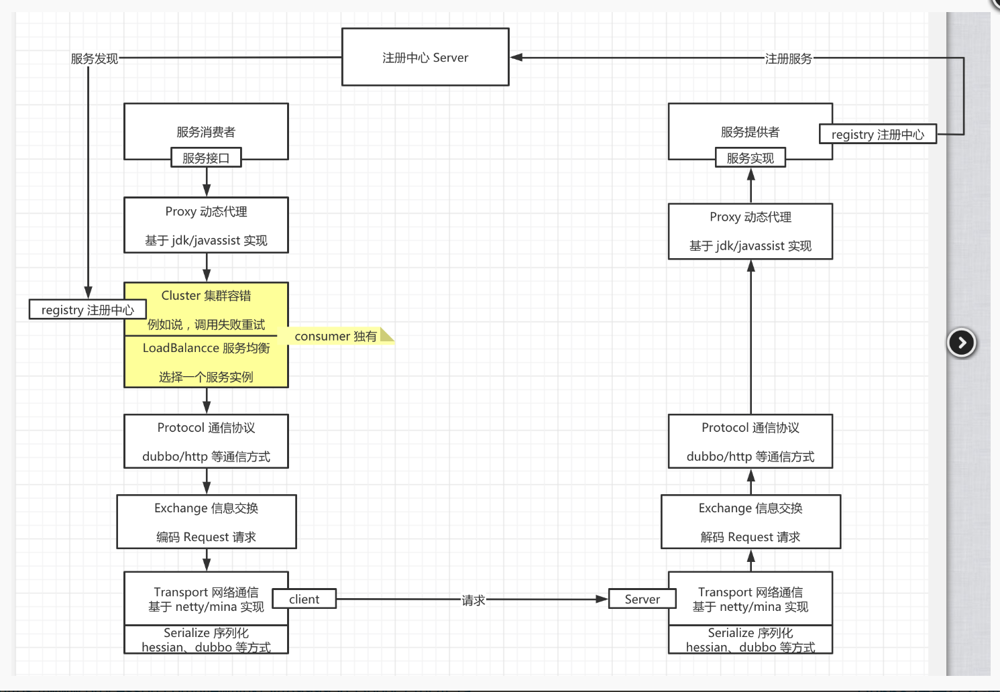
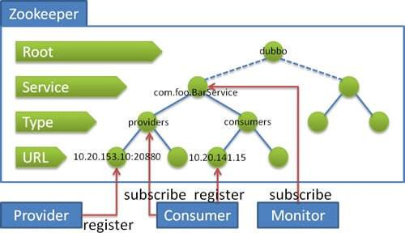

# Dubbo

## Dubbo 框架的分层设计

> 以后再来啃你啊啊啊啊啊啊啊啊


## Dubbo 调用流程



- Provider

  - 第 0 步，start 启动服务。
  - 第 1 步，register 注册服务到注册中心。

- Consumer

  - 第 2 步，subscribe 向注册中心订阅服务。

    >注意，只订阅使用到的服务。
    >
    >再注意，首次会拉取订阅的服务列表，缓存在本地。

  - 【异步】第 3 步，notify 当服务发生变化时，获取最新的服务列表，更新本地缓存。

- invoke 调用

  - Consumer 直接发起对 Provider 的调用，无需经过注册中心。而对多个 Provider 的负载均衡，Consumer 通过 **cluster** 组件实现。

- count 监控

  - 【异步】Consumer 和 Provider 都异步通知监控中心。

这里艿艿在引用一张在网上看到的图，更立体的展示 Dubbo 的调用流程：



最近又用 Processon 手绘了一张 Dubbo 的调用图，建议胖友自己试着手绘下




## Dubbo 调用是同步的吗

默认情况下，调用是**同步**的方式。

可以参考 [《Dubbo 用户指南 —— 异步调用》](http://dubbo.apache.org/zh-cn/docs/user/demos/async-call.html) 文档，配置**异步**调用的方式。当然，使用上，感觉蛮不优雅的。所以，在 Dubbo 2.7 版本后，又提供了新的两种方式，具体先参见 [《Dubbo下一站：Apache顶级项目》](https://mp.weixin.qq.com/s/3WwXcWJbP7iOS3vmN-Ek1Q) 文章。估计，后续才会更新官方文档。


## 注册中心挂了还可以通信吗

可以。对于正在运行的 Consumer 调用 Provider 是不需要经过注册中心，所以不受影响。并且，Consumer 进程中，内存已经缓存了 Provider 列表。

那么，此时 Provider 如果下线呢？如果 Provider 是正常关闭，它会主动且直接对和其处于连接中的 Consumer 们，发送一条“我要关闭”了的消息。那么，Consumer 们就不会调用该 Provider ，而调用其它的 Provider 。

另外，因为 Consumer 也会持久化 Provider 列表到本地文件。所以，此处如果 Consumer 重启，依然能够通过本地缓存的文件，获得到 Provider 列表。

再另外，一般情况下，注册中心是一个集群，如果一个节点挂了，Dubbo Consumer 和 Provider 将自动切换到集群的另外一个节点上。


## Dubbo 在 Zookeeper 存储了哪些信息

下面，我们先来看下 [《Dubbo 用户指南 —— zookeeper 注册中心》](https://dubbo.gitbooks.io/dubbo-user-book/references/registry/zookeeper.html) 文档，内容如下：



流程说明：

- 服务提供者启动时: 向 /dubbo/com.foo.BarService/providers 目录下写入自己的 URL 地址
- **服务消费者**启动时: 订阅 `/dubbo/com.foo.BarService/providers` 目录下的提供者 URL 地址。并向 `/dubbo/com.foo.BarService/consumers` 目录下写入自己的 URL 地址
- **监控中心**启动时: 订阅 `/dubbo/com.foo.BarService` 目录下的所有提供者和消费者 URL 地址。

在图中，我们可以看到 Zookeeper 的节点层级，自上而下是：

- **Root** 层：根目录，可通过 `<dubbo:registry group="dubbo" />` 的 `"group"` 设置 Zookeeper 的根节点，缺省使用 `"dubbo"` 。
- **Service** 层：服务接口全名。
- **Type** 层：分类。目前除了我们在图中看到的 `"providers"`( 服务提供者列表 ) `"consumers"`( 服务消费者列表 ) 外，还有 [`"routes"`](https://dubbo.gitbooks.io/dubbo-user-book/demos/routing-rule.html)( 路由规则列表 ) 和 [`"configurations"`](https://dubbo.gitbooks.io/dubbo-user-book/demos/config-rule.html)( 配置规则列表 )。
- **URL** 层：URL ，根据不同 Type 目录，下面可以是服务提供者 URL 、服务消费者 URL 、路由规则 URL 、配置规则 URL 。
- 实际上 URL 上带有 `"category"` 参数，已经能判断每个 URL 的分类，但是 Zookeeper 是基于节点目录订阅的，所以增加了 **Type** 层。

实际上，服务消费者启动后，不仅仅订阅了 "providers" 分类，也订阅了 "routes" "configurations" 分类。


## Dubbo Provider 如何实现优雅停机

在 [《Dubbo 用户指南 —— 优雅停机》](http://dubbo.apache.org/zh-cn/docs/user/demos/graceful-shutdown.html) 中，已经对这块进行了详细的说明。

**优雅停机**

> Dubbo 是通过 JDK 的 ShutdownHook 来完成优雅停机的，所以如果用户使用 `kill -9 PID` 等强制关闭指令，是不会执行优雅停机的，只有通过 `kill PID` 时，才会执行。

- 因为大多数情况下，Dubbo 的声明周期是交给 Spring 进行管理，所以在最新的 Dubbo 版本中，增加了对 Spring 关闭事件的监听，从而关闭 Dubbo 服务。对应可见 <https://github.com/apache/incubator-dubbo/issues/2865> 。


**服务提供方的优雅停机过程**

1. 首先，从注册中心中取消注册自己，从而使消费者不要再拉取到它。
2. 然后，sleep 10 秒( 可配 )，等到服务消费，接收到注册中心通知到该服务提供者已经下线，加大了在不重试情况下优雅停机的成功率。😈 此处是个概率学，嘻嘻。
3. 之后，广播 READONLY 事件给所有 Consumer 们，告诉它们不要在调用我了！！！【很有趣的一个步骤】并且，如果此处注册中心挂掉的情况，依然能达到告诉 Consumer ，我要下线了的功能。
4. 再之后，sleep 10 毫秒，保证 Consumer 们，尽可能接收到该消息。
5. 再再之后，先标记为不接收新请求，新请求过来时直接报错，让客户端重试其它机器。
6. 再再再之后，关闭心跳线程。
7. 最后，检测线程池中的线程是否正在运行，如果有，等待所有线程执行完成，除非超时，则强制关闭。
8. 最最后，关闭服务器。

整个过程比较复杂，感兴趣的胖友，可以详细来看看 [《精尽 Dubbo 源码解析 —— 优雅停机》](http://svip.iocoder.cn/Dubbo/graceful-shutdown/) 。

**服务消费方的优雅停机过程**

1. 停止时，不再发起新的调用请求，所有新的调用在客户端即报错。
2. 然后，检测有没有请求的响应还没有返回，等待响应返回，除非超时，则强制关闭。


## Dubbo Provider 异步关闭时，如何从注册中心下线

**① Zookeeper 注册中心的情况下**

服务提供者，注册到 Zookeeper 上时，创建的是 EPHEMERAL 临时节点。所以在服务提供者异常关闭时，等待 Zookeeper 会话超时，那么该临时节点就会自动删除。

**② Redis 注册中心的情况下**

使用 Redis 作为注册中心，是有点小众的选择，我们就不在本文详细说了。感兴趣的胖友，可以看看 [《精尽 Dubbo 源码分析 —— 注册中心（三）之 Redis》](http://svip.iocoder.cn/Dubbo/registry-redis/) 一文。总的来说，实现上，还是蛮有趣的。因为，需要通知到消费者，服务列表发生变化，所以就无法使用 Redis Key 自动过期。所以… 还是看文章吧。哈哈哈哈。


## Dubbo Consumer 只能调用从注册中心获取的 Provider 么

不是，Consumer 可以强制直连 Provider 。

在**开发及测试环境**下，经常需要绕过注册中心，只测试指定服务提供者，这时候可能需要点对点直连，点对点直连方式，将以服务接口为单位，忽略注册中心的提供者列表，A 接口配置点对点，不影响 B 接口从注册中心获取列表。

相关文档，可见 [《Dubbo 用户指南 —— 直连提供者》](http://dubbo.apache.org/zh-cn/docs/user/demos/explicit-target.html) 。

另外，直连 Dubbo Provider 时，如果要 Debug 调试 Dubbo Provider ，可以通过配置，禁用该 Provider 注册到注册中心。否则，会被其它 Consumer 调用到。具体的配置方式，参见 [《Dubbo 用户指南 —— 只订阅》](http://dubbo.apache.org/zh-cn/docs/user/demos/subscribe-only.html) 。


## Dubbo 支持哪些通信协议

Dubbo 目前支持如下 9 种通信协议：

- 【重要】`dubbo://` ，默认协议。参见 [《Dubbo 用户指南 —— dubbo://》](http://dubbo.apache.org/zh-cn/docs/user/references/protocol/dubbo.html) 。
- 【重要】`rest://` ，贡献自 Dubbox ，目前最合适的 HTTP Restful API 协议。参见 [《Dubbo 用户指南 —— rest://》](http://dubbo.apache.org/zh-cn/docs/user/references/protocol/rest.html) 。
- `rmi://` ，参见 [《Dubbo 用户指南 —— rmi://》](http://dubbo.apache.org/zh-cn/docs/user/references/protocol/rmi.html) 。
- `webservice://` ，参见 [《Dubbo 用户指南 —— webservice://》](http://dubbo.apache.org/zh-cn/docs/user/references/protocol/webservice.html) 。
- `hessian://` ，参见 [《Dubbo 用户指南 —— hessian://》](http://dubbo.apache.org/zh-cn/docs/user/references/protocol/hessian.html) 。
- `thrift://` ，参见 [《Dubbo 用户指南 —— thrift://》](http://dubbo.apache.org/zh-cn/docs/user/references/protocol/thrift.html) 。
- `memcached://` ，参见 [《Dubbo 用户指南 —— memcached://》](http://dubbo.apache.org/zh-cn/docs/user/references/protocol/memcached.html) 。
- `redis://` ，参见 [《Dubbo 用户指南 —— redis://》](http://dubbo.apache.org/zh-cn/docs/user/references/protocol/redis.html) 。
- `http://` ，参见 [《Dubbo 用户指南 —— http://》](http://dubbo.apache.org/zh-cn/docs/user/references/protocol/http.html) 。注意，这个和我们理解的 HTTP 协议有差异，而是 Spring 的 HttpInvoker 实现。


## 什么是本地暴露和远程暴露

远程暴露，比较好理解。在 [「Dubbo 支持哪些通信协议？」](http://svip.iocoder.cn/Dubbo/Interview/#) 问题汇总，我们看到的，都是远程暴露。每次 Consumer 调用 Provider 都是跨进程，需要进行网络通信。

本地暴露，在 [《Dubbo 用户指南 —— 本地调用》](http://dubbo.apache.org/zh-cn/docs/user/demos/local-call.html) 一文中，定义如下：

> 本地调用使用了 `injvm://` 协议，是一个伪协议，它不开启端口，不发起远程调用，只在 JVM 内直接关联，但执行 Dubbo 的 Filter 链。

- 怎么理解呢？本地的 Dubbo Service Proxy 对象，每次调用时，会走 Dubbo Filter 链。
- 举个例子，Spring Boot Controller 调用 Service 逻辑，就变成了调用 Dubbo Service Proxy 对象。这样，如果未来有一天，本地 Dubbo Service 迁移成远程的 Dubbo Service ，只需要进行配置的修改，而对 Controller 是透明的。


## Dubbo 使用什么通信框架

在通信框架的选择上，强大的技术社区有非常多的选择，如下列表：

- Netty3
- Netty4
- Mina
- Grizzly

那么 Dubbo 是如何做技术选型和实现的呢？Dubbo 在通信层拆分成了 API 层、实现层。项目结构如下：

- API 层：
  - `dubbo-remoting-api`
- 实现层：
  - `dubbo-remoting-netty3`
  - `dubbo-remoting-netty4`
  - `dubbo-remoting-mina`
  - `dubbo-remoting-grizzly`

再配合上 Dubbo SPI 的机制，使用者可以自定义使用哪一种具体的实现。美滋滋。

在 Dubbo 的最新版本，默认使用 **Netty4** 的版本。


## Dubbo 支持哪些序列化方式

Dubbo 目前支付如下 7 种序列化方式：

- 【重要】Hessian2 ：基于 Hessian 实现的序列化拓展。`dubbo://` 协议的默认序列化方案。
- Dubbo ：Dubbo 自己实现的序列化拓展。
- Kryo ：基于 [Kryo](https://www.oschina.net/p/kryo) 实现的序列化拓展。
- FST ：基于 [FST](https://www.oschina.net/p/FST) 实现的序列化拓展。
- JSON ：基于 [Fastjson](https://www.oschina.net/p/fastjson) 实现的序列化拓展。
- NativeJava ：基于 Java 原生的序列化拓展。
- CompactedJava ：在 **NativeJava** 的基础上，实现了对 ClassDescriptor 的处理。

然后，胖友可能会说，**Protobuf** 也是非常优秀的序列化方案，为什么 Dubbo 没有基于它的序列化拓展？从 Dubbo 后续的开发计划上，应该会增加该序列化的支持。另外，微博的 Motan 有实现对 Protobuf 序列化的支持，感兴趣的胖友，可以看看 [《深入理解RPC之序列化篇 —— 总结篇》](https://www.cnkirito.moe/rpc-serialize-2/) 的 [「Protostuff实现」](http://svip.iocoder.cn/Dubbo/Interview/#) 小节。


## Dubbo 有哪些负载均衡策略

在 [《Dubbo 用户指南 —— 负载均衡》](http://dubbo.apache.org/zh-cn/docs/user/demos/loadbalance.html) 中，我们可以看到 Dubbo 内置 4 种负载均衡策略。其中，默认使用 `random` 随机调用策略。

**Random LoadBalance**

**RoundRobin LoadBalance**

**LeastActive LoadBalance**

- ​	这个就是自动感知一下，如果某个机器性能越差，那么接收的请求越少，越不活跃，此时就会给不活跃的性能差的机器更少的请求。

**ConsistentHash LoadBalance**


## Dubbo 有哪些集群容错策略

在 [《Dubbo 用户指南 —— 集群容错》](http://dubbo.apache.org/zh-cn/docs/user/demos/fault-tolerent-strategy.html) 中，我们可以看到 Dubbo 内置 6 种负载均衡策略。其中，默认使用 `failover` 失败自动重试其他服务的策略。

**Failover Cluster**

失败自动切换，当出现失败，重试其它服务器。通常用于读操作，但重试会带来更长延迟。可通过 `retries="2"` 来设置重试次数(不含第一次)。

**Failfast Cluster**

快速失败，只发起一次调用，失败立即报错。通常用于非幂等性的写操作，比如新增记录。

**Failsafe Cluster**

失败安全，出现异常时，直接忽略。通常用于写入审计日志等操作。

**Failback Cluster**

失败自动恢复，后台记录失败请求，定时重发。通常用于消息通知操作。

**Forking Cluster**

并行调用多个服务器，只要一个成功即返回。通常用于实时性要求较高的读操作，但需要浪费更多服务资源。可通过 `forks="2"` 来设置最大并行数。

**Broadcast Cluster**

广播调用所有提供者，逐个调用，任意一台报错则报错。通常用于通知所有提供者更新缓存或日志等本地资源信息。


## Dubbo 有哪些动态代理策略

可能有胖友对动态代理不是很了解。因为，Consumer 仅仅引用服务 `***-api.jar` 包，那么可以获得到需要服务的 XXXService 接口。那么，通过动态创建对应调用 Dubbo 服务的实现类。简化代码如下：

```java
// ProxyFactory.java

/**
 * create proxy.
 *
 * 创建 Proxy ，在引用服务调用。
 *
 * @param invoker Invoker 对象
 * @return proxy
 */
@Adaptive({Constants.PROXY_KEY})
<T> T getProxy(Invoker<T> invoker) throws RpcException;
```

- 方法参数 `invoker` ，实现了调用 Dubbo 服务的逻辑。
- 返回的 `<T>` 结果，就是 XXXService 的实现类，而这个实现类，就是通过动态代理的**工具类**进行生成。

通过动态代理的方式，实现了对于我们开发使用 Dubbo 时，透明的效果。当然，因为实际场景下，我们是结合 Spring 场景在使用，所以不会直接使用该 API 。


目前实现动态代理的**工具类**还是蛮多的，如下：

- Javassist
- JDK *原生自带*
- CGLIB
- ASM

其中，Dubbo 动态代理使用了 Javassist 和 JDK 两种方式。

- 默认情况下，使用 Javassist 。
- 可通过 SPI 机制，切换使用 JDK 的方式。

**为什么默认使用 Javassist？**

在 Dubbo 开发者【梁飞】的博客 [《动态代理方案性能对比》](https://javatar.iteye.com/blog/814426) 中，我们可以看到这几种方式的性能差异，而 Javassit 排在第一。也就是说，因为**性能**的原因。

有一点需要注意，Javassit 提供**字节码** bytecode 生成方式和动态代理接口两种方式。后者的性能比 JDK 自带的还慢，所以 Dubbo 使用的是前者**字节码** bytecode 生成方式。

**那么是不是 JDK 代理就没意义？**

实际上，JDK 代理在 JDK 1.8 版本下，性能已经有很大的提升，并且无需引入三方工具的依赖，也是非常棒的选择。所以，Spring 和 Motan 在动态代理生成上，优先选择 JDK 代理。

> 注意，Spring 同时也选择了 CGLIB 作为生成动态代理的工具之一。


## Dubbo SPI 的设计思想是什么

那么既然 Java SPI 机制已经这么牛逼，为什么 Dubbo 还要自己实现 Dubbo SPI 机制呢？良心的 Dubbo 在 [《Dubbo 开发指南 —— 扩展点加载》](http://dubbo.apache.org/zh-cn/docs/dev/SPI.html) 中，给出了答案：

- 1、JDK 标准的 SPI 会一次性实例化扩展点所有实现，如果有扩展实现初始化很耗时，但如果没用上也加载，会很浪费资源。
- 2、如果扩展点加载失败，连扩展点的名称都拿不到了。比如：JDK 标准的 ScriptEngine，通过 getName() 获取脚本类型的名称，但如果 RubyScriptEngine 因为所依赖的 jruby.jar 不存在，导致 RubyScriptEngine 类加载失败，这个失败原因被吃掉了，和 ruby 对应不起来，当用户执行 ruby 脚本时，会报不支持 ruby，而不是真正失败的原因。
- 3、增加了对扩展点 IoC 和 AOP 的支持，一个扩展点可以直接 setter 注入其它扩展点。

什么意思呢？

- 第一点问题，Dubbo 有很多的拓展点，例如 Protocol、Filter 等等。并且每个拓展点有多种的实现，例如 Protocol 有 DubboProtocol、InjvmProtocol、RestProtocol 等等。那么使用 JDK SPI 机制，会初始化无用的拓展点及其实现，造成不必要的耗时与资源浪费。
- 第二点问题，因为没用过 ScriptEngine ，所以看不懂，哈哈哈哈。
- 第三点问题，严格来说，这不算问题，**而是增加了功能特性**，更多的提现是，Dubbo SPI 提供类似 Spring IoC 和 AOP 的功能。


## Dubbo 服务如何监控和管理

一旦使用 Dubbo 做了服务化后，必须必须必须要做的**服务治理**，也就是说，要做服务的管理与监控。当然，还有服务的降级和限流。这块，放在下面的面试题，在详细解析。

**Dubbo 管理平台 + 监控平台**

- `dubbo-monitor` 监控平台，基于 Dubbo 的【monitor 监控层】，实现相应的监控数据的收集到监控平台。
- `dubbo-admin` 管理平台，基于注册中心，可以获取到服务相关的信息。

关于这块的选择，胖友直接看看 [《Dubbo监控和管理（dubbokeeper）》](https://www.jianshu.com/p/a022e1305e66) 。

另外，目前 Dubbo 正在重做 `dubbo-admin` 管理平台，感兴趣的胖友，可以跟进 <https://github.com/apache/incubator-dubbo-ops> 。

**链路追踪**

关链路追踪的概念，就不重复介绍了，😈 如果不懂，请自行 Google 下。

目前能够实现链路追踪的组件还是比较多的，如下：

- Apache SkyWalking 【推荐】
- Zipkin
- Cat
- PinPoint

具体集成的方式，Dubbo 官方推荐了两篇博文：

- [《使用 Apache SkyWalking (Incubator) 做分布式跟踪》](http://www.iocoder.cn/SkyWalking/How-do-I-use-Skywalking-to-do-tracking-for-the-Dubbo-service)
- [《在 Dubbo 中使用 Zipkin》](http://dubbo.apache.org/zh-cn/blog/use-zipkin-in-dubbo.html)


## Dubbo 服务如何做降级

比如说服务 A 调用服务 B，结果服务 B 挂掉了。服务 A 再重试几次调用服务 B，还是不行，那么直接降级，走一个备用的逻辑，给用户返回响应。

在 Dubbo 中，实现服务降级的功能，一共有两大种方式。

**① Dubbo 原生自带的服务降级功能**

具体可以看看 [《Dubbo 用户指南 —— 服务降级》](http://dubbo.apache.org/zh-cn/docs/user/demos/service-downgrade.html) 。

当然，这个功能，并不能实现现代微服务的**熔断器**的功能。所以一般情况下，不太推荐这种方式，而是采用第二种方式。

**② 引入支持服务降级的组件**

目前开源社区常用的有两种组件支持服务降级的功能，分别是：

- Alibaba Sentinel
- Netflix Hystrix

因为目前 Hystrix 已经停止维护，并且和 Dubbo 的集成度不是特别高，需要做二次开发，所以推荐使用 Sentinel 。具体的介绍，胖友可以看看 [《Sentinel 介绍》](https://github.com/alibaba/Sentinel/wiki/介绍) 。

关于 Dubbo 如何集成 Sentinel ，胖友可以阅读 [《Sentinel 为 Dubbo 服务保驾护航》](http://www.iocoder.cn/Sentinel/all/sentinel-introduction-for-dubbo/) 一文。

关于 Sentinel 和 Hystrix 对比，胖友可以阅读 [《Sentinel 与 Hystrix 的对比》](http://www.iocoder.cn/Sentinel/all/Sentinel-and-Hystrix/) 一文。


## Dubbo 如何做限流

在做服务稳定性时，有一句非常经典的话：

- 怀疑第三方
- 防备使用方
- 做好自己

那么，上面看到的服务降级，就属于怀疑第三方。
而本小节的限流目的，就是防备使用方。

此处，艿艿要再推荐一篇文章：[《你应该如何正确健壮后端服务？》](http://www.iocoder.cn/Fight/How-do-you-robust-back-end-services/) 。

------

目前，在 Dubbo 中，实现服务降级的功能，一共有两大种方式。

**① Dubbo 原生自带的限流功能**

通过 TpsLimitFilter 实现，仅适用于服务提供者。具体的使用方式，源码实现，看看 [《精尽 Dubbo 源码分析 —— 过滤器（九）之 TpsLimitFilter》](http://svip.iocoder.cn/Dubbo/filter-limit-filter/) 。

😈 参照 TpsLimitFilter 的思路，可以实现自定义限流的 Filter ，并且使用 Guava RateLimiter 工具类，达到 [令牌桶算法限流](http://svip.iocoder.cn/Dubbo/Interview/令牌桶算法限流) 的功能。

**② 引入支持限流的组件**

关于这个功能，还是推荐集成 Sentinel 组件。


## Dubbo 的失败重试是什么

所谓失败重试，就是 consumer 调用 provider 要是失败了，比如抛异常了，此时应该是可以重试的，或者调用超时了也可以重试。

实际场景下，我们一般会**禁用掉重试**。因为，因为超时后重试会有问题，超时你不知道是成功还是失败。例如，可能会导致两次扣款的问题。

所以，我们一般使用 failfast 集群容错策略，而不是 failover 策略。配置如下：

```java
<dubbo:service cluster="failfast" timeout="2000" />
```

另外，一定一定一定要配置适合自己业务的**超时时间**。

当然，可以将操作分成**读**和**写**两种，前者支持重试，后者不支持重试。因为，**读**操作天然具有幂等性。


## Dubbo 支持哪些注册中心

Dubbo 支持多种主流注册中心，如下：

- 【默认】Zookeeper ，参见 [《用户指南 —— Zookeeper 注册中心》](http://dubbo.apache.org/zh-cn/docs/user/references/registry/zookeeper.html) 。
- Redis ，参见 [《用户指南 —— Redis 注册中心》](http://dubbo.apache.org/zh-cn/docs/user/references/registry/redis.html) 。
- Multicast 注册中心，参见 [《用户指南 —— Multicast 注册中心》](http://dubbo.apache.org/zh-cn/docs/user/references/registry/multicast.html) 。
- Simple 注册中心，参见 [《用户指南 —— Simple 注册中心》](http://dubbo.apache.org/zh-cn/docs/user/references/registry/simple.html) 。

目前 Alibaba 正在开源新的注册中心 [Nacos](https://nacos.io/zh-cn/) ，也是未来的选择之一。

当然，Netflix Eureka 也是注册中心的一个选择，不过 Dubbo 暂未集成实现。

另外，此处会引申一个经典的问题，见 [《为什么不应该使用 ZooKeeper 做服务发现》](http://dockone.io/article/78) 文章。


## Dubbo 接口如何实现幂等性

幂等性不仅仅是 Dubbo 接口的问题，包括 HTTP 接口、Thrift 接口都存在这样的问题，甚至说 MQ 消息、定时任务，都会碰到这样的场景。那么应该怎么办呢？

```
这个不是技术问题，这个没有通用的一个方法，这个应该结合业务来保证幂等性。

所谓幂等性，就是说一个接口，多次发起同一个请求，你这个接口得保证结果是准确的，比如不能多扣款、不能多插入一条数据、不能将统计值多加了 1。这就是幂等性。

其实保证幂等性主要是三点：

对于每个请求必须有一个唯一的标识，举个栗子：订单支付请求，肯定得包含订单 id，一个订单 id 最多支付一次，对吧。
每次处理完请求之后，必须有一个记录标识这个请求处理过了。常见的方案是在 mysql 中记录个状态啥的，比如支付之前记录一条这个订单的支付流水。
每次接收请求需要进行判断，判断之前是否处理过。比如说，如果有一个订单已经支付了，就已经有了一条支付流水，那么如果重复发送这个请求，则此时先插入支付流水，orderId 已经存在了，唯一键约束生效，报错插入不进去的。然后你就不用再扣款了。
实际运作过程中，你要结合自己的业务来，比如说利用 redis，用 orderId 作为唯一键。只有成功插入这个支付流水，才可以执行实际的支付扣款。

要求是支付一个订单，必须插入一条支付流水，order_id 建一个唯一键 unique key。你在支付一个订单之前，先插入一条支付流水，order_id 就已经进去了。你就可以写一个标识到 redis 里面去，set order_id payed，下一次重复请求过来了，先查 redis 的 order_id 对应的 value，如果是 payed 就说明已经支付过了，你就别重复支付了。
```


## Dubbo 如何升级接口

参考 [《Dubbo 用户指南 —— 多版本》](http://dubbo.apache.org/zh-cn/docs/user/demos/multi-versions.html) 。

当一个接口实现，出现不兼容升级时，**可以用版本号过渡**，版本号不同的服务相互间不引用。

可以按照以下的步骤进行版本迁移：

1. 在低压力时间段，先升级一半提供者为新版本。
2. 再将所有消费者升级为新版本。
3. 然后将剩下的一半提供者升级为新版本。

利用多版本的特性，我们也能实现灰度的功能。对于第 2 步，不要升级所有消费者为新版本，而是一半。

## Dubbo 需要 Web 容器吗

这个问题，仔细回答，需要思考 Web 容器的定义。然而实际上，真正想问的是，Dubbo 服务启动是否需要启动类似 Tomcat、Jetty 等服务器。

这个答案可以是，也可以是不是。为什么呢？根据协议的不同，Provider 会启动不同的服务器。

- 在使用 `dubbo://` 协议时，答案是**否**，因为 Provider 启动 Netty、Mina 等 NIO Server 。
- 在使用 `rest://` 协议时，答案是**是**，Provider 启动 Tomcat、Jetty 等 HTTP 服务器，或者也可以使用 Netty 封装的 HTTP 服务器。
- 在使用 `hessian://` 协议时，答案是**是**，Provider 启动 Jetty、Tomcat 等 HTTP 服务器。


## Dubbo 如何集成配置中心

- ① Dubbo 自身配置。
  - 例如：Dubbo 请求超时，Dubbo 重试次数等等。
- ② 非 Dubbo 自身配置
  - 基建配置，例如：数据库、Redis 等配置。
  - 业务配置，例如：订单超时时间，下单频率等等配置。

对于 ① ，如果我们在 Provider 配置 Dubbo 请求超时时间，当 Consumer 未配置请求超时时间，会继承该配置，使用该请求超时时间。

- 实现原理：
  - Provider 启动时，会注册到注册中心中，包括我们在 [``](http://dubbo.apache.org/zh-cn/docs/user/references/xml/dubbo-service.html) 中的配置。
  - Consumer 启动时，从注册中心获取到 Provider 列表后，会合并它们在 `<dubbo:service />` 的配置来使用。当然，如果 Consumer 自己配置了该配置项，则使用自身的。例如说，Provider 配置了请求超时时间是 10s ，而 Consumer 配置了请求超时超时是 5s ，那么最终 Consumer 请求超时的时间是 5s 。
  - 绝大数配置可以被继承，合并的核心逻辑，见 [`ClusterUtils#mergeUrl(URL remoteUrl, Map localMap)`](https://github.com/apache/incubator-dubbo/blob/master/dubbo-cluster/src/main/java/org/apache/dubbo/rpc/cluster/support/ClusterUtils.java#L35-L122) 方法。
- 实现代码，见 [《精尽 Dubbo 源码解析 —— 集群容错（六）之 Configurator 实现》](http://svip.iocoder.cn/Dubbo/cluster-6-impl-configurator/) 。

对于 ② ，市面上有非常多的配置中心可供选择：

- Apollo
- Nacos
- Disconf

这个问题不大。对于配置中心的选择，我们考虑的不是它和 Dubbo 的集成，而是它和 Spring 的集成。因为，大多数情况下，我们都是使用 Spring 作为框架的整合基础。目前，Apollo 和 Nacos 对 Spring 的支持是比较不错的。


## Dubbo 如何实现分布式事务

首先，关于分布式事务的功能，不是 Dubbo 作为服务治理框架需要去实现的，所以 Dubbo 本身并没有实现。所以在 [《Dubbo 用户指南 —— 分布式事务》](http://dubbo.apache.org/zh-cn/docs/user/demos/distributed-transaction.html) 也提到，目前并未实现。

说起分布式，理论的文章很多，落地的实践很少。笔者翻阅了各种分布式事务组件的选型，大体如下：

- TCC 模型：TCC-Transaction、Hmily
- XA 模型：Sharding Sphere、MyCAT
- 2PC 模型：raincat、lcn
- MQ 模型：RocketMQ
- BED 模型：Sharding Sphere
- Saga 模型：ServiceComb Saga

那怎么选择呢？目前社区对于分布式事务的选择，暂时没有定论，至少笔者没有看到。笔者的想法如下：

- 从覆盖场景来说，TCC 无疑是最优秀的，但是大家觉得相对复杂。实际上，复杂场景下，使用 TCC 来实现，反倒会容易很多。另外，TCC 模型，一直没有大厂开源，也是一大痛点。
- 从使用建议来说，MQ 可能是相对合适的( 不说 XA 的原因还是性能问题 )，并且基本轮询了一圈朋友，发现大多都是使用 MQ 实现最终一致性居多。
- 2PC 模型的实现，笔者觉得非常新奇，奈何隔离性是一个硬伤。
- Saga 模型，可以认为是 TCC 模型的简化版，所以在理解和编写的难度上，简单非常多。

另外，胖友在理解分布式事务时，一定要记住，分布式事务需要由多个**本地**事务组成。无论是上述的那种事务组件模型，它们都是扮演一个**协调者**，使多个**本地**事务达到最终一致性。而协调的过程中，就非常依赖每个方法操作可以被重复执行不会产生副作用，那么就需要：

- 幂等性！因为可能会被重复调用。如果调用两次退款，结果退了两次钱，那就麻烦大了。
- 本地事务！因为执行过程中可能会出错，需要回滚。


## Dubbo 如何集成网关服务

Dubbo 如何集成到网关服务，需要思考两个问题：

- 网关如何**调用** Dubbo 服务。
- 网关如何**发现** Dubbo 服务。

我们先来看看，市面上有哪些网关服务：

- Zuul
- Spring Cloud Gateway
- Kong

如上三个解决方案，都是基于 HTTP 调用后端的服务。那么，这样的情况下，Dubbo 只能通过暴露 `rest://` 协议的服务，才能被它们调用。

那么 Dubbo 的 `rest://` 协议的服务，怎么能够被如上三个解决方案注册发现呢？

- 因为 Dubbo 可用的注册中心有 Zookeeper ，如果要被 Zuul 或 Spring Cloud Gateway 注册发现，可以使用 `spring-cloud-starter-zookeeper-discovery` 库。具体可参见 [《Service Discovery with Zookeeper》](https://cloud.spring.io/spring-cloud-zookeeper/1.2.x/multi/multi_spring-cloud-zookeeper-discovery.html) 文章。
- Dubbo 与 Kong 的集成，相对比较麻烦，需要通过 Kong 的 API 添加相应的路由规则。具体可参见 [《选择 Kong 作为你的 API 网关》](https://www.cnkirito.moe/kong-introduction/) 文章。

可能会有胖友问，有没支持 `dubbo://` 协议的网关服务呢？目前有新的网关开源 [Soul](https://dromara.org/website/zh-cn/docs/soul/soul.html) ，基于 Dubbo 泛化调用的特性，实现对 `dubbo://` 协议的 Dubbo 服务的调用。

- 感兴趣的胖友，可以去研究下。
- 关于 Dubbo 泛化调用的特性，胖友可以看看 [《Dubbo 用户指南 —— 使用泛化调用》](http://dubbo.apache.org/zh-cn/docs/user/demos/generic-reference.html) 。

实际场景下，我们真的需要 Dubbo 集成到网关吗？具艿艿了解到，很多公司，并未使用网关，而是使用 Spring Boot 搭建一个 Web 项目，引入 `*-api.jar` 包，然后进行调用，从而对外暴露 HTTP API 。


## 拆分后不用 Dubbo 可以吗

当然是可以，方式还有很多：

- 第一种，使用 Spring Cloud 技术体系，这个也是目前可能最主流的之一。

- 第二种，Dubbo 换成 gRPC 或者 Thrift 。当然，此时要自己实现注册发现、负载均衡、集群容错等等功能。

- 第三种，Dubbo 换成同等定位的服务化框架，例如微博的 Motan 、蚂蚁金服的 SofaRPC 。

- 第四种，Spring MVC + Nginx 。

- 第五种，每个服务拆成一个 Maven 项目，打成 Jar 包，给其它服务使用。😈 当然，这个不是一个比较特别的方案。

  >当然可以了，大不了最次，就是各个系统之间，直接基于 spring mvc，就纯 http 接口互相通信呗，还能咋样。但是这个肯定是有问题的，因为 http 接口通信维护起来成本很高，你要考虑**超时重试**、**负载均衡**等等各种乱七八糟的问题，比如说你的订单系统调用商品系统，商品系统部署了 5 台机器，你怎么把请求均匀地甩给那 5 台机器？这不就是负载均衡？你要是都自己搞那是可以的，但是确实很痛苦。
  >
  >所以 dubbo 说白了，是一种 rpc 框架，就是说本地就是进行接口调用，但是 dubbo 会代理这个调用请求，跟远程机器网络通信，给你处理掉负载均衡了、服务实例上下线自动感知了、超时重试了，等等乱七八糟的问题。那你就不用自己做了，用 dubbo 就可以了。


## Spring Cloud 与 Dubbo 怎么选择

首先，我们来看看这两个技术栈在国内的流行程度，据艿艿了解到：

- 对于国外，Spring Cloud 基本已经统一国外的微服务体系。
- 对于国内，老的系统使用 Dubbo 较多，新的系统使用 Spring Cloud 较多。

这样说起来，仿佛 Spring Cloud 和 Dubbo 是冲突的关系？！

实际上，并不然。我们现在所使用的 Spring Cloud 技术体系，实际上是 Spring Cloud Netflix 为主，例如说：

- Netflix Eureka 注册中心
- Netflix Hystrix 熔断组件
- Netflix Ribbon 负载均衡
- Netflix Zuul 网关服务

但是，开源的世界，总是这么有趣。目前 Alibaba 基于 Spring Cloud 的**接口**，对的是接口，实现了一套 [Spring Cloud Alibaba](https://github.com/spring-cloud-incubator/spring-cloud-alibaba) 技术体系，并且已经获得 Spring Cloud 的认可，处于孵化状态。组件如下：

- Nacos 注册中心，对标 Eureka 。
- Nacos 配置中心，集成到 Spring Cloud Config 。
- Sentinel 服务保障，对标 Hystrix 。
- Dubbo 服务调用( 包括负载均衡 )，对标 Ribbon + Feign 。
- **缺失** 网关服务。
- RocketMQ 队列服务，集成到 Spring Cloud Stream 。

更多的讨论，胖友可以尾随知乎上的 [《请问哪位大神比较过 spring cloud 和 dubbo ，各自的优缺点是什么?》](https://www.zhihu.com/question/45413135) 。

艿艿的个人态度上，还是非常看好 Spring Cloud Alibaba 技术体系的。为什么呢？因为 Alibaba 背后有阿里云的存在，提供开源项目和商业服务的统一。😈 这个，是 Netflix 所无法比拟的。例如说：

| 开源项目 | 阿里云服务 |
| :------- | :--------- |
| Tengine  | LBS        |
| Dubbo    | EDAS       |
| RocketMQ | ONS        |

这里在抛出一个话题。目前传说 Dubbo 在国外的接受度比较低，那么在 Spring Cloud Alibaba 成功孵化完后，是否能够杀入国外的市场呢？让我们拭目以待。

**在聊一丢丢有意思的事情**。

事实上，Netflix 已经基本不再维护 Eureka、Hystrix ，更有趣的是，因为网关的事情，Zuul 和 Spring Cloud 团队有点闹掰了，因而后来有了 Spring Cloud Gateway 。因而，Zuul2 后续在 Spring Cloud 体系中的情况，会非常有趣~

另外，Spring Cloud 貌似也实现了一个 LoadBalance 负载均衡组件哟。


## 如何自己设计一个类似 Dubbo 的 RPC 框架

**面试官心理分析**

>说实话，就这问题，其实就跟问你如何自己设计一个 MQ 一样的道理，就考两个：
>
>- 你有没有对某个 rpc 框架原理有非常深入的理解。
>- 你能不能从整体上来思考一下，如何设计一个 rpc 框架，考考你的系统设计能力。

**面试题剖析**

>其实问到你这问题，你起码不能认怂，因为是知识的扫盲，那我不可能给你深入讲解什么 kafka 源码剖析，dubbo 源码剖析，何况我就算讲了，你要真的消化理解和吸收，起码个把月以后了。
>
>所以我给大家一个建议，遇到这类问题，起码从你了解的类似框架的原理入手，自己说说参照 dubbo 的原理，你来设计一下，举个例子，dubbo 不是有那么多分层么？而且每个分层是干啥的，你大概是不是知道？那就按照这个思路大致说一下吧，起码你不能懵逼，要比那些上来就懵，啥也说不出来的人要好一些。
>
>举个栗子，我给大家说个最简单的回答思路：
>
>- 上来你的服务就得去注册中心注册吧，你是不是得有个注册中心，保留各个服务的信心，可以用 zookeeper 来做，对吧。
>- 然后你的消费者需要去注册中心拿对应的服务信息吧，对吧，而且每个服务可能会存在于多台机器上。
>- 接着你就该发起一次请求了，咋发起？当然是基于动态代理了，你面向接口获取到一个动态代理，这个动态代理就是接口在本地的一个代理，然后这个代理会找到服务对应的机器地址。
>- 然后找哪个机器发送请求？那肯定得有个负载均衡算法了，比如最简单的可以随机轮询是不是。
>- 接着找到一台机器，就可以跟它发送请求了，第一个问题咋发送？你可以说用 netty 了，nio 方式；第二个问题发送啥格式数据？你可以说用 hessian 序列化协议了，或者是别的，对吧。然后请求过去了。
>- 服务器那边一样的，需要针对你自己的服务生成一个动态代理，监听某个网络端口了，然后代理你本地的服务代码。接收到请求的时候，就调用对应的服务代码，对吧。
>
>这就是一个最最基本的 rpc 框架的思路，先不说你有多牛逼的技术功底，哪怕这个最简单的思路你先给出来行不行？

如果上述描述，胖友看的比较闷逼，可以阅读下徐妈写的 [《简单了解 RPC 实现原理》](http://www.iocoder.cn/RPC/laoxu/easy-know-rpc/) ，自己动手撸一个最最最基础的 RPC 通信的过程。

因为 Dubbo 实现了大量的抽象，并且提供了多种代码实现，以及大量的 RPC 特性，所以代码量会相对较多。

如果胖友是自己实现一个最小化的 PRC 框架，可能代码量会比想象中的少很多，可能几千行代码就够了。强烈推荐，胖友自己撸起袖子，动起手来。从此之后，你会对 RPC 框架，有更深入的理解。

