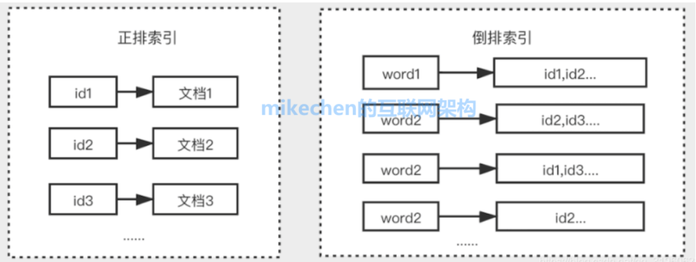
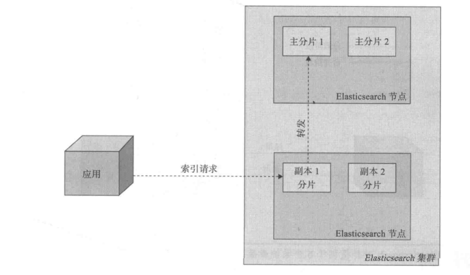
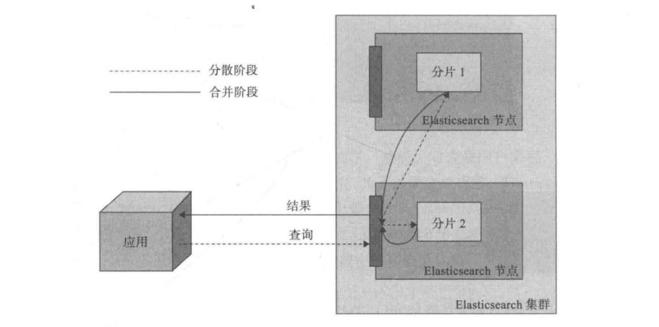
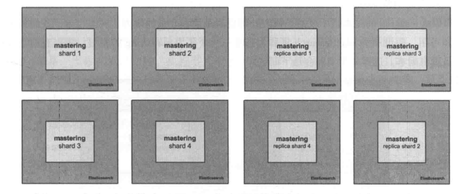

# Elasticsearch 


## 应用场景和优缺点

### 应用场景


**全文搜索的功能**

Elasticsearch提供了全文搜索的功能，适用于电商商品搜索、App搜索、企业内部信息搜索、IT系统搜索等。

**日志分析**

复杂的业务场景通常会产生繁杂多样的日志，如Apache Log、System Log、MySQL Log等，往往很难从繁杂的日志中获取价值，却要承担其存储的成本。

Elasticsearch能够借助Beats、 Logstash等快速对接各种常见的数据源，并通过集成的Kibana高效地完成日志的可视化分析，让日志产生价值。

**运维监控**

当您在ECS或者物理机中部署了Docker容器、MySQL或MongoDB等数据库，可使用Elasticsearch结合Beats、Logstash或ElasticFlow将所有日志实时集中并构建索引，然后通过集成的Kibana灵活地运用数据构建可视化运维看板，并在看板上展示主机名称、IP地址、部署情况、显示颜色等信息。

**安全分析**

当您需要通过日志解决公司内部繁杂的安全审计工作，可通过Elasticsearch分析、检索海量历史日志，高效地完成安全审计工作。


### 优缺点

**优点**

- 分布式的实时文件存储，每个字段都被索引且可用于搜索。
- 分布式的实时分析搜索引擎，海量数据下近实时秒级响应。
- 简单的restful api，天生的兼容多语言开发。
- 易扩展，处理PB级结构化或非结构化数据。

**缺点**

- 在需要添加新数据与新字段的时候，如果elasticSearch进行搜索是可能需要重新修改格式。之前的数据需要重新同步，对数据的管理有很多困难。


## 为什么要用ES，MySQL 不香吗


### MySQL 的不足

MySQL 架构天生不适合海量数据查询，它只适合海量数据存储，但无法应对海量数据下各种复杂条件的查询。有人说加索引不是可以避免全表扫描，提升查询速度吗，为啥说它不适合海量数据查询呢?

有两个原因：

①加索引确实可以提升查询速度，但在 MySQL 中加多个索引最终在执行 SQL 的时候它只会选择成本最低的那个索引。如果没有索引满足搜索条件，就会触发全表扫描，而且即便你使用了组合索引，也要符合最左前缀原则才能命中索引。

但在海量数据多种查询条件下很有可能不符合最左前缀原则而导致索引失效，而且我们知道存储都是需要成本的。

如果你针对每一种情况都加索引，以 innoDB 为例，每加一个索引，就会创建一颗 B+ 树。

如果是海量数据，将会增加很大的存储成本，之前就有人反馈说他们公司的某个表实际内容的大小才 10G, 而索引大小却有 30G!这是多么巨大的成本!所以千万不要觉得索引建得越多越好。

②有些查询条件是 MySQL 加索引都解决不了的，比如我要查询商品中所有 title 带有「格力空调」的关键词，如果你用 MySQL 写，会写出如下代码：

```sql
SELECT * FROM product WHERE title like '%格力空调%' 
```

这样的话无法命中任何索引，会触发全表扫描，而且你不能指望所有人都能输对他想要的商品，是人就会犯错误，我们经常会犯类似把「格力空调」记成「格空调」的错误。

那么 SQL 语句就会变成：

```
SELECT * FROM product WHERE title like '%格空调%' 
```

这种情况下就算你触发了全表扫描也无法查询到任何商品，综上所述，MySQL 的查询确实能力有限。


### ES

与其说上面列的这些点是 MySQL 的不足，倒不如说 MySQL 本身就不是为海量数据查询而设计的。

术业有专攻，海量数据查询还得用专门的搜索引擎，这其中 ES 是其中当之无愧的王者。

它是基于 Lucene 引擎构建的开源分布式搜索分析引擎，可以提供针对 PB 数据的近实时查询，广泛用在全文检索、日志分析、监控分析等场景。

它主要有以下三个特点：

- 轻松支持各种复杂的查询条件：它是分布式实时文件存储，会把每一个字段都编入索引(倒排索引)，利用高效的倒排索引，以及自定义打分、排序能力与丰富的分词插件等，能实现任意复杂查询条件下的全文检索需求。
- 可扩展性强：天然支持分布式存储，通过极其简单的配置实现几百上千台服务器的分布式横向扩容，轻松处理 PB 级别的结构化或非结构化数据。
- 高可用，容灾性能好：通过使用主备节点，以及故障的自动探测与恢复，有力地保障了高可用。

https://www.51cto.com/article/656071.html


## ElasticSearch中的倒排索引是什么

倒排索引是搜索引擎的核心,搜索引擎的主要目标是在查找发生搜索条件的文档时提供快速搜索。

倒排索引是一种像数据结构一样的散列图，可将用户从单词导向文档或网页,它是搜索引擎的核心其主要目标是快速搜索从数百万文件中查找数据。

`倒排索引`是区别于`正排索引`的概念:

**正排索引**:是以文档对象的唯一ID作为索引，以文档内容作为记录。

**倒排索引**: Inverted index，指的是将文档内容中的单词作为索引，将包含该词的文档ID作为记录。




## **Elasticsearch的基本概念**

### 索引

Elasticsearch将它的数据存储在一个或者多个索引(index)中。用SQL领域的术语来类比，索引就像数据库，可以向索引写入文档或者从索引中读取文档。就像之前说过的那样，Elasticsearch在内部使用Lucene将数据写入索引或从索引中检索数据。读者需要注意的是,Elasticsearch中的索引可能由一个或多个Lucene索引构成，细节Elasticsearch的索引分片(shard)、复制（replica）机制及其配置决定。


### type类型

Elasticsearch中每个文档都有与之对应的类型（type)定义。这允许用户在一个索引中存储多种文档类型，并为不同文档类型提供不同的映射。如果同SQL领域类比，Elasticsearch 的类型就像一个数据库表。


### document文档

文档(document)是 Elasticsearch世界中的主要实体(对Lucene来说也是如此)。对于所有使用Elasticsearch的案例来说，它们最终都会被归结到对文档的搜索之上。文档由字段构成,每个字段包含字段名以及一个或多个字段值(在这种情况下，该字段被称为是多值的，即文档中有多个同名字段)。文档之间可能有各自不同的字段集合，文档并没有固定的模式或强制的结构。这种现象看起来很眼熟(这些规则也适用于Lucene文档)。事实上，Elasticsearch的文档最后都被存储为Lucene文档了。从客户端的角度来看，文档是一个JSON对象。


### 映射

正如你在1.1节所了解到的那样，所有文档在写入索引前都将被分析。用户可以设置一些参数，决定如何将输入文本分割为词条，哪些词条应该被过滤掉，或哪些附加处理有必要被调用（例如移除HTML标签)。这就是映射( mapping)扮演的角色:存储分析链所需的所有信息。虽然Elasticsearch能根据字段值自动检测字段的类型，有时候(事实上几乎是所有时候)用户还是想自己来配置映射，以避免出现一些令人不愉快的意外。


### 节点

单个的Elasticsearch的服务实例被称为节点( node)。很多时候部署一个Elasticsearch节点就足以应付大多数简单的应用，但是考虑到容错性或者数据膨胀到单机无法应付这些状况,也许你会更倾向于使用多节点的Elasticsearch集群。

Elasticsearch节点可以按用途分为3类。众所周知，Elasticsearch是用来索引和查询数据的，因此第1类节点就是数据(data）节点，用来持有数据，提供对这些数据的搜索功能。第⒉类节点指主( master)节点，作为监督者负责控制其他节点的工作。一个集群中只有一个主节点。第3类节点是部落(tribe)节点。部落节点是Elasticsearch 1.0版新引入的节点类型，它可以像桥梁一样连接起多个集群，并允许我们在多个集群上执行几乎所有可以在单集Elasticsearch 上执行的功能。


### 集群

多个协同工作的Elasticsearch节点的集合被称为集群( cluster)。Elasticsearch 的分布式属性使我们可以轻松处理超过单机负载能力的数据量。同时，集群也是无间断提供服务的一种解决方案，即便当某些节点因为宕机或者执行管理任务（例如升级）不可用时,Elasticsearch 几乎是无缝集成了集群功能。在我们看来，这是它胜过竞争对手的最主要优点之一。在Elasticsearch 中配置一个集群是再容易不过的事了。


### 分片

正如我们之前提到的那样，集群允许系统存储的数据总量超过单机容量。为了满足这个需求，Elasticsearch将数据散布到多个物理的Lucene索引上去。这些 Lucene索引被称为分片( shard)，而散布这些分片的过程叫做分片处理( sharding)。Elasticsearch 会自动完成分片处理，并且让用户看来这些分片更像是一个大索引。

请记住，除了Elasticsearch本身自动进行分片处理外，用户为具体的应用进行参数调优也是至关重要的，因为分片的数量在索引创建时就被配置好了，之后无法改变，除非创建一个新索引并重新索引全部数据。


### 副本

分片处理允许用户推送超过单机容量的数据至Elasticsearch集群。副本（ replica)则解决了访问压力过大时单机无法处理所有请求的问题。思路是很简单的，为每个分片创建冗余的副本，处理查询时可以把这些副本当作最初的主分片( primary shard)使用。值得注意的是，副本给Elasticsearch带来了更多的安全性。如果主分片所在的节点宕机了，Elasticsearch 会自动从该分片的副本中选出一个作为新的主分片，因此不会对索引和搜索服务产生干扰。可以在任意时间点添加或移除副本，所以一旦你有需要，可随时调整副本的数量。

primaryshard (建立索引时一次设置，不能修改，默认5个)，replica shard(随时修改数量，默认1个)，默认每个索引10个shard，5个primary shard，5个replica shard，最小的高可用配置，是2台服务器。


## 分布式索引架构


### 选择合适的分片和副本数


#### 分片和过度分配

分片是将一个 Elasticsearch索引分割成一些更小的索引的过程，我们能够在同一集群的不同节点上散布它们。在查询的时候，结果汇总了索引中每个分片的返回结果(有时可能不是真的汇总，因为可能某个分片上就包含了所有感兴趣的数据)。

**Elasticsearch**默认为每个索引创建5个分片，即使在单节点环境下也是如此。这种冗余被称作过度分配（**overallocation**)。目前看起来这么做是完全没有必要的，反而在索引文档（散布文档到各个分片）和处理查询(查询多个分片并合并结果)时增加了复杂性。幸运的是，这种复杂性被Elasticsearch自动处理了。既然如Elasticsearch为什么还要这么做呢?

例如说我们有一个且仅有一个分片的索引。这意味着当应用程序的增长超过了单一服务器的容量时，我们会遇到问题。当前的Elasticsearch版本还无法将索引分割成多份，我们必须在创建索引时就指定好需要的分片数量。我们所能做的只有创建一个拥有更多分片的新索引，并重新索引数据。然而，这样的操作需要额外的时间和服务器资源，例如CPU,内存和大量的存储。我们可能根本就没有前面提到的时间和资源。另一方面，当使用**过度分配**时，我们可以仅仅增加一台安装了Elasticsearch 的服务器，Elasticsearch 会**重新平衡( rebalance)**集群，将部分索引**迁移**到新的机器上，**不需要额外的重新索引数据的开销**。Elasticsearch设计者选择的默认配置(5个分片和1个副本）在数据量增长和多分片搜索结果合并之间做了平衡。

默认的5个分片是标准用法。那么问题就来了:什么时候我们需要用更多的分片，或者与之相反，使用尽可能少的分片数量？
第一个答案很明显。如果你有一个有限的和明确的数据集，你可以只使用一-个分片。如果没有，那么依照经验，最理想的分片数量应该依赖于节点的数量。因此，如果你计划将来使用10个节点，你需要给索引配置10个分片。需要记住的一点是:为了保证高可用和查询的吞吐量，我们同样需要配置副本数，而且它跟普通的分片一样需要占用节点上的空间。如果每个分片有一份额外的拷贝 ( number_of_replicas等于1 )，你最终会有20个分片。10个包含主数据，10个是其副本。

总的来说，节点数和分片数、副本数的简单计算公式如下：

**所需最大节点数 = 分片数 * （副本数 + 1）**

换句话说，如果你计划使用10个分片和2个副本，那么所需的最大的节点数是30。


#### 一个过度分配的正面例子

如果你仔细阅读了本章前面的部分，你就会有一个强烈的信念:我们应该使用最少数量的分片。但是有时拥有更多的分片有其便利之处，因为一个分片事实上是一个Lucene索引。更多的分片意味着每个在较小的Lucene索引上执行的操作会更快(尤其是索引过程)。有时这是一个使用更多分片的很好的理由。当然，将查询分散成对每个分片的请求，然后合并结果，这也是有代价的。这个对于使用固定的参数来过滤查询的应用程序是可以避免的。有这种现实的案例，例如那种每个查询都在指定用户的上下文中执行的多租户系统。原理很简单，我们可以将每个用户的数据都索引到一个独立的分片中，在查询时就只查询那个用户的分片。这时需要使用路由（我们将在5.2节中详细讨论它)。


#### 多分片与多索引

你可能会奇怪，如果一个分片事实上是一个小的Lucene索引，那么什么才是真正的Elasticsearch索引？拥有多个分片和拥有多个索引有什么不同?从技术上讲，它们的区别不大，而且对于某些应用场景来说，使用多个索引是更好的选择（例如，将基于时间的数据如日志等索引到以时间段切分的不同索引中)。如果使用拥有多个分片的单个索引，某些时候可以通过路由把查询定位到一个分片上。而如果使用多个索引，你可以有机会选择只在那些感兴趣的索引上执行查询，比如，通过名称为logs_2014-10-10、logs_2014-10-11……这样的方式来选择基于时间区间构建的索引。更多的不同可以在分片和索引的平衡逻辑上看出来，尽管可以人为配置两者的平衡逻辑。


#### 副本

分片处理使我们能存储超过单节点容量的数据，而使用副本则解决了日渐增长的吞吐量和数据安全方面的问题。当一个存放主分片的节点失效后，Elasticsearch能够升级一个可用的副本为新的主分片。默认情况下，Elasticsearch只为每个索引分片创建一个副本。然而，不同于分片处理，副本的数量可以通过使用相关API随时更改。该功能让构建应用程序变得非常方便，因为我们的查询吞吐量随着用户的增长而增长，而使用副本则可以应对增长的并发查询。增加副本数目可以让查询负载分散到更多机器上，理论上可以让支持处理更多的并发请求。
使用过多副本的缺点也很明显:额外副本占用了额外的存储空间，构建索引副本的开销。当然，主分片及其副本之间的数据拷贝也存在开销。在选择分片数量的时候你应当同时考虑所需要的副本数量。如果选择了太多的副本，可能会耗光磁盘空间和Elasticsearch的资源，而事实上这些副本很多时候根本不会用到。另一方面，如果不创建副本，当主分片发生问题时，可能会造成数据的丢失。


### 路由

在5.1节中，我们提到过路由是限定查询在单个分片上执行的一个解决方案。现在是时候讲—步个绍该功能了。


#### 分片和数据

通常情况下，Elasticsearch将数据分发到哪个分片，以及哪个分片上存放特定的文档是不重要的。查询时，请求会被发送至所有的分片，所以最关键的事情就是使用一个能均匀分发数据的算法，使得每个分片都包含差不多数量的文档。我们并不希望某个分片持有99%的数据，而另一个分片持有剩下的1%，这样做极其低效。

而当我们想删除文档或者增加一个文档的新版本时，情况就有些复杂了。Elasticsearch必须确定哪个分片需要更新。尽管看起来挺麻烦，实际上，这并不是一个大问题。只要分片算法能对同一个文档标识符永远生成相同的值就足够了。如果我们有了这样一个算法，Elasticsearch在处理一个文档时就知道该去找哪个分片了。

另外，某些时候我们希望把数据的一部分索引到相同的分片上。举例来说，我们希望将特定类别的书籍都存在一个特定的分片上，在查询这类书时我们可以避免查询多个分片及合并搜索结果。这时候，因为我们确切地知道路由时使用的取值，就可以把Elasticsearch引导到与索引时相同的分片上。这就是路由要做的事情。它允许我们提供信息给Elasticsearch，然后Elasticsearch用这个信息来决定哪个分片用来存储文档和执行查询。相同的路由值总是指向同一个分片。换个说法就是:“之前你使用某个路由值将文档存放在特定的分片上，那么搜索时，也去相应的分片查找该文档。”


## ElasticSearch 的工作流程


### 与ElasticSearch通信

前面已经讨论过Elasticsearch是如何构建的了，然而，对普通用户来说，最重要的部分是如何向Elasticsearch**推送数据**以及**构建查询**。为了提供这些功能，Elasticsearch对外公开了一个设计精巧的API。如果我们说，基本上每个Elasticsearch 功能模块都有一个API,这将是令人鼓舞的。

值得一提的是，Elasticsearch在内部也使用Java API进行节点间通信。因此，Java API提供了所有可被REST API调用的功能。


#### 索引数据

Elasticsearch提供了多种索引数据的方式。最简单的方式是使用索引API，它允许用户发送一个文档至特定的索引。例如，使用curl工具，可以使用如下命令创建一个文档：

```shell
curl -xPUT http://localhost:9200/blog/article/1 -d '{"title" :"New version of Elastic search released! " , "tags" : [ "announce" ，Elasticsearch" ,"release"]}"
```

第2种方式允许用户通过bulk API或UDP bulk API一次发送多个文档至集群。两者的区别在于网络连接方式，前者使用HTTP协议，后者使用UDP协议。后者速度快，但是不可靠。还有一种方式使用被叫作河流(river)的插件来发送数据。不过在这里我们不需要了解这种河流插件，因为它们将在 Elasticsearch未来版本中被移除。

有一件事情需要记住，建索引操作只会发生在**主分片**上，而不是副本上。当一个索引请求被发送至一个节点上时，如果该节点没有对应的主分片或者只有副本，**那么这个请求会被转发到拥有正确的主分片的节点**。然后，该节点将会把索引请求**群发给所有副本**，**等待它们的响应（这一点可以由用户控制)，最后，当特定条件具备时（比如说达到规定数目的副本都完成了更新时)结束索引过程**。

下图展示了我们刚刚探讨的索引处理过程。




##### Elasticsearch索引文档的过程

面试官想考察你的是:文档写入ES创建索引的过程。

文档写入包含:单文档写入和批量bulk写入，这里只解释一下单文档写入流程。

大致分为如下三步:


**第一步**:客户从集群某节点写入数据，发送请求。

**第二步**:节点1接受到请求后，使用文档_id 来确定文档属于分片0。而分片0属于节点3，请求会被转到节点3。分片0的主分片也分配到节点3上;

**第三步**:节点3在主分片上执行写操作，成功后将请求并行转发到节点1和节点2的副本分片上。所有的副本分片都报告成功，节点3将向协调节点（节点1）报告成功，节点1向请求客户端报告写入成功。


#### 查询数据

谈到查询操作，读者应该了解一个很重要的实时：查询并不是一个简单的、单步骤的操作。一般来说，查询分为两个阶段：**分散阶段**（scatter phase）和**合并阶段**（gather phase）。

在**分散阶段**将查询分发到包含相关文档的**多个分片中去执行查询**，而在**合并阶段**则从**众多分片**中收集返回结果，然后对它们进行**合并**、**排序**，进行后续处理，然后返回给**客户端**。该机制可以由下图描述。




>搜索被执行成一个两阶段过程:
>
>**第一个阶段:Query阶段**
>
>客户端发送请求到coordinate node，协调节点将搜索请求广播到所有的primary shard或replica，每个分片在本地执行搜索并构建一个匹配文档的大小为from + size的优先队列。接着每个分片返回各自优先队列中所有docld和打分值给协调节点，由协调节点进行数据的合并、排序、分页等操作，产出最终结果。
>
>**第二个阶段:Fetch阶段**
>
>协调节点根据Query阶段产生的结果，去各个节点上查询docld实际的document 内容，最后由协调节点返回结果给客户端。
>


## Elasticsearch高并发下如何保证读写一致性

**对于更新操作**
可以通过版本号使用乐观并发控制，以确保新版本不会被旧版本覆盖

每个文档都有一个_version 版本号，这个版本号在文档被改变时加一。Elasticsearch使用这个_version保证所有修改都被正确排序。当一个旧版本出现在新版本之后，它会被简单的忽略。

利用version的这一优点确保数据不会因为修改冲突而丢失。比如指定文档的version来做更改。如果那个版本号不是现在的，我们的请求就失败了。

**对于写操作**
一致性级别支持quorum/one/all，默认为quorum，即只有当大多数分片可用时才允许写操作。但即使大多数可用，也可能存在因为网络等原因导致写入副本失败，这样该副本被认为故障，分片将会在一个不同的节点上重建。

**对于读操作**
可以设置replication为sync(默认)，这使得操作在主分片和副本分片都完成后才会返回;如果设置replication为 async时，也可以通过设置搜索请求参数_preference为primary来查询主分片，确保文档是最新版本。


## 提高性能


### 管理Elasticsearch

正如我们在本书和《Elasticsearch Server，Second Edition》中多次说过的，Elasticsearch是一个高度可扩展的搜索和分析平台。我们可以在水平和垂直方向上对Elasticsearch进行扩展。


#### 垂直扩展

当我们说到垂直扩展时，通常意味着向运行Elasticsearch的服务器添加更多的资源:可以添加内存，可以更换到有着更佳的CPU或者更快的磁盘存储的机器上。显然，使用更好的机器，我们可以期望性能的提升。依赖于我们的部署环境和它的瓶颈，可以有较小或则较高的提升。然而，垂直扩展有着它的限制，例如，服务器上的最大可用物理内存或者JVM需要使用的总内存。当你有足够多的数据和复杂的查询时，你会很快碰到内存问题，添加新的内存也许帮不了你。

例如，由于垃圾回收和无法使用压缩选项(这意味着为了标记相同的内存空间，JVM需要使用2倍的内存)，你不会想要给JVM分配超过31GB的物理内存。尽管这看起来是一个大问题，垂直扩展并不是唯一的解决方案。


#### 水平扩展

对于Elasticsearch用户来说，另一个解决方案是水平扩展。相对来说垂直扩展就像是建造一个摩天大楼，而水平扩展就像在住宅区内建造多所房子。我们选择使用多台机器并将数据分割存储在其上，以此来替代投资硬件和购买更好的机器。水平扩展给了我们几乎无限的扩展能力。即便使用了最好的硬件，用一台机器来容纳数据和处理查询也是不够的。如果一台机器容纳不下数据，我们会把索引分成多个分片( shard)，并在集群中分散它们,就像下图所展示的那样:


当没有足够的计算能力来处理查询时，总是可以为分片增加更多的副本。上图的集群有4个节点,其上运行着由4个分片构成的mastering 索引。

如果想要增加集群处理查询的能力，只需**增加额外的节点**，例如4个。增加节点后,既可以**创建有着更多分片的新索引来平衡负载**，也可以**给现有的分片增加副本**。

**两种方案都是可行的**。

**当硬件容纳不下数据时，应该寻求更多的主分片**。在这种情形下，我们通常会碰到存储器溢出的情形、分片查询时间变长、内存交换或者大量的IO等待。

**第2个方案在我们的硬件能够很好地处理数据，但是流量过高以致于节点无法跟上时使用**。第1个方案比较简单，**我们来看看第2个**。有着4个额外的节点，我们集群如下图所示:


现在，让我们通过执行下面的命令来添加一个副本:

```shell
curl -XPUT 'localhost:9200/mastering/ _settings' -d '{"index" : {"number_of_replicas" : 1)}'
```

我们的集群现在差不多是下面的样子:



我们可以看到，每个构成mastering索引的初始分片都有一个副本保存在其他节点上。

于是Elasticsearch便能够在**分片**和**它们的副本间**做**负载均衡了**，**进而查询便不会总是命中一个节点了。于是我们能够处理两倍于初始部署方式的查询负载**。


**1.自动创建副本**

略


**2.冗余和高可用**

略


**3.成本和性能的适应性**

略


**4.持续更新**

略


**5.一个物理机器上部署多个Elasticsearch实例**

略


**6.阻止分片及其副本部署在同一个节点上**

略


## Elasticsearch支持哪些类型的查询

查询主要分为两种类型:精确匹配、全文检索匹配。
精确匹配，例如term、exists、term set、range、prefix、ids、wildcard、regexp、fuzzy等;

全文检索，例如match、match_phrase、multi_match、match_phrase_prefix、query_string等


## Elasticsearch中的数据存储功能吗

Elasticsearch是一个搜索引擎，输入写入ES的过程就是索引化的过程，数据按照既定的Mapping序列化为Json文档实现存储。


## Elasticsearch 中执行搜索的各种可能方式有哪些

方式一:基于DSL检索(最常用)Elasticsearch提供基于JSON的完整查询DSL来定义查询。

```json
GET/ shirts/_search
{
	"query": {
		"bool": {
			"filter": [{
				"term": {
					"color": "red"
				}
			}, {
				"term": {
					"brand": "gucci"
				}
			}]
		}
	}
}
```

方式二:基于URL检索

```sql
GET /my_index/_search?q=user: seina
```

方式三:类SQL检索

```sql
POST /sql?format=txt
{
	"query": "SELECT * FROM uint-2020-08-17 ORDER BY itemid DESC LIMIT 5"
}
```


## ElasticSearch如何实现master选举的

对所有可以成为Master的节点(node.master: true)根据 nodeld排序，每次选举每个节点都把自己所知道节点排一次序，然后选出第一个(第0位)节点，暂且认为它是 Master 节点。

如果对某个节点的投票数达到一定的值(可以成为master节点数n/2+1)并且该节点自己也选举自己，那这个节点就是master。

否则重新选举。(当然也可以自己设定一个值，最小值设定为超过能成为Master节点的n/2+1，否则会出现脑裂问题。discovery.zen.minimum_master_nodes)


## Elasticsearch更新和删除文档的过程

删除和更新也都是写操作，但是Elasticsearch中的文档是不可变的，因此不能被删除或者改动以展示其变更;

磁盘上的每个段都有一个相应的.del文件。当删除请求发送后，文档并没有真的被删除，而是在.del文件中被标记为删除。该文档依然能匹配查询，但是会在结果中被过滤掉。当段合并时，在.del文件中被标记为删除的文档将不会被写入新段。

在新的文档被创建时，Elasticsearch会为该文档指定一个版本号，当执行更新时，旧版本的文档在.del文件中被标记为删除，新版本的文档被索引到一个新段。旧版本的文档依然能匹配查询，但是会在结果中被过滤掉。


## ElasticSearch索引多了怎么办，如何调优部署

1)在设计的时候可以基于模板+时间滚动方式创建索引，每天递增数据，避免单个索引很大的情况出现;

2)在存储的时候冷热数据分开存储比如最近3天的数据作为热数据，其他的作为冷数据。冷数据的话由于不会再写入新数据了，可以考虑定期force_merge(强制合并）和shrink (压缩）的方式进行处理，节约空间和检索效率。

3)由于es支持动态扩展，所有可以多加几台机器来缓解集群压力。


## ~~ElasticSearch中的分析器是什么~~

在ElasticSearch中索引数据时，数据由为索引定义的Analyzer在内部进行转换。分析器由一个Tokenizer和零个或多个TokenFilter组成。编译器可以在一个或多个CharFilter之前。分析模块允许您在逻辑名称下注册分析器，然后可以在映射定义或某些API中引用它们。
Elasticsearch附带了许多可以随时使用的预建分析器。或者，您可以组合内置的字符过滤器，编译器和过滤器器来创建自定义分析器。

