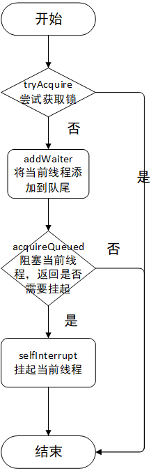

# JUC

> 这只是为面试做的简单总结。


## AQS

AbstractQueuedSynchronizer（下文简称AQS）是用来构建锁和同步器的框架，使用AQS能简单且高效构造出应用广泛的大量的同步器，比如ReentrantLock、Semaphore、CountDownLatch等。当然，我们也能利用AQS非常轻松构造出符合我们自己需求的同步器。AQS的架构图如下：


### AQS核心思想

AQS的核心思想是，如果被请求的共享资源空闲，则将当前请求资源的线程设置为工作的有效线程，并且将共享资源设定为锁定状态。如果被请求的共享资源被占用，那么需要一套线程阻塞等待以及被唤醒时锁分配的机制，这个机制AQS使用CLH队列实现的。
CLH队列指的是Craig, Landin, and Hagersten，是一个虚拟的双向队列（虚拟的双向队列即不存在队列的实例，仅存在结点之间的关联关系）。
从定义上看，AQS介绍的比较晦涩，其实说的直白点，AQS使用了一个volatile的int变量（state）表示了同步状态，通过内置的FIFO队列来完成线程的排队工作。在state状态被释放后，通过具体的锁策略（具体的AQS的实现）唤醒队列中排队线程占有锁。AQS的原理图如下：


现在我们应该已经大概了解了AQS的数据结构，首先有一个state变量以及有一个CLH形式的FIFO队列（队列中保存的是当前线程），而AQS对资源的共享方式有两种：

- 独占（Exclusive）：只有一个线程能执行，如ReentrantLock，又可分为公平锁和非公平锁：
  - 公平锁：按照线程在队列中的排队顺序，先到者先拿到锁
  - 非公平锁：当线程要获取锁时，无视队列中的线程直接去抢占锁，谁抢到就是谁的
- 共享（Share）：多个线程可同时执行。如Semaphore、CountDownLatch、ReadWriteLock等

AbstractQueuedSynchronizer是一个抽象的类，其中定义了一些抽象的方法，用于留给子类覆写，子类可根据具体的逻辑编写锁的逻辑。


### AQS源码分析

#### acuqire(int) 

```java
/**
 * 以独占模式获取, 忽略中断。
 * @param arg 计数器, 通常是1
 */
public final void acquire(int arg) {
    if (!tryAcquire(arg) && acquireQueued(addWaiter(AbstractQueuedSynchronizer.Node.EXCLUSIVE), arg))
        selfInterrupt();//将当前线程挂起
}
```




#### release(int)

了解了上述的加锁过程，我们知道如果获取线程抢占state失败的话，当前线程就会被阻塞；那么在释放锁的逻辑中，肯定是需要唤醒线程的，release(int) 代码如下：

```java
/**
 * 释放锁
 * @param arg 锁计数
 * @return 是否释放成功
 */
public final boolean release(int arg) {
    if (tryRelease(arg)) {//尝试释放锁
        AbstractQueuedSynchronizer.Node h = head;//队头
        if (h != null && h.waitStatus != 0)//队列中存在等待的节点
            unparkSuccessor(h);//唤醒队头的线程
        return true;
    }
    return false;//尝试释放失败, 直接返回false
}
```


#### unparkSuccessor(Node)

```java
/**
 * 唤醒操作
 * @param node 节点。通常来说是head节点
 */
private void unparkSuccessor(AbstractQueuedSynchronizer.Node node) {
    int ws = node.waitStatus;//等待状态
    if (ws < 0)//等待状态小于0表示当前节点是可用的(非CANCELLED状态)
        compareAndSetWaitStatus(node, ws, 0);//使用CAS将节点的等待状态更新成0(初始状态)

    AbstractQueuedSynchronizer.Node s = node.next;//下一个节点
    if (s == null || s.waitStatus > 0) {//当前节点没有下一个节点或者下一个节点是取消状态(CANCELLED)
        s = null;
        for (AbstractQueuedSynchronizer.Node t = tail; t != null && t != node; t = t.prev)//从队尾往队头遍历, 直到遍历node节点
            if (t.waitStatus <= 0)
                s = t;
    }
    if (s != null)
        LockSupport.unpark(s.thread);//唤醒
}
```

- 先更新node节点的waitStatus，将其更新为0，表示初始状态
- 然后获取node节点的下一个节点，即用户的真实的线程的数据节点，如果节点的waitStatus是已经取消的状态，那么继续往下一个节点获取，直到获取到waitStatus为小于等于0的节点
- 最后通过调用LockSupport.unpark()唤醒线程

**阅读到这里，我们已经初步了解了AQS的获取锁以及释放锁的过程，主要是对state（volatile修饰）资源的抢占及释放，如果抢占失败，对Node（CLH链表）的操作以及线程阻塞唤醒的一个具体实现。**


#### acquireSharedInterruptibly(int)

```java
/**
 * 共享式获取同步状态，响应中断
 */
public final void acquireSharedInterruptibly(int arg)
    throws InterruptedException {
    if (Thread.interrupted())
        throw new InterruptedException();
    // 为负数会让线程进入同步队列阻塞等待
    if (tryAcquireShared(arg) < 0)
        doAcquireSharedInterruptibly(arg);
}
```


#### doAcquireSharedInterruptibly

doAcquireSharedInterruptibly()与doAcquireShared()逻辑一样，只是有中断异常

```java
/**
 * 获取共享锁的核心方法。正常是有线程占用锁的话才会进入此方法。
 * @param arg 锁计数
 * @throws InterruptedException 异常
 */
private void doAcquireSharedInterruptibly(int arg)
    throws InterruptedException {
    // 创建一个node, 并将node节点存放到tail节点上
    final Node node = addWaiter(Node.SHARED);
    boolean failed = true; // 是否添加到队列失败
    try {
        for (;;) {        // 死循环保证添加成功
            final Node p = node.predecessor();      // node节点的前一个节点
            // 如果前一个节点是head节点, 证明当前线程前面已经没有线程排队了
            if (p == head) {
                int r = tryAcquireShared(arg);
                if (r >= 0) {        // 如果大于0的话, 通常来说已经没有线程占用锁了, 此时可以return了
                    setHeadAndPropagate(node, r);    // 设置头节点并传播, 如果是共享模式的话, 则会唤醒所有等待的节点
                    p.next = null; // help GC
                    failed = false;
                    return;
                }
            }
            // 等待
            if (shouldParkAfterFailedAcquire(p, node) &&
                parkAndCheckInterrupt())                     // 共享节点阻塞     
                throw new InterruptedException();
        }
    } finally {
        if (failed)         // 添加失败
            cancelAcquire(node);
    }
}
```


#### releaseShared

```java
/**
 * 释放共享锁
 * @param arg 锁计数
 * @return true/false
 */
public final boolean releaseShared(int arg) {
    if (tryReleaseShared(arg)) {//是否已经释放完锁了
        doReleaseShared();//如果释放完锁之后则唤醒head线程的下一个线程
        return true;
    }
    return false;
}
```

>当tryReleaseShared()返回true的时候，就会唤醒所有的同步队列中阻塞等待的线程。


#### doReleaseShared

释放锁调用的是doReleaseShared()，而在doReleaseShared()中有一个传播的特性，主要就是释放并唤醒同步队列中的所有线程（setHeadAndPropagate()方法）。


## ReentrantLock

ReentrantLock是一个可重入锁，底层使用的是**AQS**实现的一套锁机制。使用**state**资源，如果持有锁的线程重复获取锁时，它会将state状态进行**递增**，也就是类似一个锁计数的含义；当释放锁时，同时也释放了**锁计数**。如果上一个线程还没有完成任务，其他线程会进行入**队阻塞等待**的操作。


### Sync

在ReentrantLock中，只有一个全局变量：

```java
/** 同步器 */
private final Sync sync;
```

Sync是ReentrantLock抽象的内部类，如下，是其相关继承图：


**Sync**是实现了AQS的相关方法的实现类，其具体实现有**FairSync**（公平队列）和NonfairSync（非公平队列）。ReentrantLock的lock()、unlock()等相关接口的实现都是调用Sync相关方法实现的。而公平锁和非公平锁就是对应的Sync的实现。


### lock()

```java
    public void lock() {
        sync.lock();
    }  
```


#### NonfairSync


**NonfairSync**加锁流程，**一开始就直接抢占锁**，而不关心是否有线程占用锁；如果抢占失败，就会进入acquire()分支，而NonfairSync.tryAcquire()的逻辑与FairSync.tryAcquire()逻辑类似，但是去除了hasQueuedPredecessors() 的判断，这里我们不做详细介绍了。
**不管是公平锁还是非公平锁，如果抢占锁失败，都会进入同步队列的队尾，并且被阻塞；只有线程释放锁之后，才会唤醒同步队列的线程。**


#### FairSync


在ReentrantLock.FairSync.tryAcquire() 尝试获取锁的逻辑中中，主要通过state是否为0判断是否有线程占用锁资源。


### unlock()

ReentrantLock.unlock() 代码如下：

```java
public void unlock() {
    sync.release(1);
}
```

```java
public final boolean release(int arg) {
    // 尝试释放锁
    if (tryRelease(arg)) {
        Node h = head;  // 队头
        if (h != null && h.waitStatus != 0)          // 队列中存在等待的节点
            unparkSuccessor(h);   // 唤醒后继节点
        return true;
    }
    return false;    // 尝试释放失败, 直接返回false
}
```

```java
protected final boolean tryRelease(int releases) {
    // 线程计数器减去
    int c = getState() - releases;
    // 如果释放的不是持有锁的线程，抛出异常
    if (Thread.currentThread() != getExclusiveOwnerThread())  
        throw new IllegalMonitorStateException();
    boolean free = false;       //当前是否已经完全释放锁 
    // state == 0 表示已经释放完全了，其他线程可以获取同步状态了
    if (c == 0) {   // state为0表示没有线程持有锁
        free = true;
        // 则将锁持有线程设置为 null
        setExclusiveOwnerThread(null);
    }
    setState(c);  // 设置state
    return free;
}
```


主要释放的逻辑是在tryRelease() 方法中，如果返回true则唤醒同步队列的队头线程（head.next节点）。unlock()执行流程如下：


## CountDownLatch

CountDownLatch是一个并发的工具类，主要是对AQS的共享锁的实现。CountDownLatch允许一个或多个线程等待其他线程完成操作。CountDownLatch也只有一个全局变量：

```java
/** 同步队列。这里是共享锁 */
private final Sync sync;
```


### Sync

Sync是AQS的一个子类（与ReentrantLock类似），是CountDownLatch的一个子类，其继承结构如下：


而CountDownLatch相关的逻辑操作也是基于AQS的一个实现。下面我们具体看看CountDownLatch提供了哪些功能。Sync只有一个构造器，传递的参数就是等待的线程数量，也就是AQS的state值：

```java
/**
 * 构造器
 * @param count 状态state
 */
Sync(int count) {
    setState(count);
}
```


### countDown()

锁计数减1，如果减到了0，则会唤醒同步队列中所有等待的线程。

```java
/**
 * 对共享锁做-1操作, 其实就是对AQS的state - 1操作
 */
public void countDown() {
    sync.releaseShared(1);
}
```


### await()

如果还有其他线程在运行，则将当前线程存放到同步队列中阻塞等待

```java
/**
 * 阻塞等待
 * @throws InterruptedException 异常
 */
public void await() throws InterruptedException {
    sync.acquireSharedInterruptibly(1);
}
```

调用了CountDownLatch内部类Sync.acquireSharedInterruptibly()方法，而Sync.acquireSharedInterruptibly() 是AbstractQueuedSynchronizer.acquireSharedInterruptibly()，这里不做AQS的详细介绍。

>由此我们可以看出调用await方法的的线程在同步队列中阻塞等待了，需要countDown()去释放锁。


### 总结

> 通过上述的分析，我们知道CountDownLatch的底层是对AQS的共享锁的实现，主要的功能是两个或两组不同的线程之间的，其中一组线程等待另一组线程运行完成之后再运行。


## Semaphore

Semaphore有两个构造函数：

```java
/**
 * 构造器
 * @param permits 同时运行的线程数
 */
public Semaphore(int permits) {
    sync = new NonfairSync(permits);
}

/**
 * 构造器
 * @param permits 同时运行的线程数
 * @param fair 是否是公平队列
 */
public Semaphore(int permits, boolean fair) {
    sync = fair ? new FairSync(permits) : new NonfairSync(permits);
}
```


### acquire()

Semaphore的acquire获取锁有多个，但是不管是哪一个，最终核心都会汇聚到同一处：

- acquire()：可以中断的获取锁
- acquireUninterruptibly()：不关心中断的获取锁
- acquire(int permits)：获取锁，对锁计数增加指定的值
- acquireUninterruptibly(int permits)：获取锁（不关心中断），对锁计数增加指定的值

```java
/**
 * 获取锁, 这里是以共享的方式且不能中断的方式获取锁, 如果线程中断的话就会抛出异常
 * @throws InterruptedException 异常
 */
public void acquire() throws InterruptedException {
    sync.acquireSharedInterruptibly(1);
}

/**
 * 获取锁, 这里是以共享的方式获取锁。不关心线程是否中断
 */
public void acquireUninterruptibly() {
    sync.acquireShared(1);
}

/**
 * 一次性获取多把锁, 这里是以共享的方式且不能中断的方式获取锁, 如果线程中断的话就会抛出异常
 * @param permits 获取锁的数量
 * @throws InterruptedException 异常
 */
public void acquire(int permits) throws InterruptedException {
    if (permits < 0) throw new IllegalArgumentException();
    sync.acquireSharedInterruptibly(permits);
}

/**
 * 一次性获取多把锁, 这里是以共享的方式获取锁。不关心线程是否中断
 */
public void acquireUninterruptibly(int permits) {
    if (permits < 0) throw new IllegalArgumentException();
    sync.acquireShared(permits);
}
```


这里是直接调用Sync.acquireShared(int) 方法，而Sync我们知道是AQS的抽象实现类，而我们在AbstractQueuedSynchronizer原理分析acquireShared()获取共享锁 中已经对acquireShared()方法进行了详细的解析，这里不做重复介绍。

AQS的acquireShared()我们知道核心方法是tryAcquireShared(int) 方法，这个方法如果返回负数那么就进入doAcquireShared(int)并进行阻塞，而tryAcquireShared(int)方法在此处的实现有公平方式和非公平方式两种。

下面我们分别解析


#### FairSync: 公平式获取锁

FairSync.tryAcquireShared(int) 方法如下：

```java
/**
 * 尝试获取锁。这里是在{@link #acquireShared(int)}中调用的, 如果返回负数, 则表示获取锁失败, 当前线程需要阻塞
 * @param acquires 锁的数量
 * @return 负数表示线程需要等待
 */
protected int tryAcquireShared(int acquires) {
    for (; ; ) {
        if (hasQueuedPredecessors())//当前线程需要加入阻塞等待
            return -1;
        int available = getState();//state值
        int remaining = available - acquires;//相减
        if (remaining < 0 ||//为负数表示当前state为0
                compareAndSetState(available, remaining))//或者更新state成功
            return remaining;
    }
}
```

因为是公平队列，所以首先要知道同步队列中是否存在节点，如果存在节点则不能获取锁，要等到同步队列中的节点都释放之后才能获取锁。所以做了一层判断。
之后就会是state进行相应的减去计数了；如果为负数，那么就证明state值已经被减完，需要等待；如果不是负数，那么其他线程依然可以运行，不会被阻塞。


#### NonfairSync: 非公平式获取锁

NonfairSync.tryAcquireShared(int) 代码如下：

```java
/**
 * 尝试获取共享锁
 * @param acquires 锁计数
 * @return 加锁后的state
 */
protected int tryAcquireShared(int acquires) {
    return nonfairTryAcquireShared(acquires);
}
```

```java
/**
 * 尝试获取共享锁。这里如果返回负数的话, 证明当前线程需要进行阻塞等待
 * @param acquires 锁计数
 * @return 加锁后的state
 */
final int nonfairTryAcquireShared(int acquires) {
    for (; ; ) {
        int available = getState();//state值
        int remaining = available - acquires;//state相减
        if (remaining < 0 ||//小于0表示当前state值为0
                compareAndSetState(available, remaining))//或者更新state值成功
            return remaining;
    }
}
```

可以看出这里和上述的FairSync.tryAcquireShared(int) 几乎一样，只是少了一层

```java
if (hasQueuedPredecessors()) {return -1;}
```

这个判断，因为非公平锁，按照逻辑应该是直接获取锁，抢到锁了就是当前线程可以运行，而无关任何条件。所以不存在这个if判断。


### release()

release方法也有多个，但是最终都是同一套逻辑：

- release()：释放锁
- release(int)：释放指定值的锁计数

```java
/**
 * 一次性释放多把锁
 */
public void release(int permits) {
    if (permits < 0) throw new IllegalArgumentException();
    sync.releaseShared(permits);
}

/**
 * 释放锁
 */
public void release() {
    sync.releaseShared(1);
}
```

这里都是调用AQS.releaseShared(int) 方法，该方法我们在 1、AbstractQueuedSynchronizer原理分析-2.6 releaseShared()释放共享锁 已经有了详细介绍。即会调用tryReleaseShared(int) 方法，如果方法返回true则唤醒被阻塞的线程，否则不做操作。

**Semaphore.Sync.tryReleaseShared(int)** 代码如下：

```java
/**
 * 尝试释放锁
 * @param releases 锁计数
 * @return true/false
 */
protected final boolean tryReleaseShared(int releases) {
    for (; ; ) {
        int current = getState();//当前state值
        int next = current + releases;//相加
        //releases不能为负数 Start
        if (next < current)
            throw new Error("Maximum permit count exceeded");
        //releases不能为负数 End
        if (compareAndSetState(current, next))//更新成功返回true
            return true;
    }
}
```

这里很简单，就是对state值增加指定的数量（不能是负数），对state值进行CAS操作成功则返回true，操作失败则自旋。而如果返回true则唤醒被阻塞的线程。
到这里Semaphore就已经介绍完毕，对于其他一些辅助方法可自行阅读其源码。