# JVM

## 垃圾回收算法

有四种算法：

1. 标记-清除算法
2. 标记-整理算法
3. 复制算法
4. 分代收集算法


### 标记-清除算法

如它的名字一样，算法分为“标记”和“清除”两个阶段：首先标记出所有需要回
收的对象，在标记完成后，统一回收掉所有被标记的对象，也可以反过来，标记存活的对象，统一回
收所有未被标记的对象。标记过程就是对象是否属于垃圾的判定过程，这在前一节讲述垃圾对象标记
判定算法时其实已经介绍过了。

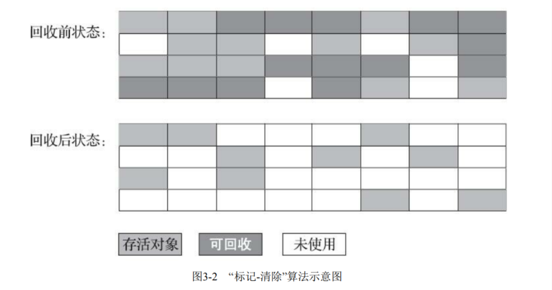

**缺点**

1. **执行效率不稳定**，如果Java堆中包含大量对象，而且其中大部分是需要被回收的，这时必须进行大量标记和清除的动作，**导致标记和清除两个过程的执行效率都随对象数量增长而降低**
2. **内存空间的碎片化问题**，标记、清除之后会产生大量不连续的内存碎片，空间碎片太多可能会导致当以后在程序运行过程中需要分配较大对象时无法找到足够的连续内存而不得不提前触发另一次垃圾收集动作。


### **标记-整理算法**

标记整理算法，类似与标记清除算法，不过它标记完对象后，不是直接对可回收对象进行清理，而是让所有存活的对象都向一端移动，然后直接清理掉边界以外的内存。

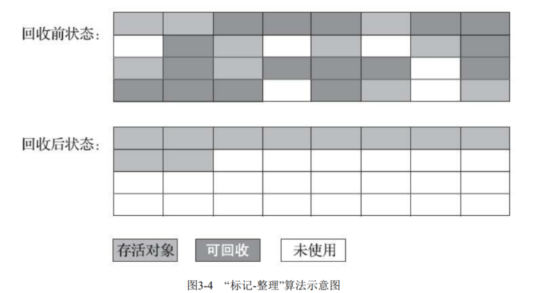


**优点：**

- 相对标记清除算法，解决了内存碎片问题。
- 没有内存碎片后，对象创建内存分配也更快速了

**缺点：**

- 效率问题，（同标记清除算法）标记和整理两个过程的效率都不高。


### 标记-复制算法

复制算法，可以解决效率问题，它将可用内存按容量划分为大小相等的两块，每次只使用其中的一块，当这一块内存用完了，就将还存活着的对象复制到另一块上面，然后再把已经使用过的内存空间一次清理掉，这样使得每次都是对整个半区进行内存回收，内存分配时也就不用考虑内存碎片等复杂情况，只要移动堆顶指针，按顺序分配内存即可。

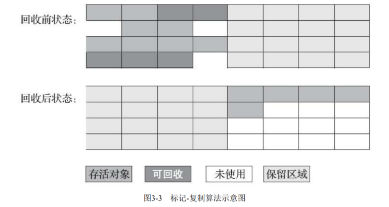

**优点：**

- 效率高，没有内存碎片

**缺点：**

- 浪费一半的内存空间。
- 复制收集算法在对象存活率较高时就要进行较多的复制操作，效率将会变低。


### **分代收集理论**

当前商业虚拟机都是采用分代收集算法，它根据对象存活周期的不同将内存划分为几块，一般是把 Java 堆分为新生代和老年代，然后根据各个年代的特点采用最适当的收集算法。

- 在新生代中，每次垃圾收集都发现有大批对象死去，只有少量存活，就选用复制算法。
- 而老年代中，因为对象存活率高，没有额外空间对它进行分配担保，就必须使用“标记清理”或者“标记整理”算法来进行回收。

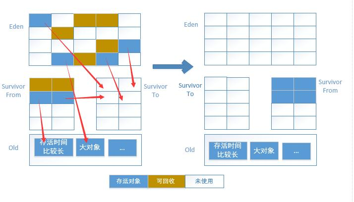

- 对象分配策略：
  - 对象优先在 Eden 区域分配，如果对象过大直接分配到 Old 区域。
  - 长时间存活的对象进入到 Old 区域。
- 改进自复制算法
  - 现在的商业虚拟机都采用这种收集算法来回收新生代，IBM 公司的专门研究表明，新生代中的对象 98% 是“朝生夕死”的，所以并不需要按照 `1:1` 的比例来划分内存空间，而是将内存分为一块较大的 Eden 空间和两块较小的 Survivor 空间，每次使用 Eden 和其中一块 Survivor 。当回收时，将 Eden 和 Survivor 中还存活着的对象一次性地复制到另外一块 Survivor 空间上，最后清理掉 Eden 和刚才用过的 Survivor 空间。
  - HotSpot 虚拟机默认 Eden 和 2 块 Survivor 的大小比例是 `8:1:1`，也就是每次新生代中可用内存空间为整个新生代容量的 90%（80%+10%），只有 10% 的内存会被“浪费”。当然，98% 的对象可回收只是一般场景下的数据，我们没有办法保证每次回收都只有不多于 10% 的对象存活，当 Survivor 空间不够用时，需要依赖其他内存（这里指老年代）进行分配担保（Handle Promotion）。


## 垃圾回收器


### Serial收集器

曾经（在JDK 1.3.1之前）是HotSpot虚拟机新生代 收集器的唯一选择。大家只看名字就能够猜到，这个收集器是一个单线程工作的收集器，但它的“单线 程”的意义并不仅仅是说明它只会使用一个处理器或一条收集线程去完成垃圾收集工作，更重要的是强 调在它进行垃圾收集时，必须暂停其他所有工作线程，直到它收集结束。“Stop The World”这个词语也 许听起来很酷，但这项工作是由虚拟机在后台自动发起和自动完成的，在用户不可知、不可控的情况 下把用户的正常工作的线程全部停掉，这对很多应用来说都是不能接受的。

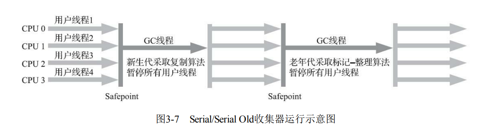


### Serial Old收集器

Serial Old是Serial收集器的老年代版本，它同样是一个单线程收集器，使用标记-整理算法。

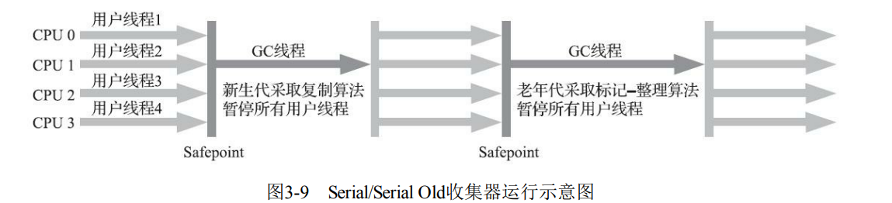


### ParNew收集器

ParNew收集器实质上是Serial收集器的多线程并行版本，**除了同时使用多条线程进行垃圾收集之 外**，其余的行为包括Serial收集器可用的所有控制参数、收集算法、Stop The World、对象分配规 则、回收策略等都与Serial收集器完全一致，在实现上这两种收集器也共用了相当多的代码。ParNew收 集器的工作过程如图3-8所示。 

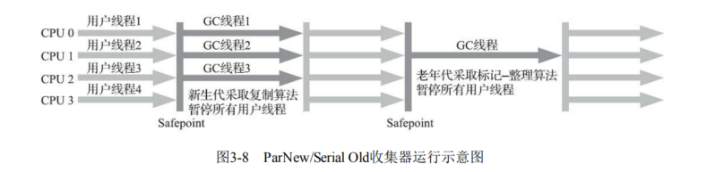

ParNew收集器除了支持多线程并行收集之外，其他与Serial收集器相比并没有太多创新之处，但它 却是不少运行在服务端模式下的HotSpot虚拟机，尤其是JDK 7之前的遗留系统中首选的新生代收集 器，其中有一个与功能、性能无关但其实很重要的原因是：除了Serial收集器外，目前只有它能与CMS 收集器配合工作。 


### Parallel Scavenge收集器

Parallel Scavenge收集器也是一款新生代收集器，它同样是基于标记-复制算法实现的收集器，也是能够并行收集的多线程收集器……Parallel Scavenge的诸多特性从表面上看和ParNew非常相似，那它有什么特别之处呢？

Parallel Scavenge收集器的特点是它的关注点与其他收集器不同，CMS等收集器的关注点是尽可能地缩短垃圾收集时用户线程的停顿时间，而Parallel Scavenge收集器的目标则是达到一个可控制的吞吐量（Throughput）。所谓吞吐量就是处理器用于运行用户代码的时间与处理器总消耗时间的比值，即：


### Parallel Old收集器

Parallel Old是Parallel Scavenge收集器的老年代版本，支持多线程并发收集，基于标记-整理算法实
现。


### CMS

CMS（Concurrent Mark Sweep）收集器是一种以获取最短回收停顿时间为目标的收集器。目前很
大一部分的Java应用集中在互联网网站或者基于浏览器的B/S系统的服务端上，这类应用通常都会较为
关注服务的响应速度，希望系统停顿时间尽可能短，以给用户带来良好的交互体验。CMS收集器就非
常符合这类应用的需求。


**CMS的回收步骤**

从名字（包含“Mark Sweep”）上就可以看出CMS收集器是基于标记-清除算法实现的。

- 初始标记（CMS initial mark） 
- 并发标记（CMS concurrent mark） 
- 重新标记（CMS remark）
- 并发清除（CMS concurrent sweep）

**其中初始标记、重新标记这两个步骤仍然需要“Stop The World”。**

`初始标记`仅仅只是标记一下GCRoots能直接关联到的对象，速度很快。

`并发标记`阶段就是从GC Roots的直接关联对象开始遍历整个对象图的过程，这个过程耗时较长但是不需要停顿用户线程，可以与垃圾收集线程一起并发运行。

`重新标记`阶段则是为了修正并发标记期间，因用户程序继续运作而导致标记产生变动的那一部分对象的
标记记录。这个阶段的停顿时间通常会比初始标记阶段稍长一些，但也远比并发标记阶段的时间短。

最后是`并发清除`阶段，清理删除掉标记阶段判断的已经死亡的对象，由于不需要移动存活对象，所以这个阶段也是可以与用户线程同时并发的。


由于在整个过程中耗时最长的并发标记和并发清除阶段中，垃圾收集器线程都可以与用户线程一 起工作，所以从总体上来说，CMS收集器的内存回收过程是与用户线程一起并发执行的。通过下图可以比较清楚地看到CMS收集器的运作步骤中并发和需要停顿的阶段。

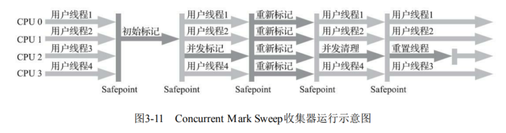

CMS是一款优秀的收集器，它最主要的优点在名字上已经体现出来：并发收集、低停顿，一些官 方公开文档里面也称之为“并发低停顿收集器”（Concurrent Low Pause Collector）。CMS收集器是 HotSpot虚拟机追求低停顿的第一次成功尝试，但是它还远达不到完美的程度，**至少有以下三个明显的 缺点：**

**CMS收集器对处理器资源非常敏感。**事实上，面向并发设计的程序都对处理器资源比较敏 感。在并发阶段，它虽然不会导致用户线程停顿，但却会因为占用了一部分线程（或者说处理器的计 算能力）而导致应用程序变慢，降低总吞吐量。CMS默认启动的回收线程数是（处理器核心数量 +3）/4，也就是说，如果处理器核心数在四个或以上，并发回收时垃圾收集线程只占用不超过25%的 处理器运算资源，并且会随着处理器核心数量的增加而下降。

**CMS收集器无法处理“浮动垃圾”（Floating Garbage）**，有可能出现“Con-current ModeFailure”失败进而导致另一次完全“Stop The World”的Full GC的产生。在CMS的并发标记和并发清理阶段，用户线程是还在继续运行的，程序在运行自然就还会伴随有新的垃圾对象不断产生，但这一部分垃圾对象是出现在标记过程结束以后，CMS无法在当次收集中处理掉它们，只好留待下一次垃圾收集时再清理掉。这一部分垃圾就称为“浮动垃圾”。

**CMS是一款基于“标记-清除”算法实现的收集器，如果读者对前面这部分介绍还有印象的话，就可能想到这意味着收集结束时会有大量空间碎片产生。**空间碎片过多时，将会给大对象分配带来很大麻烦，往往会出现老年代还有很多剩余空间，但就是无法找到足够大的连续空间来分配当前对象，而不得不提前触发一次Full GC的情况。


### G1

Garbage First（简称G1）收集器是垃圾收集器技术发展历史上的里程碑式的成果，它开创了收集器面向局部收集的设计思路和基于Region的内存布局形式。

**G1是一款主要面向服务端应用的垃圾收集器。**HotSpot开发团队最初赋予它的期望是（在比较长期的）未来可以替换掉JDK 5中发布的CMS收集器。现在这个期望目标已经实现过半了，JDK 9发布之日，G1宣告取代Parallel Scavenge加Parallel Old组合，成为服务端模式下的默认垃圾收集器，而CMS则沦落至被声明为不推荐使用（Deprecate）的收集器。

在G1收集器出现之前的所有其他收集器，包括CMS在内，垃圾收集的目标范围要么是整个新生代（Minor GC），要么就是整个老年代（Major GC），再要么就是整个Java堆（Full GC）。而G1跳出了这个樊笼，它可以面向堆内存任何部分来组成回收集（Collection Set，一般简称CSet）进行回收，衡量标准不再是它属于哪个分代，而是哪块内存中存放的垃圾数量最多，回收收益最大，这就是G1收集器的Mixed GC模式。


#### G1内部是如何分区的（region）

**G1开创的基于Region的堆内存布局是它能够实现这个目标的关键。虽然G1也仍是遵循分代收集理论设计的，但其堆内存的布局与其他收集器有非常明显的差异：G1不再坚持固定大小以及固定数量的分代区域划分，而是把连续的Java堆划分为多个大小相等的独立区域（Region），每一个Region都可以根据需要，扮演新生代的Eden空间、Survivor空间，或者老年代空间。收集器能够对扮演不同角色的 Region采用不同的策略去处理，这样无论是新创建的对象还是已经存活了一段时间、熬过多次收集的 旧对象都能获取很好的收集效果。** 

Region中还有一类特殊的Humongous区域，专门用来存储大对象。G1认为只要大小超过了一个 Region容量一半的对象即可判定为大对象。每个Region的大小可以通过参数-XX：G1HeapRegionSize设 定，取值范围为1MB～32MB，且应为2的N次幂。而对于那些超过了整个Region容量的超级大对象， 将会被存放在N个连续的Humongous Region之中，G1的大多数行为都把Humongous Region作为老年代 的一部分来进行看待，如图3-12所示。

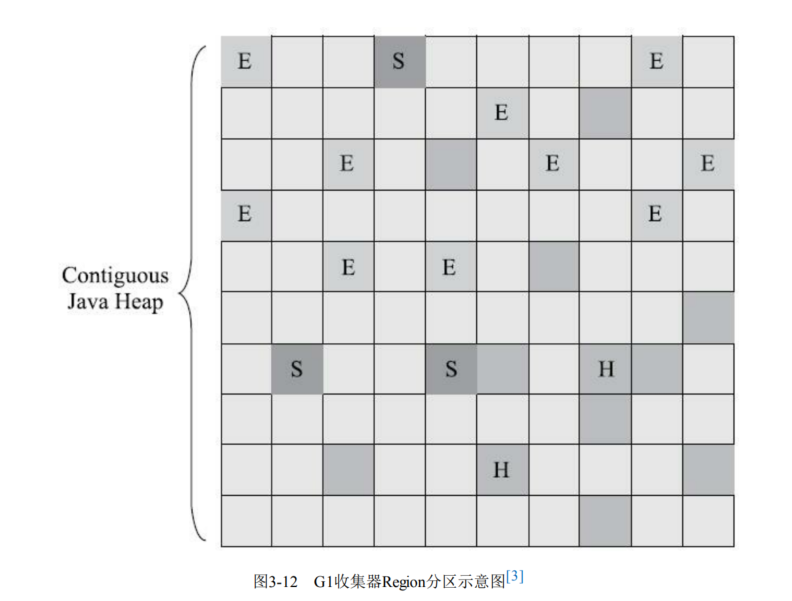

虽然G1仍然保留新生代和老年代的概念，但新生代和老年代不再是固定的了，它们都是一系列区域（不需要连续）的动态集合。G1收集器之所以能建立可预测的停顿时间模型，是因为它将Region作为单次回收的最小单元，即每次收集到的内存空间都是Region大小的整数倍，这样可以有计划地避免在整个Java堆中进行全区域的垃圾收集。更具体的处理思路是让G1收集器去跟踪各个Region里面的垃圾堆积的“价值”大小，价值即回收所获得的空间大小以及回收所需时间的经验值，然后在后台维护一个优先级列表，每次根据用户设定允许的收集停顿时间（使用参数-XX：MaxGCPauseMillis指定，默认值是200毫秒），优先处理回收价值收益最大的那些Region，这也就是“Garbage First”名字的由来。这种使用Region划分内存空间，以及具有优先级的区域回收方式，保证了G1收集器在有限的时间内获取尽可能高的收集效率。


#### G1收集器的运作过程

1. `初始标记`（Initial Marking）：仅仅只是标记一下GC Roots能直接关联到的对象，并且修改TAMS 指针的值，让下一阶段用户线程并发运行时，能正确地在可用的Region中分配新对象。这个阶段需要 停顿线程，但耗时很短，而且是借用进行Minor GC的时候同步完成的，所以G1收集器在这个阶段实际 并没有额外的停顿。
2. `并发标记`（Concurrent Marking）：从GC Root开始对堆中对象进行可达性分析，递归扫描整个堆里的对象图，找出要回收的对象，这阶段耗时较长，但可与用户程序并发执行。当对象图扫描完成以后，还要重新处理SATB记录下的在并发时有引用变动的对象。
3. `最终标记`（Final Marking）：对用户线程做另一个短暂的暂停，用于处理并发阶段结束后仍遗留下来的最后那少量的SATB记录。
4. `筛选回收`（Live Data Counting and Evacuation）：负责更新Region的统计数据，对各个Region的回 收价值和成本进行排序，根据用户所期望的停顿时间来制定回收计划，可以自由选择任意多个Region 构成回收集，然后把决定回收的那一部分Region的存活对象复制到空的Region中，再清理掉整个旧 Region的全部空间。这里的操作涉及存活对象的移动，是必须暂停用户线程，由多条收集器线程并行 完成的。

从上述阶段的描述可以看出，G1收集器除了并发标记外，其余阶段也是要完全暂停用户线程的，换言之，它并非纯粹地追求低延迟，官方给它设定的目标是在延迟可控的情况下获得尽可能高的吞吐量，所以才能担当起“全功能收集器”的重任与期望。

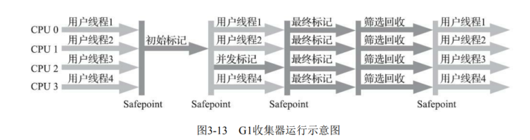


#### G1和CMS的区别

- 相比CMS，G1的优点有很多，**暂且不论可以指定最大停顿时间**、分Region的内存布局、**按收益动态确定回收集这些创新性设计带来的红利**，单从最传统的算法理论上看，G1也更有发展潜力。**与CMS 的“标记-清除”算法不同，G1从整体来看是基于“标记-整理”算法实现的收集器，但从局部（两个Region 之间）上看又是基于“标记-复制”算法实现，无论如何，这两种算法都意味着G1运作期间不会产生内存 空间碎片，垃圾收集完成之后能提供规整的可用内存。**这种特性有利于程序长时间运行，在程序为大 对象分配内存时不容易因无法找到连续内存空间而提前触发下一次收集。
- 不过，G1相对于CMS仍然不是占全方位、压倒性优势的，从它出现几年仍不能在所有应用场景中代替CMS就可以得知这个结论。比起CMS，G1的弱项也可以列举出不少，如在用户程序运行过程中，**G1无论是为了垃圾收集产生的内存占用（Footprint）还是程序运行时的额外执行负载（Overload）都要比CMS要高。**
  就内存占用来说，虽然G1和CMS都使用卡表来处理跨代指针，但G1的卡表实现更为复杂，而且堆中每个Region，无论扮演的是新生代还是老年代角色，都必须有一份卡表，这导致G1的记忆集（和其他内存消耗）可能会占整个堆容量的20%乃至更多的内存空间；相比起来CMS的卡表就相当简单，只有唯一一份，而且只需要处理老年代到新生代的引用，反过来则不需要，由于新生代的对象具有朝生夕灭的不稳定性，引用变化频繁，能省下这个区域的维护开销是很划算的。

>简单总结：
>
>- CMS ：并发标记清除。他的主要步骤有：初始标记，并发标记，重新标记，并发清除。
>- G1：主要步骤：初始标记，并发标记，最终标记，筛选回收。
>- CMS 的缺点是对 CPU 的要求比较高。G1是将内存化成了多块，所有对内段的大小有很大的要求。（暂时这样理解吧）。
>- CMS是清除，所以会存在很多的内存碎片。G1是整理。
>- G1 和 CMS 都是响应优先，他们的目的都是尽量控制 STW 时间。


### 为什么 CMS 从来没有成为默认收集器

- 新生代收集器

  - Serial 收集器

  - ParNew 收集器

    > ParNew 收集器，是 Serial 收集器的多线程版。

  - Parallel Scavenge 收集器

- 老年代收集器

  - Serial Old 收集器
    - Serial Old 收集器，是 Serial 收集器的老年代版本。
  - Parallel Old 收集器
    - Parallel Old 收集器，是 Parallel Scavenge 收集器的老年代版本。
  - CMS 收集器

- 新生代 + 老年代收集器

  - G1 收集器
  - ZGC 收集器


**因为 CMS 并不是一个非常成功的 GC 策略：**

- CMS 在垃圾清除阶段是使用并发清除的，如果处理器核数不高的情况下，垃圾回收会造成很高的负载。
- CMS 仅针对老年代，还需要一个年轻代的收集器。CMS 又和 Parallel Scavenge 不兼容，只能和 ParNew 凑合，然而 ParNew 又不如 Parallel Scavenge 先进。
- CMS 需要调整的参数太多，比 G1 要多一倍。
- Mark-Sweep 算法对内存碎片无能为力，当内存碎片太多，触发了 Concurrent Mode Failure 还得去请 Serial Old 来收拾烂摊子。

以上的种种，造成的结果就是 ParNew + CMS + Serial Old 的组合工作起来其实并不稳定。为了得到 CMS 那一点好处，需要付出很多的代价（包括 JVM 调参）。

> CMS 比 G1 早不了多少。CMS 从 JDK 5 开始加入，6 成熟；而 G1 是 7 加入，8 成熟，9 正式成为默认 GC 策略。此时 CMS 就被标记为 Deprecated，随后在 JDK 14 中被移除。

CMS 的杯具之处在于，**它相比前辈们，没有带来革命性的改变；而它的后辈们比它强太多**。它自身的实现又很复杂，兼容性又差，调参也很麻烦，所以无法成为默认 GC 方案了。


### 默认垃圾收集器

**各 JDK 版本默认 GC**

- JDK 7，默认是 Parallel Scavenge + Serial Old。
- JDK 8 及 JDK 7u40 之后的版本，默认是 Parallel Scavenge + Parallel Old。
- JDK 9 到 JDK 17，默认是 G1。

用 `Java -XX:+PrintCommandLineFlags -version` 命令可以查看默认收集器。


## 运行时数据区域

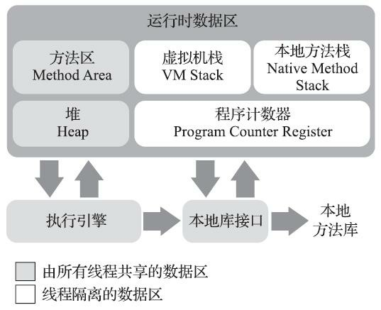


### 方法区

**方法区**（Method Area）与Java堆一样，是各个线程共享的内存区域，它用于存储已被虚拟机加载
的**类型信息**、**常量**、**静态变量**、**即时编译器编译后的代码缓存等数据**。

说到方法区，不得不提一下“**永久代**”这个概念，尤其是在JDK 8以前，许多Java程序员都习惯在 HotSpot虚拟机上开发、部署程序，很多人都更愿意把方法区称呼为“永久代”（Permanent Generation），或将两者混为一谈。本质上这两者并不是等价的，因为仅仅是当时的HotSpot虚拟机设 计团队选择把收集器的分代设计扩展至方法区，或者说使用永久代来实现方法区而已，这样使得 HotSpot的垃圾收集器能够像管理**Java堆**一样管理这部分内存，省去专门为方法区编写内存管理代码的工作。


在**JDK 6**的时候HotSpot开发团队就有放弃永久代，逐步改为采用本地内存（Native Memory）来实现方法区的计划了。

到了**JDK 7**的HotSpot，已经把原本放在永久代的字符串常量池、静态变量等移出。

到了 **JDK 8**，终于完全废弃了永久代的概念，改用与JRockit、J9一样在本地内存中实现的元空间（Metaspace）来代替，把JDK  7中永久代还剩余的内容（主要是**类型信息**）全部移到元空间中。


#### 方法区内存溢出

方法区存放类的相关信息，我们可以不断生成新的类信息到方法区，直到撑爆方法区。

如何动态产生类信息呢？JavaAPI中有反射， 但是很多框架中都是用CGLib，例如Spring。这里也使用CGLib.

其代码如下：

```java
import net.sf.cglib.proxy.Enhancer;
import net.sf.cglib.proxy.MethodInterceptor;
import net.sf.cglib.proxy.MethodProxy;
import java.lang.reflect.Method;

/**
 * Created by Administrator on 2017/6/23.
 */
public class JavaMethodAreaOOM {

    static  class OOMObject{

    }

    public static void main(String[] args) {
        while (true){
            //创建增强器
            Enhancer enhancer=new Enhancer();
            //设置要增强的父类
            enhancer.setSuperclass(OOMObject.class);
            //不使用缓存很重要，保证更容易触发OOM
            enhancer.setUseCache(false);
            //不增强任何方法
            enhancer.setCallback(new MethodInterceptor() {
                public Object intercept(Object o, Method method, Object[] objects, MethodProxy methodProxy) throws Throwable {
                    return methodProxy.invoke(o,objects);
                }
            });
           //创建增强后的类
            enhancer.create();
        }
    }
}
```


### 运行时常量池

**运行时常量池**（Runtime Constant Pool）是**方法区**的一部分。Class文件中除了有类的版本、字段、方法、接口等描述信息外，还有一项信息是常量池表（Constant Pool Table），用于存放编译期生成的各种字面量与符号引用，这部分内容将在类加载后存放到方法区的运行时常量池中。

**运行时常量池**相对于**Class文件常量池**的另外一个重要特征是具备**动态性**，Java语言并不要求常量 一定只有编译期才能产生，也就是说，并非预置入Class文件中常量池的内容才能进入方法区运行时常 量池，**运行期间也可以将新的常量放入池中**，这种特性被开发人员利用得比较多的便是String类的 **intern()**方法。 

既然**运行时常量池**是方法区的一部分，自然受到方法区内存的限制，当常量池无法再申请到内存时会抛出**OutOfMemoryError**异常。


### 直接内存

直接内存（Direct Memory）并不是虚拟机运行时数据区的一部分，也不是《Java虚拟机规范》中
定义的内存区域。但是这部分内存也被频繁地使用，而且也可能导致OutOfMemoryError异常出现。

在JDK 1.4中新加入了NIO（New Input/Output）类，引入了一种基于通道（Channel）与缓冲区 （Buffer）的I/O方式，它可以使用Native函数库直接分配堆外内存，然后通过一个存储在Java堆里面的 DirectByteBuffer对象作为这块内存的引用进行操作。这样能在一些场景中显著提高性能，因为避免了 在Java堆和Native堆中来回复制数据。 


## 类加载的过程

“家宴准备了西式菜”，即家(加载)宴(验证)准备(准备)了西(解析)式(初始化)菜。


### 加载

1. 通过一个类的全限定名获取定义此类的二进制字节流
2. 将这个字节流所代表的静态存储结构转化为方法区的运行时数据结构
3. 在内存中生成一个代表这个类的对象，作为方法区这个类的各种数据访问入口。 


### 链接【验证、准备、解析】


#### 验证(Verify):

目的在于确保Class文件的字节流中包含信息符合当前虚拟机要求，保证被加载类的正确性，不会危害虚拟机自身安全。

主要包括四种验证，文件格式验证、元数据验证、字节码验证、符号引用验证。


#### 准备(Prepare):

为类变量分配内存并且设置该类变量的默认初始值，即零值。


#### 解析(Resolve):

将常量池内的符号引用转换为直接引用的过程。


### 初始化

在初始化阶段，则会根据程序员通过程序编码制定的主观计划去初始化类变量和其他资源。


### 自定义加载

static Integer a = 10在类加载阶段的值的变化，如何加载这个类，使加载完成后，a的值为null。


在Java中，静态成员变量在类加载阶段会被初始化。如果你在类加载阶段想要将静态成员变量的值改为null，可以通过自定义一个ClassLoader来加载这个类，并在加载完成后修改静态成员变量的值。以下是一个示例代码：

```java
public class Main {
    public static void main(String[] args) throws Exception {
        CustomClassLoader classLoader = new CustomClassLoader();
        Class<?> clazz = classLoader.loadClass("TestClass");
        System.out.println("Before null: " + TestClass.a);
        TestClass.a = null;
        System.out.println("After null: " + TestClass.a);
    }

    static class TestClass {
        static Integer a = 10;
    }

    static class CustomClassLoader extends ClassLoader {
        public Class<?> loadClass(String name) throws ClassNotFoundException {
            if ("TestClass".equals(name)) {
                byte[] classBytes = getClassBytes(name);
                return defineClass(name, classBytes, 0, classBytes.length);
            }
            return super.loadClass(name);
        }

        private byte[] getClassBytes(String className) {
            // 这里省略了读取类字节码的过程，你需要根据实际情况获取TestClass类的字节码
            return null;
        }
    }
}
```


## 四种引用


### 强引用

强引用是最传统的“引用”的定义，是指在程序代码之中普遍存在的引用赋值，即类似“Object obj=new Object()”这种引用关系。无论任何情况下，只要强引用关系还存在，垃圾收集器就永远不会回 收掉被引用的对象。


### 软引用

软引用是用来描述一些还有用，但非必须的对象。只被软引用关联着的对象，在系统将要发生内 存溢出异常前，会把这些对象列进回收范围之中进行第二次回收，如果这次回收还没有足够的内存， 才会抛出内存溢出异常。在JDK 1.2版之后提供了SoftReference类来实现软引用。

以下是 JDK 8 中使用 `SoftReference` 的几个典型地方：

1.`SoftReference` 用于内存敏感的缓存。当 JVM 检测到内存不足时，会优先回收通过 `SoftReference` 引用的对象，而非直接回收强引用的对象。


### 弱引用

弱引用也是用来描述那些非必须对象，但是它的强度比软引用更弱一些，被弱引用关联的对象只 能生存到下一次垃圾收集发生为止。当垃圾收集器开始工作，无论当前内存是否足够，都会回收掉只 被弱引用关联的对象。在JDK 1.2版之后提供了WeakReference类来实现弱引用。

如ThreadLocal的ThreadLocalMap的实现使用了弱引用。


### 虚引用

虚引用也称为“幽灵引用”或者“幻影引用”，它是最弱的一种引用关系。一个对象是否有虚引用的 存在，完全不会对其生存时间构成影响，也无法通过虚引用来取得一个对象实例。为一个对象设置虚 引用关联的唯一目的只是为了能在这个对象被收集器回收时收到一个系统通知。在JDK 1.2版之后提供 了PhantomReference类来实现虚引用。


幻像引用与[软引用](https://www.baeldung.com/java-soft-references)和[弱](https://www.baeldung.com/java-weak-reference)引用有两个主要区别。

- **我们无法获取幻像引用的引用对象。**引用对象永远无法通过 API 直接访问，这就是为什么我们需要一个引用队列来处理这种类型的引用。
- **垃圾收集器在执行引用对象的 finalize 方法后，**会将幻像引用添加到引用队列。这意味着该实例仍在内存中。

虚引用有两种常见用途。

**第一种技术是确定对象何时从内存中删除，这有助于调度内存敏感型任务。例如，我们可以等待大型对象被删除后再加载另一个对象。**

**第二种做法是避免使用finalize方法并改进finalize 过程。**

