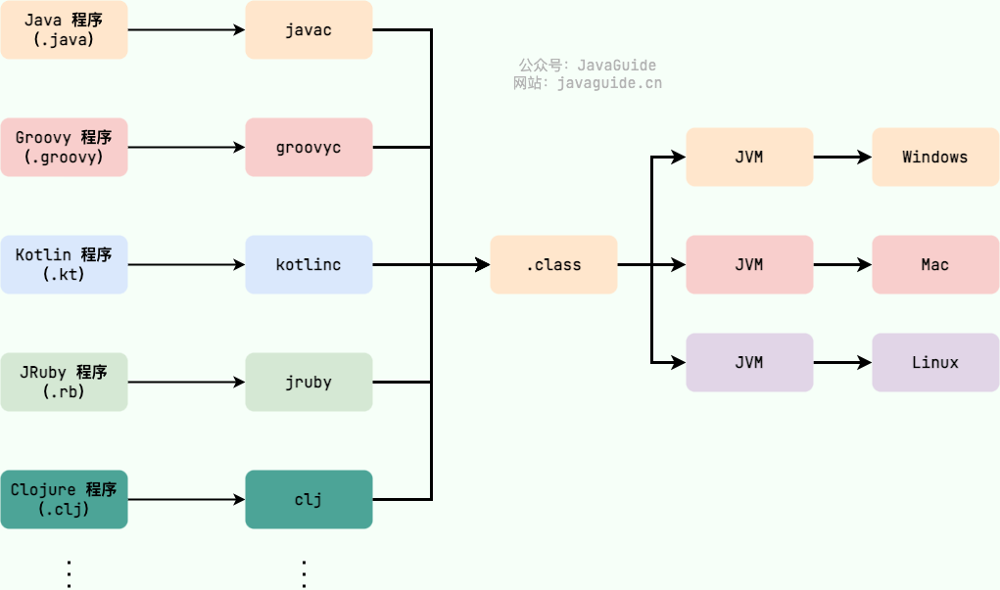

# Java 基础


## equals 与 == 的区别


- 值类型（`int`,`char`,`long`,`boolean` 等）的话
  - 都是用 == 判断相等性。
- 对象引用的话
  - == 判断引用所指的对象是否是同一个。
  - equals 方法，是 Object 的成员函数，有些类会覆盖(`override`) 这个方法，用于判断对象的等价性。


## 什么是自动拆装箱


自动装箱和拆箱，就是基本类型和引用类型之间的转换。


- `int` 是基本数据类型。
- Integer 是其包装类，注意是一个类。


1. 当数值范围为-128~127时：如果两个new出来Integer对象，即使值相同，通过“==”比较结果为false，但两个对象直接赋值，则通过“==”比较结果为“true，这一点与String非常相似。
2. 当数值不在-128~127时，无论通过哪种方式，即使两个对象的值相等，通过“==”比较，其结果为false；
3. 当一个Integer对象直接与一个int基本数据类型通过“==”比较，其结果与第一点相同；
4. Integer对象的hash值为数值本身；


**JVM会自动维护八种基本类型的常量池，int常量池中初始化-128~127的范围，所以当为Integer i=127时，在自动装箱过程中是取自常量池中的数值，而当Integer i=128时，128不在常量池范围内，所以在自动装箱过程中需new 128，所以地址不一样。**

查看Integer类源码，发现里面有一个私有的静态内部类IntegerCache，而如果直接将一个基本数据类型的值赋给Integer对象，则会发生自动装箱，其原理就是通过调用Integer类的public static Integer valueOf(将int类型的值包装到一个对象中 ，其部分源码如下：


```java

    private static class IntegerCache {
        static final int low = -128;
        static final int high;
        static final Integer cache[];
 
        static {
            // high value may be configured by property
            int h = 127;
            String integerCacheHighPropValue =
                sun.misc.VM.getSavedProperty("java.lang.Integer.IntegerCache.high");
            if (integerCacheHighPropValue != null) {
                int i = parseInt(integerCacheHighPropValue);
                i = Math.max(i, 127);
                // Maximum array size is Integer.MAX_VALUE
                h = Math.min(i, Integer.MAX_VALUE - (-low) -1);
            }
            high = h;
 
            cache = new Integer[(high - low) + 1];
            int j = low;
            for(int k = 0; k < cache.length; k++)
                cache[k] = new Integer(j++);
        }
 
        private IntegerCache() {}
    }
  ..................
  ...................
  ...................
 

    public static Integer valueOf(int i) {
        assert IntegerCache.high >= 127;
        if (i >= IntegerCache.low && i <= IntegerCache.high)
            return IntegerCache.cache[i + (-IntegerCache.low)];
        return new Integer(i);
    }
 
```


## JVM vs JDK vs JRE

### JVM

Java 虚拟机（Java Virtual Machine, JVM）是运行 Java 字节码的虚拟机。JVM 有针对不同系统的特定实现（Windows，Linux，macOS），目的是使用相同的字节码，它们都会给出相同的结果。字节码和不同系统的 JVM 实现是 Java 语言“一次编译，随处可以运行”的关键所在。

如下图所示，不同编程语言（Java、Groovy、Kotlin、JRuby、Clojure ...）通过各自的编译器编译成 `.class` 文件，并最终通过 JVM 在不同平台（Windows、Mac、Linux）上运行。



**JVM 并不是只有一种！只要满足 JVM 规范，每个公司、组织或者个人都可以开发自己的专属 JVM。** 也就是说我们平时接触到的 HotSpot VM 仅仅是是 JVM 规范的一种实现而已。


### JDK 和 JRE

JDK（Java Development Kit）是一个功能齐全的 Java 开发工具包，供开发者使用，用于创建和编译 Java 程序。它包含了 JRE（Java Runtime Environment），以及编译器 javac 和其他工具，如 javadoc（文档生成器）、jdb（调试器）、jconsole（监控工具）、javap（反编译工具）等。

JRE 是运行已编译 Java 程序所需的环境，主要包含以下两个部分：

1. **JVM** : 也就是我们上面提到的 Java 虚拟机。
2. **Java 基础类库（Class Library）**：一组标准的类库，提供常用的功能和 API（如 I/O 操作、网络通信、数据结构等）。

简单来说，JRE 只包含运行 Java 程序所需的环境和类库，而 JDK 不仅包含 JRE，还包括用于开发和调试 Java 程序的工具。

如果需要编写、编译 Java 程序或使用 Java API 文档，就需要安装 JDK。某些需要 Java 特性的应用程序（如 JSP 转换为 Servlet 或使用反射）也可能需要 JDK 来编译和运行 Java 代码。因此，即使不进行 Java 开发工作，有时也可能需要安装 JDK。

下图清晰展示了 JDK、JRE 和 JVM 的关系。


