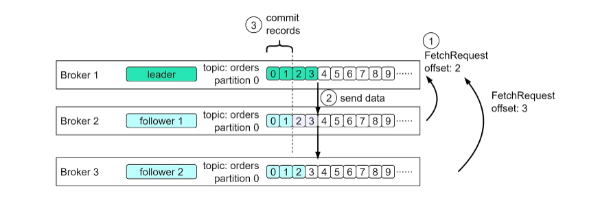

# Kafka

## Apache Kafka 是什么

Kafka 是基于**发布与订阅**的**消息系统**。它最初由 LinkedIn 公司开发，之后成为 Apache 项目的一部分。Kafka 是一个分布式的，可分区的，冗余备份的持久性的日志服务。它主要用于处理活跃的流式数据。

在大数据系统中，常常会碰到一个问题，整个大数据是由各个子系统组成，数据需要在各个子系统中高性能、低延迟的不停流转。传统的企业消息系统并不是非常适合大规模的数据处理。为了同时搞定在线应用（消息）和离线应用（数据文件、日志），Kafka 就出现了。Kafka 可以起到两个作用：

- 降低系统组网复杂度。
- 降低编程复杂度，各个子系统不在是相互协商接口，各个子系统类似插口插在插座上，Kafka 承担高速**数据总线**的作用。

### 基础概念

#### 主题和分区

**Kafka 的消息通过主题进行分类**。主题就好比数据库的表或文件系统的文件夹。**主题可以被分为若干个分区，一个分区就是一个提交日志**。消息会以追加的方式被写入分区，然后按照先入先出的顺序读取。需要 注意的是，由于一个主题一般包含几个分区，因此无法在整个主题范围内保证消息的顺序，但可以保证消 息在单个分区内是有序的。

图 1-5 所示的主题有 4 个分区，消息被追加写入每个分区的尾部。Kafka 通过 分区来实现数据的冗余和伸缩。分区可以分布在不同的服务器上，也就是说，一个主题可以横跨多台服务 器，以此来提供比单台服务器更强大的性能。此外，分区可以被复制，相同分区的多个副本可以保存在多 台服务器上，以防其中一台服务器发生故障。

​                                                                     *图 1-5：包含多个分区的主题*

#### 生产者和消费者

Kafka 的客户端就是 Kafka 系统的用户，其被分为两种基本类型：生产者和消费者。除此之外，还有其他高级客户端 API——用于数据集成的 Kafka Connect API 和用于流式处理的 Kafka Streams。这些高级客户端 API 使用生产者和消费者作为内部组件，提供了更高级的功能。

**生产者创建消息**。一条消息会被发布到 一个特定的主题上。在默认情况下，生产者会把消息均衡地分布到主题的所有分区中。不过，在某些情况 下，生产者会把消息直接写入指定的分区，这通常是通过消息键和分区器来实现的。分区器会为键生成一个哈希值，并将其映射到指定的分区，这样可以保证包含同一个键的消息被写入同一个分区。生产者也可以使用自定义的分区器，根据不同的业务规则将消息映射到不同的分区。

**消费者读取消息**。**消费者会订阅一个或多个主题，并按照消息写入分区的顺序读取它们**。消费者通过检查消息的**偏移量**来区分已经读取过的消息。**偏移量（不断递增的整数值）是另一种元数据，在创建消息时，Kafka 会把它添加到消息里**。

在给定的分区中，每一条消息的偏移量都是唯一的，越往后消息的偏移量越大（但不一定是严格单调递增）。消 费者会把每一个分区可能的下一个偏移量保存起来（通常保存在 Kafka 中），如果消费者关闭或重启，则其读取状态不会丢失。

#### 消费者群组

消费者可以是消费者群组的一部分，属于同一群组的一个或多个消费者共同读取一个主题。**群组可以保证每个分区只被这个群组里的一个消费者读取**。在图 1-6 所示的群组中，有 3 个消费者同时读取一个主题， 其中的两个消费者各自读取 3 个分区中的 1 个分区，另外一个消费者读取其他 2 个分区。消费者与分区之 间的映射通常被称为消费者对分区的所有权关系。

​                                                        *图 1-6：消费者群组从主题读取消息*

通过这种方式，消费者可以读取包含大量消息的主题。而且，如果一个消费者失效，那么群组里的其他消 费者可以接管失效消费者的工作。

#### broker 和集群

**一台单独的 Kafka 服务器被称为 broke**r。broker 会接收来自生产者的消息，为其设置偏移量，并提交到磁 盘保存。broker 会为消费者提供服务，对读取分区的请求做出响应，并返回已经发布的消息。根据硬件配 置及其性能特征的不同，单个 broker 可以轻松处理数千个分区和每秒百万级的消息量。

broker 组成了集群。每个集群都有一个同时充当了集群控制器角色的 broker（自动从活动的集群成员中选 举出来）。控制器负责管理工作，包括为 broker 分配分区和监控 broker。在集群中，一个分区从属于一个broker，这个 broker 被称为分区的首领。一个被分配给其他 broker 的分区副本（参见图 1-7）叫作这个分 区的“跟随者”。分区复制提供了分区的消息冗余，如果一个 broker 发生故障，则其中的一个跟随者可以接 管它的领导权。所有想要发布消息的生产者必须连接到首领，但消费者可以从首领或者跟随者那里读取消息。

​                                                                       *图 1-7：集群中的分区复制*

### **Kafka 的主要特点**

1. 同时为发布和订阅提供高吞吐量。据了解，Kafka 每秒可以生产约 25 万消息（50MB），每秒处理 55 万消息（110MB）。
2. 可进行持久化操作。将消息持久化到磁盘，因此可用于批量消费，例如 ETL ，以及实时应用程序。通过将数据持久化到硬盘，以及replication ，可以防止数据丢失。
3. 分布式系统，易于向外扩展。所有的 Producer、Broker 和Consumer 都会有多个，均为分布式的。并且，无需停机即可扩展机器。
4. 消息被处理的状态是在 Consumer 端维护，而不是由 Broker 端维护。当失败时，能自动平衡。
5. 支持 online 和 offline 的场景。

## Kafka 为何如此之快？它是如何工作的？

当人们说kafka快时，通常是指它能高效地传输大量数据。

都有哪些设计决策使得Kafka能快速传输大量数据呢？Kafka的性能得益手许多设计决策的综合。本次我们将重点关注其中两个。我们认为这两个因素最为关键。

**首要的一点是Kafka对顺序I/O的依赖**；什么是顺序I/O,普遍误解硬盘访问和内存访问相比速度较慢,但这很大程度上取决于数据访问模式。硬盘有两种访问模式：随机和顺序。对于硬盘，物理上将磁盘臂移动到不同位置会消耗时间。这是随机访问变慢的原因。对于顺序访问，因为磁盘臂无需频繁移动，连续读写数据块的速度要快得多。Kafka通过使用只追加日志作为主要数据结构,充分利用这一点。只追加日志是在文件的末尾添加新数据，这种访问模式是顺序的。

现在让我们用一些数字来具体说明这点。

**第二点是其对效率地重视**，Kafka频繁地在网络和磁盘之间传输大量数据。在磁盘和网络之间传输大量数据时，避免不必要的复制至关重要。这就是零拷贝原则发挥作用的地方，首先我们来看看在不使用零拷贝的情况下，Kafka是如何将磁盘上的一页数据发送给消费者的：

有四次复制和两次系统调用，这显然效率不高。

现在，我们来看看零拷贝的情况

第一步是相同地， 数据从磁盘加载到OS缓存 。通过零拷贝，Kafka应用会使用名为sendfile的系统调用，指示操作系统直接从OS缓存将数据复制到网络接口缓冲区（网卡）。在这个优化路径中，唯一的复制步骤是从OS缓存到网络缓冲区。使用现代化地网卡，这个复制过程通常由DMA来完成，DMA代表直接内存访问，当使用DMA时，CPU无需参与，这进一步提高了效率

>总结一下顺序I/O和零拷贝原则是Kafka实现高性能的关键基石。许多其他消息/流媒体平台也普遍使用相同的技术。

### 步骤1

**步骤 1.1 - 1.3：生产者将数据写入磁盘**

### 步骤2

**消费者在读取数据时没有使用零拷贝。**

2.1 数据从磁盘加载到OS缓存

2.2 数据从OS缓存复制到Kafka应用程序

2.3 Kafka 应用程序将数据复制到套接字缓冲区中

2.4 数据从套接字缓冲区复制到网卡

2.5 网卡将数据发送给消费者

### 步骤3

**消费者使用零拷贝读取数据。**

3.1 数据从磁盘加载到OS缓存 

3.2 OS cache通过sendfile ()命令直接将数据复制到网卡 

3.3 网卡向消费者发送数据

零拷贝是节省应用程序上下文和内核上下文之间多次数据拷贝的捷径，这种方法将时间缩短了约 65%。

## Kafka 如何保证消息的顺序性

Kafka 本身，并不像 RocketMQ 一样，提供顺序性的消息。所以，提供的方案，都是相对有损的。如下：

>这里的顺序消息，我们更多指的是，单个 Partition 的消息，被顺序消费。

- 方式一，Consumer ，对每个 Partition 内部单线程消费，单线程吞吐量太低，一般不会用这个。

- 方式二，Consumer ，拉取到消息后，写到 N 个内存 queue，具有相同 key 的数据都到同一个内存 queue 。然后，对于 N 个线程，每个线程分别消费一个内存 queue 即可，这样就能保证顺序性。

## **Kafka 为什么要将 Topic 进行分区**

正如我们在 [「聊聊 Kafka 的设计要点？」](http://svip.iocoder.cn/Kafka/Interview/#) 问题中所看到的，是为了负载均衡，从而能够水平拓展。

- Topic 只是逻辑概念，面向的是 Producer 和 Consumer ，而 Partition 则是物理概念。如果 Topic 不进行分区，而将 Topic 内的消息存储于一个 Broker，那么关于该 Topic 的所有读写请求都将由这一个 Broker 处理，吞吐量很容易陷入瓶颈，这显然是不符合高吞吐量应用场景的。
- 有了 Partition 概念以后，假设一个 Topic 被分为 10 个 Partitions ，Kafka 会根据一定的算法将 10 个 Partition 尽可能均匀的分布到不同的 Broker（服务器）上。
- 当 Producer 发布消息时，Producer 客户端可以采用 random、key-hash 及轮询等算法选定目标 Partition ，若不指定，Kafka 也将根据一定算法将其置于某一分区上。
- 当 Consumer 拉取消息时，Consumer 客户端可以采用 Range、轮询等算法分配 Partition ，从而从不同的 Broker 拉取对应的 Partition 的 leader 分区。

所以，Partiton 机制可以极大的提高吞吐量，并且使得系统具备良好的水平扩展能力。

## Kafka 的架构是怎么样的

从高层的角度来看，该架构有两层：计算层和存储层。

### 计算层

计算层或处理层允许各种应用程序通过 API 与 Kafka broker 进行通信。

生产者使用 Producer API。如果外部系统（如数据库）需要与 Kafka 进行交互，Kafka 还提供了 Kafka Connect 作为集成 API。

消费者通过 Consumer API 与 broker 通信。为了将事件路由到其他数据存储（如搜索引擎或数据库），我们可以使用 Kafka Connect API。此外，消费者可以通过 Kafka Streams API 执行流处理。如果我们处理的是无限的记录流，可以创建一个 KStream。

可以看到，借助计算层中各种 API 的支持，我们可以非常灵活地串联想要对事件流执行的操作。例如，我们可以订阅主题 “orders”，根据产品对订单进行聚合，并将订单计数发送回 Kafka 的主题 “ordersByProduct”，另一个分析应用程序可以订阅该主题并进行展示。

### 存储层

这一层由 Kafka brokers 组成。Kafka brokers 运行在服务器集群上，数据存储在不同主题的分区中。主题类似于数据库表，主题中的分区可以分布在集群节点上。在一个分区内，事件按照它们的偏移量严格排序。偏移量表示事件在分区中的位置，并且是单调递增的。保存在 broker 上的事件是不可变的，且只能追加，即使是删除操作也被建模为一个删除事件。因此，生产者只需处理顺序写入，而消费者只需顺序读取。

Kafka broker 的职责包括管理分区、处理读写请求以及管理分区的复制。其设计非常简单，因此易于扩展。

由于 Kafka brokers 以集群模式部署，因此有两个必要的组件来管理节点：控制平面和数据平面。

#### 控制平面

控制平面管理 Kafka 集群的元数据。以前是 Zookeeper 来管理控制器：一个 broker 被选为控制器。现在 Kafka 使用一个新的模块 KRaft 来实现控制平面。一些 brokers 会被选为控制器。

为什么 Zookeeper 被移除出了集群的依赖？使用 Zookeeper 时，我们需要维护两种不同类型的系统：一种是 Zookeeper，另一种是 Kafka。而使用 KRaft，我们只需要维护一种系统，这使得配置和部署比以前更简单。此外，KRaft 在将元数据传播到 brokers 时更加高效。

我们不会在这里讨论 KRaft 共识的具体细节。需要记住的一点是，控制器和 brokers 中的元数据缓存通过 Kafka 中的一个特殊主题进行同步。

#### 数据平面

数据平面负责数据复制。下图展示了一个示例。主题 “orders” 中的分区 0 在 3 个 broker 上有 3 个副本。Broker 1 上的分区是 leader，当前数据偏移量为 4；Broker 2 和 Broker 3 上的分区是 follower，偏移量分别为 2 和 3。

步骤 1 - 为了跟上 leader 的进度，Follower 1 发出偏移量为 2 的 FetchRequest 请求，Follower 2 发出偏移量为 3 的 FetchRequest 请求。

步骤 2 - 然后 leader 根据请求将数据发送给两个 follower。

步骤 3 - 由于 followers 的请求隐含地确认了之前获取的记录，leader 随后提交了偏移量 2 之前的记录。

### Broker

我们已经讨论了 broker 作为存储层的作用。数据以主题组织，并作为分区存储在 broker 上。现在我们来看一下 broker 的详细工作流程。

步骤 1：生产者发送请求到 broker，该请求首先进入 broker 的套接字接收缓冲区。

步骤 2 和 3：网络线程之一从套接字接收缓冲区中获取请求，并将其放入共享请求队列。这个线程与特定的生产者客户端绑定。

步骤 4：Kafka 的 I/O 线程池从请求队列中获取请求。

步骤 5 和 6：I/O 线程验证数据的 CRC 校验，并将数据追加到提交日志。提交日志在磁盘上以段的形式组织。每个段有两个部分：实际数据和索引。

步骤 7：生产者请求被存入一个用于复制的 purgatory 结构中，以便 I/O 线程可以释放出来处理下一个请求。

步骤 8：一旦请求完成复制，它将从 purgatory 中移除。然后生成响应并放入响应队列。

步骤 9 和 10：网络线程从响应队列中获取响应，并将其发送到相应的套接字发送缓冲区。需要注意的是，网络线程与某个客户端绑定。只有在该请求的响应发送完毕后，网络线程才会从特定客户端处理下一个请求。

source: https://developer.confluent.io/courses/architecture/get-started/

## Kafka 的应用场景有哪些

1）消息队列

2）行为跟踪

3）元信息监控

4）日志收集

5）流处理

6）事件源

7）持久性日志（Commit Log）

## Kafka 消息发送和消费的简化流程是什么

- 1、Producer ，根据指定的 partition 方法（round-robin、hash等），将消息发布到指定 Topic 的 Partition 里面。
- Kafka 集群，接收到 Producer 发过来的消息后，将其持久化到硬盘，并保留消息指定时长（可配置），而不关注消息是否被消费
- Consumer ，从 Kafka 集群 pull 数据，并控制获取消息的 offset 。至于消费的进度，可手动或者自动提交给 Kafka 集群。

###  **Producer 发送消息**

Producer 采用 push 模式将消息发布到 Broker，每条消息都被 append 到 Patition 中，属于顺序写磁盘（顺序写磁盘效率比随机写内存要高，保障 Kafka 吞吐率）。Producer 发送消息到 Broker 时，会根据分区算法选择将其存储到哪一个 Partition 。

其路由机制为：

1. 指定了 Partition ，则直接使用。
2. 未指定 Partition 但指定 key ，通过对 key 进行 hash 选出一个 Partition 。
3. Partition 和 key 都未指定，使用轮询选出一个 Partition 。

写入流程：

1. Producer 先从 ZooKeeper 的 `"/brokers/.../state"` 节点找到该 Partition 的 leader 。

   >注意噢，Producer 只和 Partition 的 leader 进行交互。

2. Producer 将消息发送给该 leader 。

3. leader 将消息写入本地 log 

4. followers 从 leader pull 消息，写入本地 log 后 leader 发送 ACK 。

5. leader 收到所有 ISR 中的 replica 的 ACK 后，增加 HW（high watermark ，最后 commit 的 offset） 并向 Producer 发送 ACK 。

### **Broker 存储消息**

物理上把 Topic 分成一个或多个 Patition，每个 Patition 物理上对应一个文件夹（该文件夹存储该 Patition 的所有消息和索引文件）。

### **Consumer 消费消息**

high-level Consumer API 提供了 consumer group 的语义，一个消息只能被 group 内的一个 Consumer 所消费，且 Consumer 消费消息时不关注 offset ，最后一个 offset 由 ZooKeeper 保存（下次消费时，该 group 中的 Consumer 将从 offset 记录的位置开始消费）。

注意：

- 1、如果消费线程大于 Patition 数量，则有些线程将收不到消息。
- 2、如果 Patition 数量大于消费线程数，则有些线程多收到多个 Patition 的消息。
- 3、如果一个线程消费多个 Patition，则无法保证你收到的消息的顺序，而一个 Patition 内的消息是有序的。

Consumer 采用 pull 模式从 Broker 中读取数据。

- push 模式，很难适应消费速率不同的消费者，因为消息发送速率是由 Broker 决定的。它的目标是尽可能以最快速度传递消息，但是这样很容易造成 Consumer 来不及处理消息，典型的表现就是拒绝服务以及网络拥塞。而 pull 模式，则可以根据 Consumer 的消费能力以适当的速率消费消息。
- 对于 Kafka 而言，pull 模式更合适，它可简化 Broker 的设计，Consumer 可自主控制消费消息的速率，同时 Consumer 可以自己控制消费方式——即可批量消费也可逐条消费，同时还能选择不同的提交方式从而实现不同的传输语义。

### **Kafka Consumer 是否可以消费指定的分区消息**

Consumer 消费消息时，向 Broker 发出“fetch”请求去消费特定分区的消息，Consumer 指定消息在日志中的偏移量(offset)，就可以消费从这个位置开始的消息，Consumer 拥有了 offset 的控制权，可以向后回滚去重新消费之前的消息，这是很有意义的。

## Kafka 的副本机制是怎么样的

Kafka 的副本机制，是多个 Broker 节点对其他节点的 Topic 分区的日志进行复制。当集群中的某个节点出现故障，访问故障节点的请求会被转移到其他正常节点(这一过程通常叫 Reblance)，Kafka 每个主题的每个分区都有一个主副本以及 0 个或者多个副本，副本保持和主副本的数据同步，当主副本出故障时就会被替代。

>注意哈，下面说的 Leader 指的是每个 Topic 的某个分区的 Leader ，而不是 Broker 集群中的【集群控制器】。

在 Kafka 中并不是所有的副本都能被拿来替代主副本，所以在 Kafka 的Leader 节点中维护着一个 ISR（In sync Replicas）集合，翻译过来也叫正在同步中集合，在这个集合中的需要满足两个条件:

1. 节点必须和 Zookeeper 保持连接。
2. 在同步的过程中这个副本不能落后主副本太多。

另外还有个 AR（Assigned Replicas）用来标识副本的全集，OSR 用来表示由于落后被剔除的副本集合，所以公式如下：

- ISR = Leader + 没有落后太多的副本。
- AR = OSR + ISR 。

## ZooKeeper 在 Kafka 中起到什么作用

在基于 Kafka 的分布式消息队列中，ZooKeeper 的作用有：

1. Broker 在 ZooKeeper 中的注册。

2. Topic 在 ZooKeeper 中的注册。

3. Consumer 在 ZooKeeper 中的注册。

4. Producer 负载均衡。

   >主要指的是，Producer 从 Zookeeper 拉取 Topic 元数据，从而能够将消息发送负载均衡到对应 Topic 的分区中。

5. Consumer 负载均衡。

6. 记录消费进度 Offset 。

   >Kafka 已推荐将 consumer 的 Offset 信息保存在 Kafka 内部的 Topic 中。

7. 记录 Partition 与 Consumer 的关系。

## Kafka 如何实现高可用

在 [「Kafka 的架构是怎么样的？」](http://svip.iocoder.cn/Kafka/Interview/#) 问题中，已经基本回答了这个问题。

[Kafka 集群](https://segmentfault.com/img/bVbcmpm?w=776&h=436)

- Zookeeper 部署 2N+1 节点，形成 Zookeeper 集群，保证高可用。

- Kafka Broker 部署集群。每个 Topic 的 Partition ，基于【副本机制】，在 Broker 集群中复制，形成 replica 副本，保证消息存储的可靠性。每个 replica 副本，都会选择出一个 leader 分区（Partition），提供给客户端（Producer 和 Consumer）进行读写。
- Kafka Producer 无需考虑集群，因为和业务服务部署在一起。Producer 从 Zookeeper 拉取到 Topic 的元数据后，选择对应的 Topic 的 leader 分区，进行消息发送写入。而 Broker 根据 Producer 的 `request.required.acks` 配置，是写入自己完成就响应给 Producer 成功，还是写入所有 Broker 完成再响应。这个，就是胖友自己对消息的可靠性的选择。
- Kafka Consumer 部署集群。每个 Consumer 分配其对应的 Topic Partition ，根据对应的分配策略。并且，Consumer 只从 leader 分区（Partition）拉取消息。另外，当有新的 Consumer 加入或者老的 Consumer 离开，都会将 Topic Partition 再均衡，重新分配给 Consumer 。

总的来说，Kafka 和 RocketMQ 的高可用方式是比较类似的，主要的差异在 Kafka Broker 的副本机制，和 RocketMQ Broker 的主从复制，两者的差异，以及差异带来的生产和消费不同。

## Kafka 是否会弄丢数据

**消费端弄丢了数据**

唯一可能导致消费者弄丢数据的情况，就是说，你消费到了这个消息，然后消费者那边自动提交了 offset ，让 Broker 以为你已经消费好了这个消息，但其实你才刚准备处理这个消息，你还没处理，你自己就挂了，此时这条消息就丢咯。

这不是跟 RabbitMQ 差不多吗，大家都知道 Kafka 会自动提交 offset ，那么只要关闭自动提交 offset ，在处理完之后自己手动提交 offset ，就可以保证数据不会丢。但是此时确实还是可能会有重复消费，比如你刚处理完，还没提交 offset ，结果自己挂了，此时肯定会重复消费一次，自己保证幂等性就好了。

>RocketMQ push 模式下，在确认消息被消费完成，才会提交 Offset 给 Broker 。

**Broker 弄丢了数据**

这块比较常见的一个场景，就是 Kafka 某个 Broker 宕机，然后重新选举 Partition 的 leader。大家想想，要是此时其他的 follower 刚好还有些数据没有同步，结果此时 leader 挂了，然后选举某个 follower 成 leader 之后，不就少了一些数据？这就丢了一些数据啊。

生产环境也遇到过，我们也是，之前 Partition 的 leader 机器宕机了，将 follower 切换为 leader 之后，就会发现说这个数据就丢了。

所以此时一般是要求起码设置如下 4 个参数：

- 给 Topic 设置 `replication.factor` 参数：这个值必须大于 1，要求每个 partition 必须有至少 2 个副本。

- 在 Kafka 服务端设置 `min.insync.replicas` 参数：这个值必须大于 1 ，这个是要求一个 leader 至少感知到有至少一个 follower 还跟自己保持联系，没掉队，这样才能确保 leader 挂了还有一个 follower 吧。

- 在 Producer 端设置 `acks=all`：这个是要求每条数据，必须是**写入所有 replica 之后，才能认为是写成功了**。

  >不过这个也不一定能够绝对保证，例如说，Broker 集群里，所有节点都挂了，只剩下一个节点。此时，`acks=all` 和 `acks=1` 就等价了。当然，也可以通过设置 `min.insync.replics` 参数，每次写入要求最小的同步副本数。
  >
  >这块也和朋友交流了下，他们金融场景下，`acks=all` 也是这么配置的。原因嘛，因为他们是金融场景呀。

- 在 Producer 端设置 `retries=MAX`（很大很大很大的一个值，无限次重试的意思）：这个是**要求一旦写入失败，就无限重试**，卡在这里了。

我们生产环境就是按照上述要求配置的，这样配置之后，至少在 Kafka broker 端就可以保证在 leader 所在 Broker 发生故障，进行 leader 切换时，数据不会丢失。

 **生产者会不会弄丢数据**

如果按照上述的思路设置了 `acks=all` ，一定不会丢，要求是，你的 leader 接收到消息，所有的 follower 都同步到了消息之后，才认为本次写成功了。如果没满足这个条件，生产者会自动不断的重试，重试无限次。

## Kafka如何解决数据堆积

　**1. 监控和警报：**

　　实时监控Kafka集群的健康状态对于及时发现消息堆积问题至关重要。可以使用Kafka提供的监控工具或第三方监控工具进行监测，并设置警报机制，一旦发现消息堆积情况，及时采取措施进行处理。

　　**2. 扩展消费者数量：**

　　增加消费者的数量可以提高消息处理的并发性，从而减轻消息堆积的压力。可以通过增加消费者实例的数量或者增加消费者组的数量来实现。

　　**3. 提高消费者的消费能力：**

　　消费者的消费能力可能成为消息堆积的瓶颈。可以通过以下方式提高消费者的消费能力：

　　- 增加消费者的线程数量，使消费者能够并行地处理消息。

　　- 优化消费者的代码逻辑，减少处理消息的时间。

　　- 提高消费者的硬件配置，例如增加内存或CPU资源。

　　**4. 增加Kafka分区数量：**

　　如果消息堆积问题集中在某个特定的分区上，可以考虑增加该分区的数量。增加分区数量会增加消息的并行处理能力，减少单个分区的负载压力。

　　**5. 调整Kafka参数：**

　　通过调整Kafka的配置参数，可以优化消息的传递和处理效率。例如，可以调整以下参数：

　　- `max.poll.records`：每次拉取的最大消息数。

　　- `fetch.max.bytes`：每次拉取的最大字节数。

　　- `replica.fetch.max.bytes`：副本拉取的最大字节数。

　　**6. 数据清理和归档：**

　　对于已经处理完毕的消息，可以进行数据清理和归档，以减少磁盘空间的占用和提高整体性能。可以根据业务需求设置合适的数据保留

　　期限和清理策略。

　　**7. 避免生产者过载：**

　　如果生产者发送的消息量过大，可能会导致消费者无法及时处理，从而造成消息堆积。因此，需要合理设置生产者的发送速率，避免过度发送消息。

