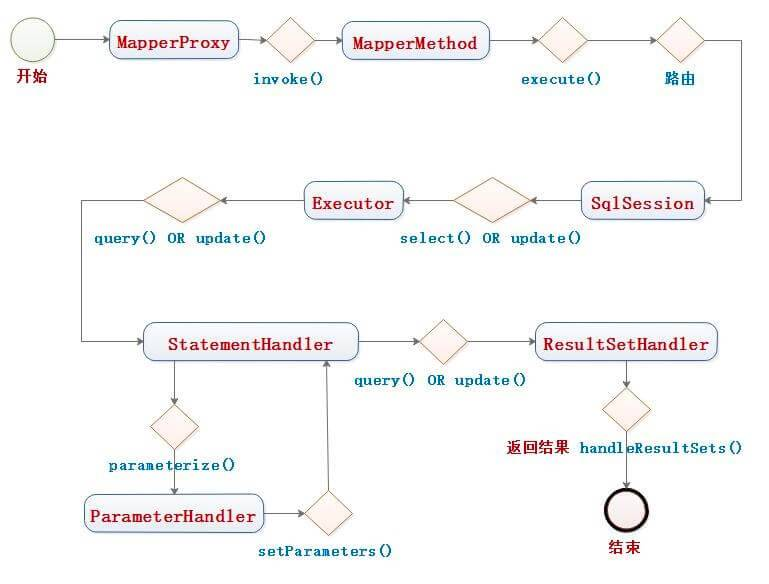

# MyBatis


## MyBatis 与 Hibernate 有哪些不同


Mybatis 和 Hibernate 不同，它**不完全是**一个 ORM 框架，因为MyBatis 需要程序员自己编写 SQL 语句。不过 MyBatis 可以通过 XML 或注解方式灵活配置要运行的 SQL 语句，并将 Java 对象和 SQL 语句映射生成最终执行的 SQL ，最后将 SQL 执行的结果再映射生成 Java 对象。

**Mybatis 学习门槛低**，简单易学，程序员直接编写原生态 SQL ，可严格控制 SQL 执行性能，灵活度高。但是灵活的前提是 MyBatis 无法做到数据库无关性，如果需要实现支持多种数据库的软件则需要自定义多套 SQL 映射文件，工作量大。

Hibernate 对象/关系映射能力强，数据库无关性好。如果用 Hibernate 开发可以节省很多代码，提高效率。但是 Hibernate 的缺点是学习门槛高，要精通门槛更高，而且怎么设计 O/R 映射，在性能和对象模型之间如何权衡，以及怎样用好 Hibernate 需要具有很强的经验和能力才行。

总之，按照用户的需求在有限的资源环境下只要能做出维护性、扩展性良好的软件架构都是好架构，所以框架只有适合才是最好。简单总结如下：

- Hibernate 属于全自动 ORM 映射工具，使用 Hibernate 查询关联对象或者关联集合对象时，可以根据对象关系模型直接获取。
- Mybatis 属于半自动 ORM 映射工具，在查询关联对象或关联集合对象时，需要手动编写 SQL 来完成。


##  动态 SQL 


MyBatis 动态SQL，可以让我们在XML映射文件内，以XML标签的形式编写动态SQL，完成逻辑判断和动态拼接SQL的功能。

Mybatis 提供了9种动态SQL标签：<if />、<choose />、<when />、<otherwise />、<trim />、<where />、<set />、<foreach />、<bind /> 。

其执行原理为，使用OGNL表达式，从SQL参数对象中计算表达式的值，根据表达式的值动态拼接SQL,以此来完成动态SQL的功能。


## `#{}` 和 `${}` 的区别


`${}` 是 Properties 文件中的变量占位符，它可以用于 XML 标签属性值和 SQL 内部，属于**字符串替换**。例如将 `${driver}` 会被静态替换为 `com.mysql.jdbc.Driver` ：

```xml
<dataSource type="UNPOOLED">
    <property name="driver" value="${driver}"/>
    <property name="url" value="${url}"/>
    <property name="username" value="${username}"/>
</dataSource>
```

`${}` 也可以对传递进来的参数**原样拼接**在 SQL 中。代码如下：

```xml
<select id="getSubject3" parameterType="Integer" resultType="Subject">
    SELECT * FROM subject
    WHERE id = ${id}
</select>
```

- 实际场景下，不推荐这么做。因为，可能有 SQL 注入的风险。


`#{}` 是 SQL 的参数占位符，Mybatis 会将 SQL 中的 `#{}` 替换为 `?` 号，在 SQL 执行前会使用 PreparedStatement 的参数设置方法，按序给 SQL 的 `?` 号占位符设置参数值，比如 `ps.setInt(0, parameterValue)` 。 所以，`#{}` 是**预编译处理**，可以有效防止 SQL 注入，提高系统安全性。


另外，`#{}` 和 `${}` 的取值方式非常方便。例如：`#{item.name}` 的取值方式，为使用反射从参数对象中，获取 `item` 对象的 `name` 属性值，相当于 `param.getItem().getName()` 。


## ~~Mybatis 能否执行一对一、一对多的关联查询吗？都有哪些实现方式，以及它们之间的区别~~


能，Mybatis 不仅可以执行一对一、一对多的关联查询，还可以执行多对一，多对多的关联查询。

>艿艿：不过貌似，我自己实际开发中，还是比较喜欢自己去查询和拼接映射的数据。😈


- 多对一查询，其实就是一对一查询，只需要把 `selectOne(...)` 修改为 `selectList(...)` 即可。案例可见 [《MyBatis：多对一表关系详解》](https://blog.csdn.net/xzm_rainbow/article/details/15336959) 。
- 多对多查询，其实就是一对多查询，只需要把 `#selectOne(...)` 修改为 `selectList(...)` 即可。案例可见 [《【MyBatis学习10】高级映射之多对多查询》](https://blog.csdn.net/eson_15/article/details/51655188) 。


关联对象查询，有两种实现方式：

> 所有的技术方案，即会有好处，又会有坏处。很难出现一个完美的银弹方案。

- 一种是单独发送一个SQL去查询关联对象，赋给主对象，然后返回主对象。好处是多条SQL分开，相对简单，坏处是发起的SQL可能会比较多。
- 另一种是使用嵌套查询，嵌套查询的含义为使用 join 查询，一部分列是 A 对象的属性值，另外一部分列是关联对象 B 的属性值。好处是只发一个 SQL 查询，就可以把主对象和其关联对象查出来，坏处是 SQL 可能比较复杂。

那么问题来了，`join` 查询出来 100 条记录，如何确定主对象是 5 个，而不是 100 个呢？其去重复的原理是 `<resultMap>` 标签内的`<id>` 子标签，指定了唯一确定一条记录的 `id` 列。Mybatis 会根据`<id>` 列值来完成 100 条记录的去重复功能，`<id>` 可以有多个，代表了联合主键的语意。

同样主对象的关联对象，也是根据这个原理去重复的。尽管一般情况下，只有主对象会有重复记录，关联对象一般不会重复。例如：下面 `join` 查询出来6条记录，一、二列是 Teacher 对象列，第三列为 Student 对象列。Mybatis 去重复处理后，结果为 1 个老师和 6 个学生，而不是 6 个老师和 6 个学生。

| t_id | t_name  | s_id |
| :--- | :------ | :--- |
| 1    | teacher | 38   |
| 1    | teacher | 39   |
| 1    | teacher | 40   |
| 1    | teacher | 41   |
| 1    | teacher | 42   |
| 1    | teacher | 43   |


## MyBatis 编程步骤


1. 创建 SqlSessionFactory 对象。

2. 通过 SqlSessionFactory 获取 SqlSession 对象。

3. 通过 SqlSession 获得 Mapper 代理对象。

4. 通过 Mapper 代理对象，执行数据库操作。

5. 执行成功，则使用 SqlSession 提交事务。

6. 执行失败，则使用 SqlSession 回滚事务。

7. 最终，关闭会话。

   


## Mapper 接口的工作原理


Mapper 接口，对应的关系如下：

- 接口的权限名，就是映射文件中的“namespace”的值
- 接口的方法名，就是映射文件中MappedStatement 的`"id"` 值。
- 接口方法内的参数，就是传递给SQL的参数


Mapper 接口是没有实现类的，当调用接口方法时，接口 全限名 + 方法名拼接字符串作为key值，可唯一定位一个对应的 MappedStatement 。举例：`com.mybatis3.mappers.StudentDao.findStudentById` ，可以唯一找到 `"namespace"` 为 `com.mybatis3.mappers.StudentDao` 下面 `"id"` 为 `findStudentById` 的 MappedStatement 。

总结来说，在 Mybatis 中，每一个 `<select />`、`<insert />`、`<update />`、`<delete />` 标签，都会被解析为一个 MappedStatement 对象。

另外，Mapper接口的实现类，通过MyBatis使用**JDK Proxy**自动生成其代理对象Proxy，而代理对象Proxy会拦截接口方法，从而“调用”对应的 MappedStatement 方法，最终执行 SQL ，返回执行结果。整体流程如下图：



其中，SqlSession 在调用 Executor 之前，会获得对应的 MappedStatement 方法。例如：`DefaultSqlSession#select(String statement, Object parameter, RowBounds rowBounds, ResultHandler handler)` 方法，代码如下：

```java
// DefaultSqlSession.java

@Override
public void select(String statement, Object parameter, RowBounds rowBounds, ResultHandler handler) {
    try {
        // 获得 MappedStatement 对象
        MappedStatement ms = configuration.getMappedStatement(statement);
        // 执行查询
        executor.query(ms, wrapCollection(parameter), rowBounds, handler);
    } catch (Exception e) {
        throw ExceptionFactory.wrapException("Error querying database.  Cause: " + e, e);
    } finally {
        ErrorContext.instance().reset();
    }
}
```

Mapper 接口里的方法，是不能重载的，因为是**全限名 + 方法名**的保存和寻找策略。😈 所以有时，想个 Mapper 接口里的方法名，还是蛮闹心的。

