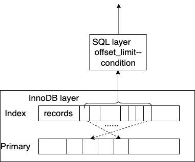
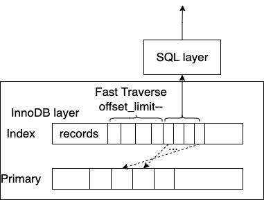
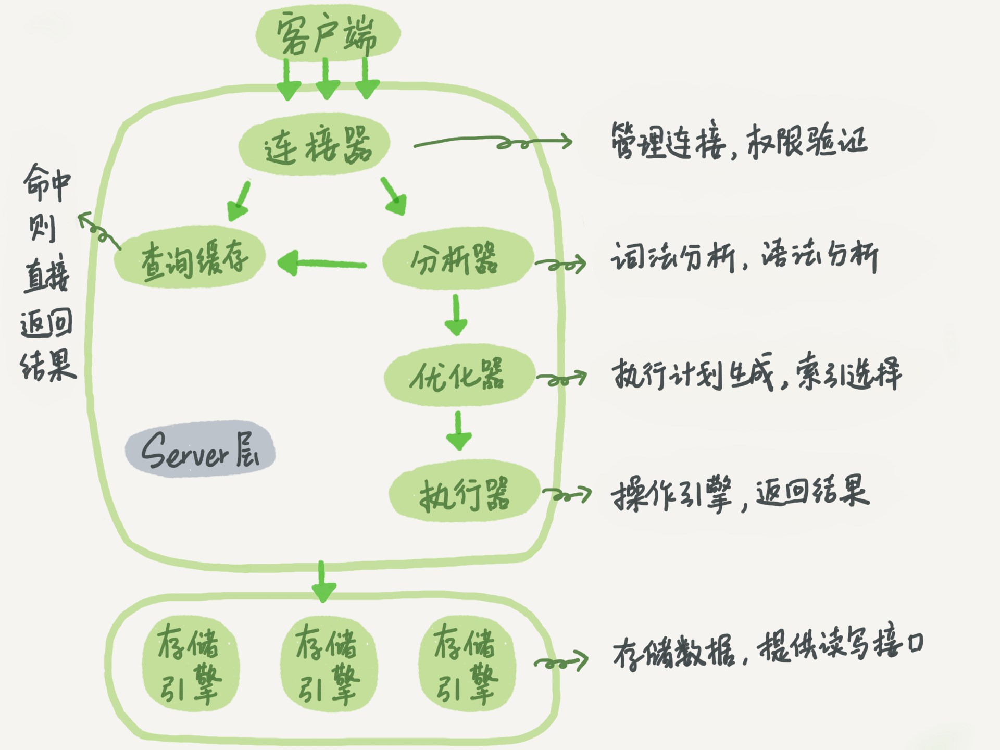
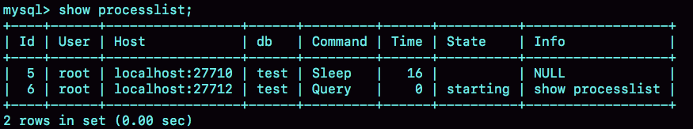
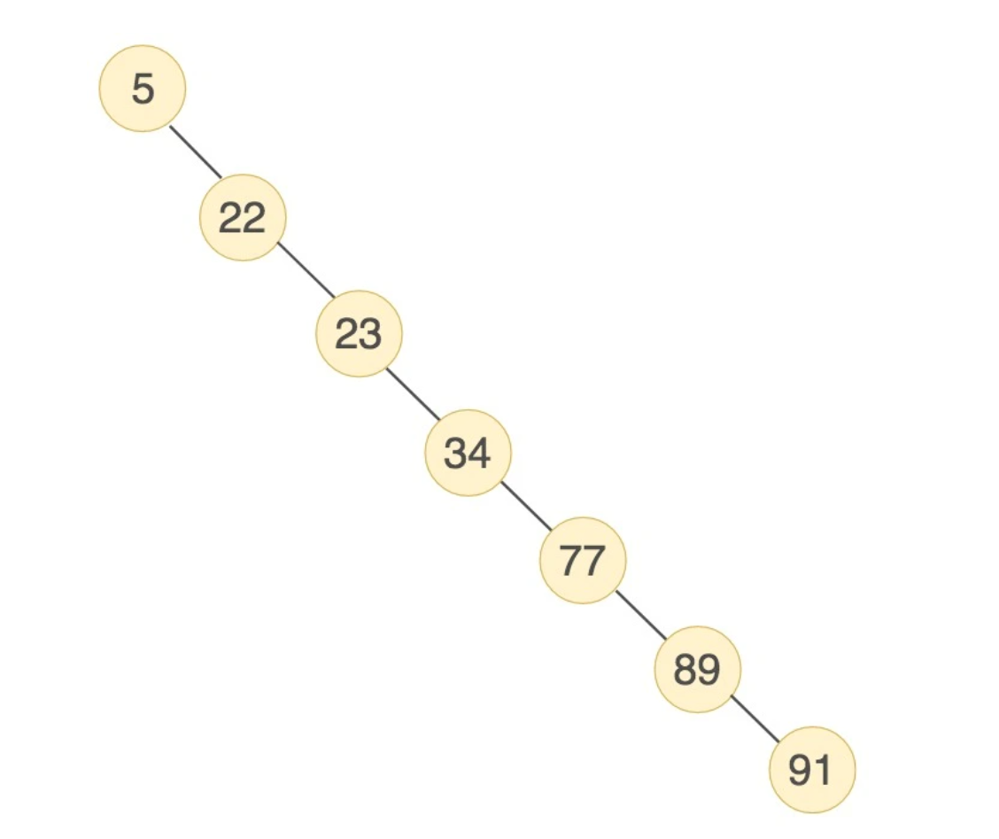
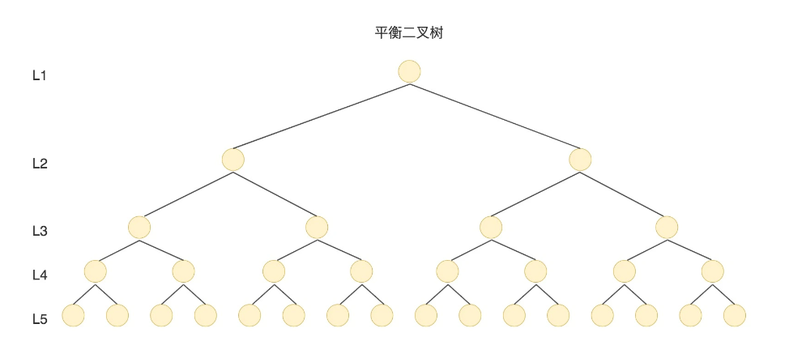
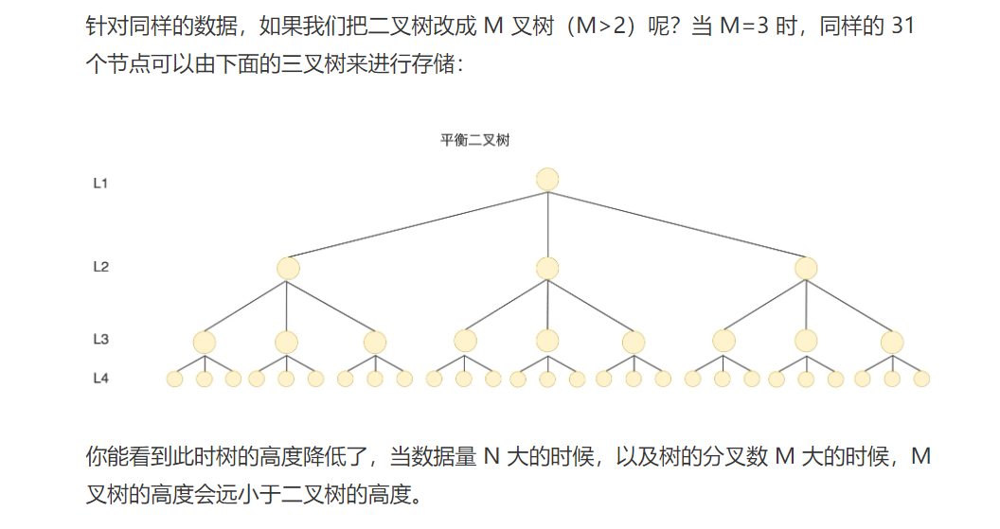
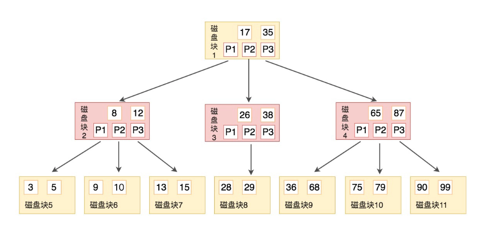
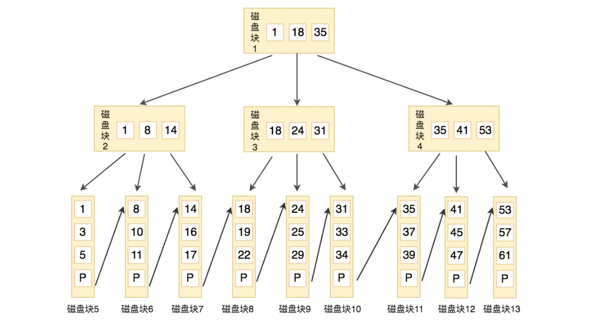

# MySQL 


注意：这是专为面试准备的，力求简洁，有深度。一定要简介，负责会臃肿不堪。


## MySQL 有哪些存储引擎？


### 存储引擎简介

MySQL中的数据用各种不同的技术存储在文件(或者内存)中。这些技术中的每一种技术都使用不同的存储机制、索引技巧、锁定水平并且最终提供广泛的不同的功能和能力。


### InnoDB


- 【最重要】支持事务。
- 支持行级锁和表级锁，能支持更多的并发量。
- ~~查询不加锁，完全不影响查询。~~
- 支持崩溃后恢复。


### MyISAM

- 不支持事务。
- 使用表级锁，如果数据量大，一个插入操作锁定表后，其他请求都将阻塞。


#### 存储

每个`MyISAM`表都以两个文件的形式存储在磁盘上。这些文件的名称以表名开头，并具有指示文件类型的扩展名。数据文件具有 `.MYD`( `MYData`) 扩展名。索引文件具有`.MYI` ( `MYIndex`) 扩展名。


#### **MyISAM** 存储引擎特征

| 特征         | 支持 |
| ------------ | ---- |
| **聚集索引** | 不   |
| **B 树索引** | 是   |
| **锁定粒度** | 表   |
| **事务**     | 不   |


- **加锁并发**

MyISAM 对张表加锁，而不是针对行。读取时会对需要读到的所有表加共享锁，写入时则对表加排他锁。但是在表有读取查询的同时，也可以往表中插入新的记录（这被称为并发插入）

> 并发插入
>
> 存储`MyISAM`引擎支持并发插入，以减少给定表的读取者和写入者之间的争用：如果表`MyISAM`在数据文件中没有空洞（中间删除了行），则 [`INSERT`](https://dev.mysql.com/doc/refman/8.0/en/insert.html)可以执行语句将行添加到表的末尾同时该 [`SELECT`](https://dev.mysql.com/doc/refman/8.0/en/select.html)语句从表中读取行。如果有多个 [`INSERT`](https://dev.mysql.com/doc/refman/8.0/en/insert.html)语句，它们将排队并按顺序执行，与 [`SELECT`](https://dev.mysql.com/doc/refman/8.0/en/select.html)语句同时执行。并发的结果[`INSERT`](https://dev.mysql.com/doc/refman/8.0/en/insert.html)可能不会立即可见。


- **修复**

对于MyISAM表，MySQL可以手工或者自动执行检查和修复操作，但这里说的修复和事务恢复以及崩溃恢复是不同的概念。执行表的修复可能导致一些数据丢失。


## 事务

事务只是一个改变，是一些的操作集合；用专业的术语去解释，就是一个程序的执行单元；事务本身并不包含这四个特性，我们需要通过某些手段，尽可能让这个执行单元满足这四个特性，那么，我们就可以称它是一个事务，或者说是一个正确的，完美的事务。


### ACID

在关系型数据库中，事务具有 ACID 四个基本属性。数据库事务的 ACID 四大特性是事务的基础，了解了 ACID 是如何实现的，我们也就清楚了事务的实现。


#### 原子性（Atomicity）

一个事务必须被视为一个不可分割的最小工作单元，整个事务中的所有操作要么全部提交成功，要么全部失败回滚，对于一个事务来说，不可能只执行其中的一部分操作，这就是事务的原子性。


##### 回滚日志

想要保证事务的原子性，就需要在异常发生时，对已经执行的操作进行**回滚**，而在 MySQL 中，恢复机制是通过*回滚日志*（undo log）实现的，所有事务进行的修改都会先记录到这个回滚日志中，然后在对数据库中的对应行进行写入。


这个过程其实非常好理解，为了能够在发生错误时撤销之前的全部操作，肯定是需要将之前的操作都记录下来的，这样在发生错误时才可以回滚。

回滚日志除了能够在发生错误或者用户执行 `ROLLBACK` 时提供回滚相关的信息，它还能够在整个系统发生崩溃、数据库进程直接被杀死后，当用户再次启动数据库进程时，还能够立刻通过查询回滚日志将之前未完成的事务进行回滚，这也就需要回滚日志必须先于数据持久化到磁盘上，是我们需要先写日志后写数据库的主要原因。

回滚日志并不能将数据库物理地恢复到执行语句或者事务之前的样子；它是逻辑日志，当回滚日志被使用时，它只会按照日志**逻辑地**将数据库中的修改撤销掉看，可以**理解**为，我们在事务中使用的每一条 `INSERT` 都对应了一条 `DELETE`，每一条 `UPDATE` 也都对应一条相反的 `UPDATE` 语句。


#### 一致性（Consistency）


数据库总是从一个一致性的状态转换到另外一个一致性的状态。


#### 隔离性(isolation)

通常来说，一个事务所作的修改在最终提交以前，对其他事务是不可见的。后面我们讨论隔离级别的时候，会发现为什么我们说“通常来说”是不可见的。


##### 隔离级别的实现

数据库对于隔离级别的实现就是使用**并发控制机制**对在同一时间执行的事务进行控制，限制不同的事务对于同一资源的访问和更新。


#### 持久性（durability）

一旦事务提交，则其所作的修改就会永久保存到数据库中。即使此时系统崩溃，修改的数据也不会丢失。


##### 重做日志

与原子性一样，事务的持久性也是通过日志来实现的，MySQL 使用重做日志（redo log）实现事务的持久性，重做日志由两部分组成，一是内存中的重做日志缓冲区，因为重做日志缓冲区在内存中，所以它是易失的，另一个就是在磁盘上的重做日志文件，它是持久的。


当我们在一个事务中尝试对数据进行修改时，它会先将数据从磁盘读入内存，并更新内存中缓存的数据，然后生成一条重做日志并写入重做日志缓存，当事务真正提交时，MySQL 会将重做日志缓存中的内容刷新到重做日志文件，再将内存中的数据更新到磁盘上，图中的第 4、5 步就是在事务提交时执行的。

在 InnoDB 中，重做日志都是以 512 字节的块的形式进行存储的，同时因为块的大小与磁盘扇区大小相同，所以重做日志的写入可以保证原子性，不会由于机器断电导致重做日志仅写入一半并留下脏数据。

除了所有对数据库的修改会产生重做日志，因为回滚日志也是需要持久存储的，它们也会创建对应的重做日志，在发生错误后，数据库重启时会从重做日志中找出未被更新到数据库磁盘中的日志重新执行以满足事务的持久性。


### 隔离级别


#### 并发情况下事务引发的问题

> 一般情况下，多个单元操作（事务，这里的事务，并不是完美的事务）并发执行，会出现这么几个问题：

- 脏读：A事务还未提交，B事务就读到了A操作的结果。（破坏了隔离性）
- 不可重复读：A事务在本次事务中，对自己未操作过数据，进行多次读取，结果出现不一致或记录不存在的情况。（破坏了一致性，重点是update和delete）
- 幻读：A事务在本次事务中，先读取了一遍数据，发现数据不存在，过了一会，又读取了一遍，发现又有数据了。（破坏了一致性，重点是insert）


#### 解决（制定标准）

为了权衡『隔离』和『并发』的矛盾，ISO定义了4个事务隔离级别，每个级别隔离程度不同，允许出现的副作用也不同。

- 未提交读（read-uncommitted）：最低级别，基本只保证持久性；会出现脏读，不可重复读，幻读的问题。
- 已提交读（read-committed）：语句级别；会出现不可重复读，幻读的问题。
- 可重复读（repeatable-read）：事务级别；只会出现幻读问题。
- 串行化（serializable）：最高级别，也就是事务与事务完全串行化执行，无并发可言，性能低；但不会出现任何问题。

| 事务隔离级别                 | 脏读 | 不可重复读 | 幻读 |
| ---------------------------- | ---- | ---------- | ---- |
| 读未提交（read-uncommitted） | 会   | 会         | 会   |
| 不可重复读（read-committed） | -    | 会         | 会   |
| 可重复读（repeatable-read）  | -    | -          | 会   |
| 串行化（serializable）       | -    | -          | -    |

注意：这四个级别只是一个标准，各个数据库厂商，并不完全按照标准做的。


#### 实现（InnoDB）

- 锁机制：阻止其他事务对数据进行操作， 各个隔离级别主要体现在读取数据时加的锁的释放时机。
  - RU：事务读取时不加锁
  - RC：事务读取时加行级共享锁（读到才加锁），一旦读完，立刻释放（并不是事务结束）。
  - RR：事务读取时加行级共享锁，直到事务结束时，才会释放。
  - SE：事务读取时加表级共享锁，直到事务结束时，才会释放。

- MVCC机制：生成一个数据快照，并用这个快照来提供一定级别的一致性读取，也称为多版本数据控制。
  - 实际就是『版本控制』加『读写分离』思想，主要用作于RC和RR级别。
  - 这里面就太细了，主要涉及到事务原理和索引，就不讲了，因为！第一：面试要求讲MVCC的原理比较少，第二：主要我讲了你必然记不住，这也是为什么问的比较少的原因了，因为面试官自己肯定是记不住的。除非像在下一样，每天每天的看，感觉忘了就看。一般人也做不到。如果面试被问到了，肯定是面试官上班无聊，刷到一些软文，自己看了看，觉得写得很好，随口就问了。

## 复制


## 分页


在社区MySQL中，业务如果对大表做深度分页查询往往性能很差，查询的响应时间很难满足业务的需求。PolarDB MySQL对深度分页场景优化，可以极大提升分页查询性能。


### 社区MySQL深度分页


我们基于TPCH(Scale 10)的表举例，比如业务对订单明细表（lineitem表）按照特定发货日期(l_shipDATE列)范围查询订单明细信息。 如果100行每页，我们查询1万页以后的查询如下：

```sql
SELECT *
FROM   lineitem
WHERE  l_shipdate > '1997-01-01'
       AND l_shipdate < '1997-08-01'
ORDER  BY l_shipdate
LIMIT  1000000, 100;
```


在社区MySQL中，我们可以看到如下执行计划，选择了列l_shipDATE的索引，利用索引序不需要做额外的sort操作。

```sql
mysql> explain select * from lineitem where l_shipDATE >'1997-01-01' and l_shipDATE < '1997-05-01' order by l_shipDATE limit 1000000, 100\G
*************************** 1. row ***************************
           id: 1
  select_type: SIMPLE
        table: lineitem
   partitions: NULL
         type: range
possible_keys: i_l_shipdate
          key: i_l_shipdate
      key_len: 4
          ref: NULL
         rows: 5820160
     filtered: 100.00
        Extra: Using index condition

在PolarDB中对optimizer_switch做如下设置，可以得到社区MySQL的执行计划。
mysql> set @@optimizer_switch='limit_offset_pushdown=off,detach_range_condition=off';
```

上述深度分页查询，当完全是冷数据的时候需要48.77s，全在内存中时候耗时也需要4.99s。这对于使用该业务的客户，等待时间就很难接受。


```sql
mysql> select * from lineitem where l_shipDATE >'1997-01-01' and l_shipDATE < '1997-05-01' order by l_shipDATE limit 1000000, 100;
```


而且该时间会随着数据量的增加而大幅增加，当200万行数据的时候冷数据要63.17s，热数据要10.04s。这里冷数据没有线性增加是因为物理IO因为已经读取的page在后面被使用而没有线性增加。如果是InnoDB buffer pool相比读取数据小，比如这里200万行的读取，设置Buffer pool size为128M，那么执行时间就需要225s。


```sql
mysql> select * from lineitem where l_shipDATE >'1997-01-01' and l_shipDATE < '1997-05-01' order by l_shipDATE limit 2000000, 100;
```


MySQL中所有的分页操作都会从存储引擎中将数据行逐行取出，上面的查询还要回表取非索引列数据，然后交给SQL层，SQL层检查条件，然后将不需要返回给客户端的offset数据过滤掉。




### PolarDB深度分页


在PolarDB中，优化器会分析深度分页查询的谓词条件，如果谓词条件能够在引擎的扫描范围中体现，那么就会把谓词条件的检查完全下推到引擎层，从SQL层移除。上面场景中移除谓词条件后，PolarDB会把分页数据中offset的扫描也下推到引擎层，做快速的扫描过滤。同时如果需要回表访问，PolarDB会仅对最后需要返回客户端数据做回表，极大的减少开销。



上面的查询在PolarDB中默认计划如下：

```sql
mysql> explain select * from lineitem where l_shipDATE >'1997-01-01' and l_shipDATE < '1997-05-01' order by l_shipDATE limit 1000000, 100\G
*************************** 1. row ***************************
           id: 1
  select_type: SIMPLE
        table: lineitem
   partitions: NULL
         type: range
possible_keys: i_l_shipdate
          key: i_l_shipdate
      key_len: 4
          ref: NULL
         rows: 5820160
     filtered: 100.00
        Extra: Using limit-offset pushdown
```

在PolarDB中冷数据100w行深度分页执行时间0.21s，热数据执行主要0.07s。 对于200w行的深度分页，冷数据执行时间0.41s，热数据执行时间0.15s。当设置Buffer pool size为128M的时候，执行时间依然为0.15s，因为PolarDB 分页的200w行数据是不需要查询主键的，能够避免大量的随机IO，BP能够缓存大量二级索引数据。


### 性能对比总结

| 100w行深度分页冷数据 | 100w行深度分页热数据 | 200w行深度分页冷数据 | 200w行深度分页热数据 | 200w行深度分页低BP size |        |
| :------------------- | :------------------- | :------------------- | :------------------- | :---------------------- | ------ |
| 社区MySQL            | 48.77s               | 4.99s                | 63.17s               | 10.04s                  | 225s   |
| PolarDB MySQL        | 0.21s                | 0.07                 | 0.41s                | 0.15s                   | 0.15s  |
| PolarDB MySQL提升    | 232倍                | 71倍                 | 154倍                | 67倍                    | 1500倍 |

上面可以看到在通过索引深度分页查询表上各个列信息情况下，PolarDB MySQL可以有67到200倍以上的性能提升，对于Buffer pool size小于数据大小的场景可以有更大的提升。在不需要回表，仅查询二级索引列的场景，热数据情况下PolarDB也可以有6倍性能提升。可参加PolarDB MySQL深度分页优化的官网[功能介绍文档](https://help.aliyun.com/document_detail/437535.html?spm=a2c4g.11186623.0.0.cebf49b1u8jzR7)。


## 一条sql 的执行过程 




大体来说，MySQL 可以分为 Server 层和存储引擎层两部分。

Server 层包括连接器、查询缓存、分析器、优化器、执行器等，涵盖 MySQL 的大多数核
心服务功能，以及所有的内置函数（如日期、时间、数学和加密函数等），所有跨存储引擎
的功能都在这一层实现，比如存储过程、触发器、视图等。

而存储引擎层负责数据的存储和提取。其架构模式是插件式的，支持 InnoDB、MyISAM、
Memory 等多个存储引擎。现在最常用的存储引擎是 InnoDB，它从 MySQL 5.5.5 版本开
始成为了默认存储引擎。


### 连接器


第一步，你会先连接到这个数据库上，这时候接待你的就是连接器。连接器负责跟客户端建
立连接、获取权限、维持和管理连接。连接命令一般是这么写的：

```sql
mysql -h$ip -P$port -u$user -p
```

输完命令之后，你就需要在交互对话里面输入密码。虽然密码也可以直接跟在 -p 后面写在
命令行中，但这样可能会导致你的密码泄露。如果你连的是生产服务器，强烈建议你不要这
么做。


​		连接命令中的 mysql 是客户端工具，用来跟服务端建立连接。在完成经典的 TCP 握手后， 连接器就要		开始认证你的身份，这个时候用的就是你输入的用户名和密码。 


​		如果用户名或密码不对，你就会收到一个"Access denied for user"的错误，然后客户端 程序结束执行。 		如果用户名密码认证通过，连接器会到权限表里面查出你拥有的权限。之后，这个连接里 面的权限判断		逻辑，都将依赖于此时读到的权限。

这就意味着，一个用户成功建立连接后，即使你用管理员账号对这个用户的权限做了修改，
也不会影响已经存在连接的权限。修改完成后，只有再新建的连接才会使用新的权限设置。

连接完成后，如果你没有后续的动作，这个连接就处于空闲状态，你可以在 show
processlist 命令中看到它。文本中这个图是 show processlist 的结果，其中的
Command 列显示为“Sleep”的这一行，就表示现在系统里面有一个空闲连接。



客户端如果太长时间没动静，连接器就会自动将它断开。这个时间是由参数 wait_timeout
控制的，默认值是 8 小时。


### 查询缓存


连接建立完成后，你就可以执行 select 语句了。执行逻辑就会来到第二步：查询缓存。

MySQL 拿到一个查询请求后，会先到查询缓存看看，之前是不是执行过这条语句。之前执
行过的语句及其结果可能会以 key-value 对的形式，被直接缓存在内存中。key 是查询的
语句，value 是查询的结果。如果你的查询能够直接在这个缓存中找到 key，那么这个
value 就会被直接返回给客户端。

如果语句不在查询缓存中，就会继续后面的执行阶段。执行完成后，执行结果会被存入查询 缓存中。你可以看到，如果查询命中缓存，MySQL 不需要执行后面的复杂操作，就可以直 接返回结果，这个效率会很高。 

**但是大多数情况下我会建议你不要使用查询缓存，为什么呢？因为查询缓存往往弊大于利。** 

查询缓存的失效非常频繁，只要有对一个表的更新，这个表上所有的查询缓存都会被清空。
因此很可能你费劲地把结果存起来，还没使用呢，就被一个更新全清空了。对于更新压力大
的数据库来说，查询缓存的命中率会非常低。除非你的业务就是有一张静态表，很长时间才
会更新一次。比如，一个系统配置表，那这张表上的查询才适合使用查询缓存。

**需要注意的是，MySQL 8.0 版本直接将查询缓存的整块功能删掉了，也就是说 8.0 开始彻**
**底没有这个功能了。**


### 分析器


如果没有命中查询缓存，就要开始真正执行语句了。首先，MySQL 需要知道你要做什么，
因此需要对 SQL 语句做解析。


分析器先会做“词法分析”。你输入的是由多个字符串和空格组成的一条 SQL 语句，MySQL 需要识别出里面的字符串分别是什么，代表什么。

MySQL 从你输入的"select"这个关键字识别出来，这是一个查询语句。它也要把字符串“T”识别成“表名 T”，把字符串“ID”识别成“列 ID”。

做完了这些识别以后，就要做“语法分析”。根据词法分析的结果，语法分析器会根据语法规则，判断你输入的这个 SQL 语句是否满足 MySQL 语法。

如果你的语句不对，就会收到“You have an error in your SQL syntax”的错误提醒，比如下面这个语句 select 少打了开头的字母“s”。

**一般语法错误会提示第一个出现错误的位置，所以你要关注的是紧接“use near”的内容。**


### 优化器


经过了分析器，MySQL 就知道你要做什么了。在开始执行之前，还要先经过优化器的处理。

优化器是在表里面有多个索引的时候，决定使用哪个索引；或者在一个语句有多表关联（join）的时候，决定各个表的连接顺序。比如你执行下面这样的语句，这个语句是执行两个表的 join：

```sql
mysql> select * from t1 join t2 using(ID) where t1.c=10 and t2.d=20;
```

既可以先从表 t1 里面取出 c=10 的记录的 ID 值，再根据 ID 值关联到表 t2，再判断 t2里面 d 的值是否等于 20。
也可以先从表 t2 里面取出 d=20 的记录的 ID 值，再根据 ID 值关联到 t1，再判断 t1 里面 c 的值是否等于 10。

这两种执行方法的逻辑结果是一样的，但是执行的效率会有不同，而优化器的作用就是决定选择使用哪一个方案。
优化器阶段完成后，这个语句的执行方案就确定下来了，然后进入执行器阶段。如果你还有一些疑问，比如优化器是怎么选择索引的，有没有可能选择错等等，没关系，我会在后面的文章中单独展开说明优化器的内容。


### 执行器


MySQL 通过分析器知道了你要做什么，通过优化器知道了该怎么做，于是就进入了执行器阶段，开始执行语句。


## 索引的原理：我们为什么用B+树来做索引


索引其实就是一种数据结构，那么今天我们就来看下，索引的数据结构究竟是怎样的？对索引底层的数据结构有了更深入的了解后，就会更了解索引的使用原则。


### 如何评价索引的数据结构设计好坏


数据库服务器有两种存储介质，分别为硬盘和内存。内存属于临时存储，容量有限，而且当发生意外时（比如断电或者发生故障重启）会造成数据丢失；硬盘相当于永久存储介质，这也是为什么我们需要把数据保存到硬盘上。

虽然内存的读取速度很快，但我们还是需要将索引存放到硬盘上，这样的话，当我们在硬盘上进行查询时，也就产生了硬盘的 I/O 操作。相比于内存的存取来说，硬盘的 I/O 存取消耗的时间要高很多。我们通过索引来查找某行数据的时候，需要计算产生的磁盘 I/O 次数，当磁盘 I/O 次数越多，所消耗的时间也就越大。如果我们能让索引的数据结构尽量减少硬盘的 I/O 操作，所消耗的时间也就越小。


### 二叉树的局限性


二分查找法是一种高效的数据检索方式，时间复杂度为 O(log2n)，是不是采用二叉树就适合作为索引的数据结构呢？

有时候二叉树的深度非常大。比如我们给出的数据顺序是 (5, 22, 23, 34, 77, 89, 91)，创造出来的二分搜索树如下图所示：



此时性能上已经退化成了一条链表，查找数据的时间复杂度变成了 O(n)。为了解决这个问题，人们提出了平衡二叉搜索树（AVL 树），它在二分搜索树的基础上增加了约束，每个节点的左子树和右子树的高度差不能超过 1，也就是说节点的左子树和右子树仍然为平衡二叉树。

这里说一下，常见的平衡二叉树有很多种，包括了平衡二叉搜索树、红黑树、数堆、伸展树。平衡二叉搜索树是最早提出来的自平衡二叉搜索树，当我们提到平衡二叉树时一般指的就是平衡二叉搜索树，搜索时间复杂度就是 O(log2n)。

我刚才提到过，数据查询的时间主要依赖于磁盘 I/O 的次数，如果我们采用二叉树的形式，即使通过平衡二叉搜索树进行了改进，树的深度也是 O(log2n)，当 n 比较大时，深度也是比较高的，比如下图的情况：



每访问一次节点就需要进行一次磁盘 I/O 操作，对于上面的树来说，我们需要进行 5 次 I/O 操作。虽然平衡二叉树比较的效率高，但是树的深度也同样高，这就意味着磁盘 I/O 操作次数多，会影响整体数据查询的效率。

针对同样的数据，如果我们把二叉树改成 M 叉树（M>2）呢？当 M=3 时，同样的 31 个节点可以由下面的三叉树来进行存储：




### 什么是 B 树


如果用二叉树作为索引的实现结构，会让树变得很高，增加硬盘的 I/O 次数，影响数据查询的时间。因此一个节点就不能只有 2 个子节点，而应该允许有 M 个子节点 (M>2)。

B 树的出现就是为了解决这个问题，B 树的英文是 Balance Tree，也就是平衡的多路搜索树，它的高度远小于平衡二叉树的高度。在文件系统和数据库系统中的索引结构经常采用 B 树来实现。

B 树的结构如下图所示：



B 树作为平衡的多路搜索树，它的每一个节点最多可以包括 M 个子节点，M 称为 B 树的阶。同时你能看到，每个磁盘块中包括了关键字和子节点的指针。如果一个磁盘块中包括了 x 个关键字，那么指针数就是 x+1。对于一个 100 阶的 B 树来说，如果有 3 层的话最多可以存储约 100 万的索引数据。对于大量的索引数据来说，采用 B 树的结构是非常适合的，因为树的高度要远小于二叉树的高度。

一个 M 阶的 B 树（M>2）有以下的特性：

1. 根节点的儿子数的范围是[2,M]。
2. 每个中间节点包含 k-1 个关键字和 k 个孩子，孩子的数量 = 关键字的数量 +1，k 的取值范围为[ceil(M/2), M]。
3. 叶子节点包括 k-1 个关键字（叶子节点没有孩子），k 的取值范围为[ceil(M/2), M]。
4. 假设中间节点节点的关键字为：Key[1], Key[2], …, Key[k-1]，且关键字按照升序排序，即 Key[i]<Key[i+1]。此时 k-1 个关键字相当于划分了 k 个范围，也就是对应着 k 个指针，即为：P[1], P[2], …, P[k]，其中 P[1]指向关键字小于 Key[1]的子树，P[i]指向关键字属于 (Key[i-1], Key[i]) 的子树，P[k]指向关键字大于 Key[k-1]的子树。
5. 所有叶子节点位于同一层。

B 树相比于平衡二叉树来说磁盘 I/O 操作要少，在数据查询中比平衡二叉树效率要高。


### 什么是 B+ 树


B+ 树基于 B 树做出了改进，主流的 DBMS 都支持 B+ 树的索引方式，比如 MySQL。B+ 树和 B 树的差异在于以下几点：

1. 有 k 个孩子的节点就有 k 个关键字。也就是孩子数量 = 关键字数，而 B 树中，孩子数量 = 关键字数 +1。
2. 非叶子节点的关键字也会同时存在在子节点中，并且是在子节点中所有关键字的最大（或最小）。
3. 非叶子节点仅用于索引，不保存数据记录，跟记录有关的信息都放在叶子节点中。而 B 树中，非叶子节点既保存索引，也保存数据记录。
4. 所有关键字都在叶子节点出现，叶子节点构成一个有序链表，而且叶子节点本身按照关键字的大小从小到大顺序链接。

下图就是一棵 B+ 树，阶数为 3，根节点中的关键字 1、18、35 分别是子节点（1，8，14），（18，24，31）和（35，41，53）中的最小值。每一层父节点的关键字都会出现在下一层的子节点的关键字中，因此在叶子节点中包括了所有的关键字信息，并且每一个叶子节点都有一个指向下一个节点的指针，这样就形成了一个链表。



看起来 B+ 树和 B 树的查询过程差不多，但是 B+ 树和 B 树有个根本的差异在于，B+ 树的中间节点并不直接存储数据。这样的好处都有什么呢？

首先，B+ 树查询效率更稳定。因为 B+ 树每次只有访问到叶子节点才能找到对应的数据，而在 B 树中，非叶子节点也会存储数据，这样就会造成查询效率不稳定的情况，有时候访问到了非叶子节点就可以找到关键字，而有时需要访问到叶子节点才能找到关键字。

其次，B+ 树的查询效率更高，这是因为通常 B+ 树比 B 树更矮胖（阶数更大，深度更低），查询所需要的磁盘 I/O 也会更少。同样的磁盘页大小，B+ 树可以存储更多的节点关键字。

不仅是对单个关键字的查询上，在查询范围上，B+ 树的效率也比 B 树高。这是因为所有关键字都出现在 B+ 树的叶子节点中，并通过有序链表进行了链接。而在 B 树中则需要通过中序遍历才能完成查询范围的查找，效率要低很多。