# Redis


## Redis的基本数据结构类型


大多数小伙伴都知道，Redis有以下这五种基本类型：

- String（字符串）
- Hash（哈希）
- List（列表）
- Set（集合）
- zset（有序集合）

~~它还有三种特殊的数据结构类型~~

- Geospatial
- Hyperloglog
- Bitmap


### Redis 的五种基本数据类型


#### String（字符串）

   

- 简介：String 是Redis最基础的数据结构类型，它是二进制安全的，可以存储图片或者序列化的对象，值最大存储为512M
- 简单使用举例: set key value、get key等
- 应用场景：**点赞次数**、**播放次数**、**共享session**、**分布式锁**，**计数器**、**限流**。
- ~~内部编码~~


C语言的字符串是char[]实现的，而Redis使用**SDS（simple dynamic string）** 封装，sds源码如下：

```c
// 随着版本迭代，已经发生变化，这里仅仅帮助理解
struct sdshdr{
  unsigned int len; // 标记buf的长度
  unsigned int free; //标记buf中未使用的元素个数
  char buf[]; // 存放元素的坑
}
```

**SDS 结构图如下：**

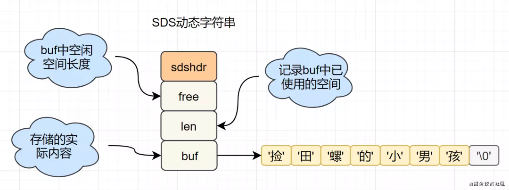


**Redis为什么选择SDS结构，而C语言原生的char[]不香吗？**

1. SDS中，O(1)时间复杂度，就可以获取字符串长度；而C 字符串，需要遍历整个字符串，时间复杂度为O(n)
2. C语言字符数组的结尾位置用“\0”表示，意思是指字符串的结束。不符合 Redis 希望能保存任意二进制数据的需求了。


#### Hash（哈希）


- 简介：在Redis中，哈希类型是指v（值）本身又是一个键值对（k-v）结构
- 简单使用举例：hset key field value 、hget key field
- ~~内部编码：ziplist（压缩列表） 、hashtable（哈希表）~~
- 应用场景：**缓存用户信息**，**未完成的任务信息**等。
- **注意点**：如果开发使用hgetall，哈希元素比较多的话，可能导致Redis阻塞，可以使用hscan。而如果只是获取部分field，建议使用hmget。


**字符串和哈希类型对比如下图：**

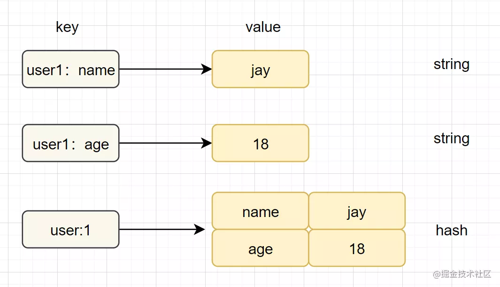


#### List（列表）


- 简介：列表（list）类型是用来存储多个有序的字符串，一个列表最多可以存储2^32-1个元素。
- 简单实用举例：lpush key value [value ...] 、lrange key start end
- ~~内部编码：ziplist（压缩列表）、linkedlist（链表）~~
- 应用场景：**消息队列**，文章列表、（其它堆栈的使用场景）,


一图看懂list类型的插入与弹出：

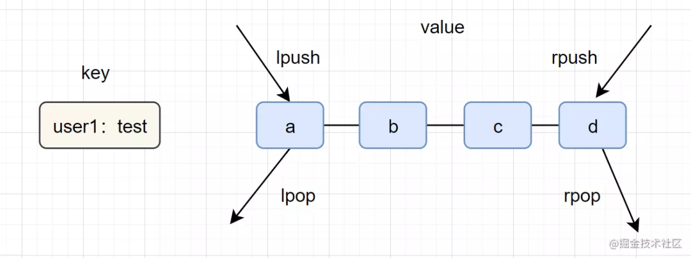

list应用场景参考以下：

```
lpush+lpop=Stack（栈）

lpush+rpop=Queue（队列）

lpsh+ltrim=Capped Collection（有限集合）

lpush+brpop=Message Queue（消息队列）
```


#### Set（集合)


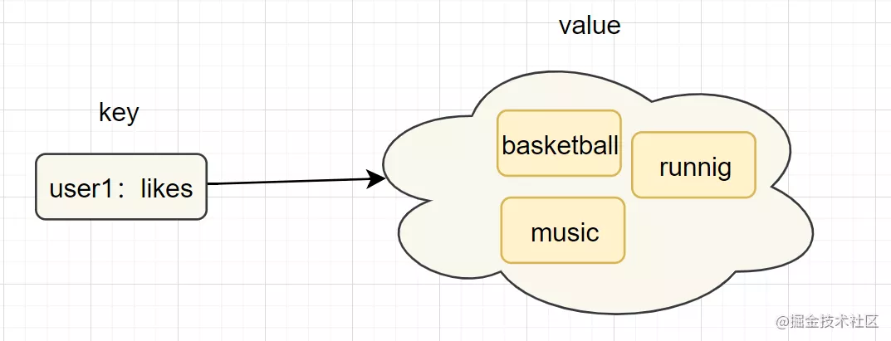

- 简介：集合（set）类型也是用来保存多个字符串元素，但是不允许重复元素
- 简单使用举例：sadd key element [element ...]、smembers key
- ~~内部编码：intset（整数集合）、hashtable（哈希表）~~
- **注意点**：smembers和lrange、hgetall都属于比较重的命令，如果元素过多存在阻塞Redis的可能性，可以使用sscan来完成。
- 应用场景：用户标签,生成随机数抽奖、社交需求。


#### 有序集合（zset）


- 简介：已排序的字符串集合，同时元素不能重复
- 简单格式举例：zadd key score member [score member ...]，zrank key member
- ~~底层内部编码：ziplist（压缩列表）、skiplist（跳跃表）~~
- 应用场景：**排行榜**，社交需求（如用户点赞）,账户积分。


### Redis 的三种特殊数据类型


- Geo：Redis3.2推出的，地理位置定位，用于存储地理位置信息，并对存储的信息进行操作。
- HyperLogLog：用来做基数统计算法的数据结构，如统计网站的UV。
- Bitmaps ：用一个比特位来映射某个元素的状态，在Redis中，它的底层是基于字符串类型实现的，可以把bitmaps成作一个以比特位为单位的数组


#### Geo


Redis GEO 主要用于存储地理位置信息，并对存储的信息进行操作，该功能在 Redis 3.2 版本新增。

Redis GEO 操作方法有：

- geoadd：添加地理位置的坐标。
- geopos：获取地理位置的坐标。
- geodist：计算两个位置之间的距离。
- georadius：根据用户给定的经纬度坐标来获取指定范围内的地理位置集合。
- georadiusbymember：根据储存在位置集合里面的某个地点获取指定范围内的地理位置集合。
- geohash：返回一个或多个位置对象的 geohash 值。

**比如可以用来查询附近的人。**


#### HyperLogLog

HyperLogLog 是一种用于**估计集合中唯一元素数量的算法**，它通过概率统计方法，在极小的内存空间内提供近似的计数结果。这种方法特别适用于需要统计巨[大数据](https://cloud.tencent.com/solution/bigdata?from_column=20065&from=20065)集中唯一元素数量的场景(例如UV场景)。


#### Bitmaps 

位图（Bitmaps）并不是一种实际的数据类型，而是在字符串类型上定义的一组面向位的操作，这种字符串类型被视为位向量。由于字符串是二进制安全的数据块，其最大长度为 512 MB，因此适用于设置多达 2^32 个不同的位。

- `SETBIT` 在给定偏移量上将一个位设置为 0 或 1。
- `GETBIT` 返回给定偏移量上的位的值。
- `BITOP` 允许对一个或多个字符串执行按位操作。

```go
// ShowCurrentMonthSignIn 获取当月签到情况
func ShowCurrentMonthSignIn(accountId int) (map[string]string, error) {
	signKey := makeSignKey(accountId)
	var day int = time.Now().Local().Day()
	offset := fmt.Sprintf("u%d", day)
	result, err := global.GoRedisClient.BitField(context.Background(),
		signKey, "GET", offset, 0).Result()
	if err != nil {
		return nil, err
	}
	signBoolList := make([]bool, 0)
	signDayList := make([]string, 0)
	v := result[0]
	//fmt.Println(v)
	for i := day; i > 0; i-- {
		pos := (day - i) * -1
		day := time.Now().Local().AddDate(0, 0, pos).Format(global.DateFormat1)
		signDayList = append(signDayList, day)
        // 这是一个逻辑表达式，表示如果将v右移一位再左移一位的结果与原来的v不相等，那么表达式的值为true；否则，表达式的值为false。这样做的目的是判断v的最低位是否为1。
		var b = v>>1<<1 != v
		signBoolList = append(signBoolList, b)
		v >>= 1
	}
	//fmt.Println(signDayList)
	//fmt.Println(signBoolList)

	m := make(map[string]string)
	for v := 0; v < len(signBoolList); v++ {
		if signBoolList[v] {
			m[signDayList[v]] = "已签到"
		} else {
			m[signDayList[v]] = "未签到"
		}
	}
	return m, nil
}
```

**如使用Bitmap 统计每月打卡**。

## Redis为什么这么快


### 基于内存存储实现


我们都知道内存读写是比在磁盘快很多的，Redis 基于内存存储实现的数据库，相对于数据存在磁盘的MySQL数据库，省去磁盘I/O的消耗。


### 高效的数据结构


我们知道，Mysql索引为了提高效率，选择了B+树的数据结构。其实合理的数据结构，就是可以让你的应用/程序更快。


#### SDS简单动态字符串


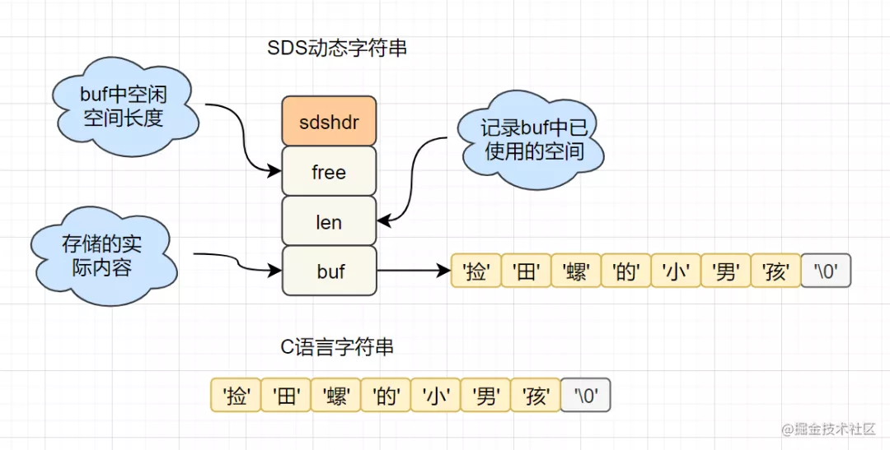


```

字符串长度处理：Redis 获取字符串长度，时间复杂度为O(1)，而C语言中，需要从头开始遍历，复杂度为O(n);

空间预分配：字符串修改越频繁的话，内存分配越频繁，就会消耗性能，而SDS修改和空间扩充，会额外分配未使用的空间，减少性能损耗。

惰性空间释放：SDS 缩短时，不是回收多余的内存空间，而是free记录下多余的空间，后续有变更，直接使用free中记录的空间，减少分配。

二进制安全：Redis可以存储一些二进制数据，在C语言中字符串遇到'\0'会结束，而 SDS中标志字符串结束的是len属性。
```


#### 字典


Redis 作为K-V型内存数据库，所有的键值就是用字典来存储。字典就是哈希表，比如HashMap，通过key就可以直接获取到对应的value。而哈希表的特性，在O（1）时间复杂度就可以获得对应的值。


#### 跳跃表


跳跃表是Redis特有的数据，就是在链表的基础上，增加多级索引提升查找效率。

跳跃表支持平均O（logN）,最坏O（N）复杂度的节点查找，还可以通过顺序性操作批量处理节点。


### ~~合理的数据编码~~


Redis 支持多种数据数据类型，每种基本类型，可能对多种数据结构。什么时候,使用什么样数据结构，使用什么样编码，是redis设计者总结优化的结果。

> String：如果存储数字的话，是用int类型的编码;如果存储非数字，小于等于39字节的字符串，是embstr；大于39个字节，则是raw编码。
>
> List：如果列表的元素个数小于512个，列表每个元素的值都小于64字节（默认），使用ziplist编码，否则使用linkedlist编码
>
> Hash：哈希类型元素个数小于512个，所有值小于64字节的话，使用ziplist编码,否则使用hashtable编码。
>
> Set：如果集合中的元素都是整数且元素个数小于512个，使用intset编码，否则使用hashtable编码。
>
> Zset：当有序集合的元素个数小于128个，每个元素的值小于64字节时，使用ziplist编码，否则使用skiplist（跳跃表）编码


### 合理的线程模型


**I/O 多路复用**

>多路I/O复用技术可以让单个线程高效的处理多个连接请求，而Redis使用用epoll作为I/O多路复用技术的实现。并且，Redis自身的事件处理模型将epoll中的连接、读写、关闭都转换为事件，不在网络I/O上浪费过多的时间。


什么是I/O多路复用？

>I/O ：网络 I/O
>
>多路 ：多个网络连接
>
>复用：复用同一个线程
>
>IO多路复用其实就是一种同步IO模型，它实现了一个线程可以监视多个文件句柄；一旦某个文件句柄就绪，就能够通知应用程序进行相应的读写操作；而没有文件句柄就绪时,就会阻塞应用程序，交出cpu。


**单线程模型**

- Redis是单线程模型的，而单线程避免了CPU不必要的上下文切换和竞争锁的消耗。也正因为是单线程，如果某个命令执行过长（如hgetall命令），会造成阻塞。Redis是面向快速执行场景的数据库。所以要慎用如smembers和lrange、hgetall等命令。
- Redis 6.0 引入了多线程提速，它的执行命令操作内存的仍然是个单线程。


## 虚拟内存机制


Redis直接自己构建了VM机制 ，不会像一般的系统会调用系统函数处理，会浪费一定的时间去移动和请求。

**Redis的虚拟内存机制是啥呢？**

> 虚拟内存机制就是暂时把不经常访问的数据(冷数据)从内存交换到磁盘中，从而腾出宝贵的内存空间用于其它需要访问的数据(热数据)。通过VM功能可以实现冷热数据分离，使热数据仍在内存中、冷数据保存到磁盘。这样就可以避免因为内存不足而造成访问速度下降的问题。


## Redis6新特性之IO多线程

作为Redis6版本中的其中一大新特性，IO多线程大大提升了Redis的并发性能。该功能也是在社区内被反复提起，而之前Antirez在自己的博客中也曾经做过简单的介绍：

http://antirez.com/news/126


### 为什么Redis6.0之前是单线程模型

首先我们要明确一个共识，我们通常所说的Redis单线程是指获取 (socket 读)、解析、执行、内容返回 (socket 写) 等都由一个顺序串行的主线程处理，这个主线程就是我们平时说的"单线程"，而其他的清理脏数据、无用连接的释放、LRU淘汰策略等等也是有其他线程在处理的，因此其实在Redis6之前的Redis本质上也是多线程的。

为什么这些操作要放在同一个主线程中，官方给出的解释：传送门 

- 通常瓶颈不在 CPU，而是在内存和网络IO；

- 多线程会带来线程不安全的情况；
- 多线程可能存在线程切换、甚至加锁解锁、死锁造成的性能损耗；
- 单线程降低了Redis内部实现复杂度；
- hash的惰性rehash，lpush等线程不安全的命令可以无锁执行；


### 从单线程处理网络请求到多线程处理

**在 Redis 6.0 中，非常受关注的第一个新特性就是多线程**。这是因为，Redis 一直被大家熟知的就是它的单线程架构，虽然有些命令操作可以用后台线程或子进程执行（比如数据删除、快照生成、AOF 重写），但是，从网络 IO 处理到实际的读写命令处理，都是由单个线程完成的。

随着网络硬件的性能提升，Redis 的性能瓶颈有时会出现在网络 IO 的处理上，也就是说，**单个主线程处理网络请求的速度跟不上底层网络硬件的速度。**

redis采用多个 IO 线程来处理网络请求，提高网络请求处理的并行度。

但是，Redis 的多 IO 线程只是用来处理网络请求的，对于读写命令，Redis 仍然使用单线程来处理。这是因为，Redis 处理请求时，网络处理经常是瓶颈，通过多个 IO 线程并行处理网络操作，可以提升实例的整体处理性能。而继续使用单线程执行命令操作，就不用为了保证 Lua 脚本、事务的原子性，额外开发多线程互斥机制了。这样一来，Redis 线程模型实现就简单了。

我们来看下，在 Redis 6.0 中，主线程和 IO 线程具体是怎么协作完成请求处理的。掌握了具体原理，你才能真正地会用多线程。为了方便你理解，我们可以把主线程和多 IO 线程的协作分成四个阶段。

**阶段一：服务端和客户端建立 Socket 连接，并分配处理线程**

首先，主线程负责接收建立连接请求。当有客户端请求和实例建立 Socket 连接时，主线程会创建和客户端的连接，并把 Socket 放入全局等待队列中。紧接着，主线程通过轮询方法把 Socket 连接分配给 IO 线程。

**阶段二：IO 线程读取并解析请求**

主线程一旦把 Socket 分配给 IO 线程，就会进入阻塞状态，等待 IO 线程完成客户端请求读取和解析。因为有多个 IO 线程在并行处理，所以，这个过程很快就可以完成。

**阶段三：主线程执行请求操作**

等到 IO 线程解析完请求，主线程还是会以单线程的方式执行这些命令操作。下面这张图显示了刚才介绍的这三个阶段，你可以看下，加深理解。


**阶段四：IO 线程回写 Socket 和主线程清空全局队列**

当主线程执行完请求操作后，会把需要返回的结果写入缓冲区，然后，主线程会阻塞等待 IO 线程把这些结果回写到 Socket 中，并返回给客户端。

和 IO 线程读取和解析请求一样，IO 线程回写 Socket 时，也是有多个线程在并发执行，所以回写 Socket 的速度也很快。等到 IO 线程回写 Socket 完毕，主线程会清空全局队列，等待客户端的后续请求。

我也画了一张图，展示了这个阶段主线程和 IO 线程的操作，你可以看下。

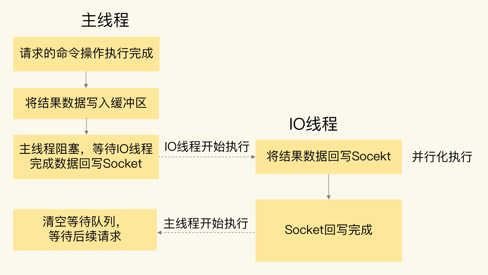

参考：[Redis6新特性之IO多线程](https://www.modb.pro/db/27969)


## 缓存击穿、缓存穿透、缓存雪崩


### 缓存穿透问题

**缓存穿透**：指查询一个一定不存在的数据，由于缓存是不命中时需要从数据库查询，查不到数据则不写入缓存，这将导致这个不存在的数据每次请求都要到数据库去查询，进而给数据库带来压力。

缓存穿透一般都是这几种情况产生的：

- **业务不合理的设计**，比如大多数用户都没开守护，但是你的每个请求都去缓存，查询某个userid查询有没有守护。
- **业务/运维/开发失误的操作**，比如缓存和数据库的数据都被误删除了。
- **黑客非法请求攻击**，比如黑客故意捏造大量非法请求，以读取不存在的业务数据。


如何避免缓存穿透呢？一般有三种方法

- 如果是非法请求，我们在API入口，对参数进行校验，过滤非法值。
- 如果查询数据库为空，我们可以给缓存设置个空值，或者默认值。但是如有有写请求进来的话，需要更新缓存哈，以保证缓存一致性，同时，最后给缓存设置适当的过期时间。（业务上比较常用，简单有效）
- 使用布隆过滤器快速判断数据是否存在。即一个查询请求过来时，先通过布隆过滤器判断值是否存在，存在才继续往下查。

>布隆过滤器原理：它由初始值为0的位图数组和N个哈希函数组成。一个对一个key进行N个hash算法获取N个值，在比特数组中将这N个值散列后设定为1，然后查的时候如果特定的这几个位置都为1，那么布隆过滤器判断该key存在


### 缓存雪崩问题


**缓存雪崩：** 指缓存中数据大批量到过期时间，而查询数据量巨大，请求都直接访问数据库，引起数据库压力过大甚至down机。

- 缓存雪奔一般是由于大量数据同时过期造成的，对于这个原因，可通过均匀设置过期时间解决，即让过期时间相对离散一点。如采用一个较大固定值+一个较小的随机值，5小时+0到1800秒酱紫。
- Redis 故障宕机也可能引起缓存雪崩。这就需要构造Redis高可用集群啦。


### 缓存击穿问题


**缓存击穿：** 指热点key在某个时间点过期的时候，而恰好在这个时间点对这个Key有大量的并发请求过来，从而大量的请求打到db。

缓存击穿看着有点像，其实它两区别是，缓存雪奔是指数据库压力过大甚至down机，缓存击穿只是大量并发请求到了DB数据库层面。可以认为击穿是缓存雪奔的一个子集吧。有些文章认为它俩区别，是区别在于击穿针对某一热点key缓存，雪奔则是很多key。

解决方案就有两种：

- **1.使用互斥锁方案**。缓存失效时，不是立即去加载db数据，而是先使用某些带成功返回的原子操作命令，如(Redis的setnx）去操作，成功的时候，再去加载db数据库数据和设置缓存。否则就去重试获取缓存。
- **2. “永不过期”**，是指没有设置过期时间，但是热点数据快要过期时，异步线程去更新和设置过期时间。


## 什么是热Key问题，如何解决热key问题


**什么是热Key呢**？在Redis中，我们把访问频率高的key，称为热点key。

如果某一热点key的请求到服务器主机时，由于请求量特别大，可能会导致主机资源不足，甚至宕机，从而影响正常的服务。

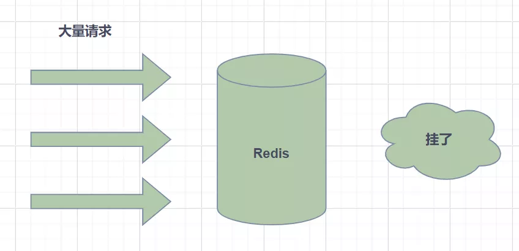


而热点Key是怎么产生的呢？主要原因有两个：

> 用户消费的数据远大于生产的数据，如秒杀、热点新闻等读多写少的场景。
>
> 请求分片集中，超过单Redi服务器的性能，比如固定名称key，Hash落入同一台服务器，瞬间访问量极大，超过机器瓶颈，产生热点Key问题。

那么在日常开发中，如何识别到热点key呢？

> 凭经验判断哪些是热Key；
>
> 客户端统计上报；
>
> 服务代理层上报

如何解决热key问题？

> Redis集群扩容：增加分片副本，均衡读流量；
>
> 将热key分散到不同的服务器中；
>
> 使用二级缓存，即JVM本地缓存,减少Redis的读请求。


## Redis 过期策略和内存淘汰策略


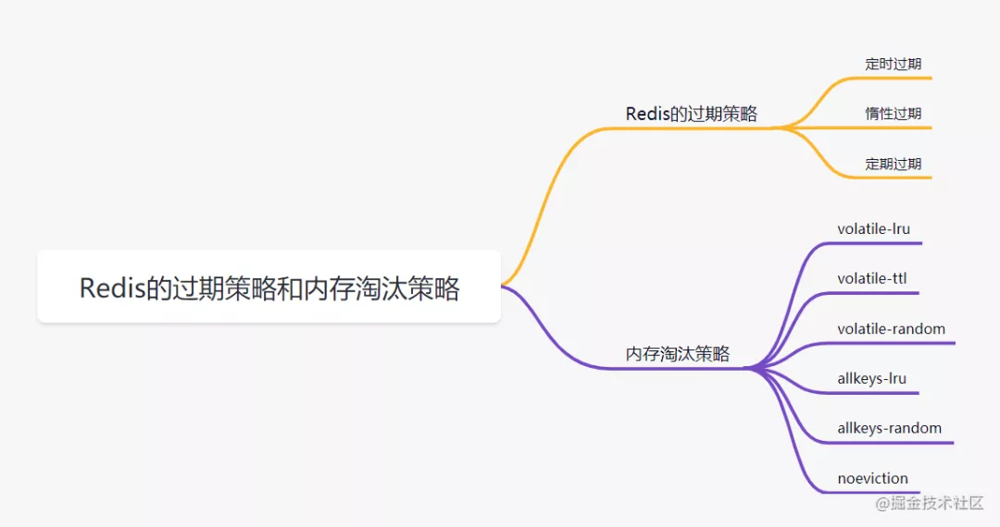


### Redis 的过期策略


我们在set key的时候，可以给它设置一个过期时间，比如expire key 60。指定这key60s后过期，60s后，redis是如何处理的嘛？我们先来介绍几种过期策略：


**定时过期**

每个设置过期时间的key都需要创建一个定时器，到过期时间就会立即对key进行清除。该策略可以立即清除过期的数据，对内存很友好；但是会占用大量的CPU资源去处理过期的数据，从而影响缓存的响应时间和吞吐量。


**惰性删除**

只有当访问一个key时，才会判断该key是否已过期，过期则清除。该策略可以最大化地节省CPU资源，却对内存非常不友好。极端情况可能出现大量的过期key没有再次被访问，从而不会被清除，占用大量内存。


**定期删除**

每隔一定的时间，会扫描一定数量的数据库的expires字典中一定数量的key，并清除其中已过期的key。该策略是前两者的一个折中方案。通过调整定时扫描的时间间隔和每次扫描的限定耗时，可以在不同情况下使得CPU和内存资源达到最优的平衡效果。

expires字典会保存所有设置了过期时间的key的过期时间数据，其中，key是指向键空间中的某个键的指针，value是该键的毫秒精度的UNIX时间戳表示的过期时间。键空间是指该Redis集群中保存的所有键。


Redis中同时使用了**惰性过期和定期过期**两种过期策略。

- 假设Redis当前存放30万个key，并且都设置了过期时间，如果你每隔100ms就去检查这全部的key，CPU负载会特别高，最后可能会挂掉。
- 因此，redis采取的是定期过期，每隔100ms就随机抽取一定数量的key来检查和删除的。
- 但是呢，最后可能会有很多已经过期的key没被删除。这时候，redis采用惰性删除。在你获取某个key的时候，redis会检查一下，这个key如果设置了过期时间并且已经过期了，此时就会删除。


但是呀，如果定期删除漏掉了很多过期的key，然后也没走惰性删除。就会有很多过期key积在内存内存，直接会导致内存爆的。或者有些时候，业务量大起来了，redis的key被大量使用，内存直接不够了，运维小哥哥也忘记加大内存了。难道redis直接这样挂掉？不会的！Redis用8种内存淘汰策略保护自己~


### Redis 内存淘汰策略

Redis 内存淘汰策略共有八种，这八种策略大体分为「不进行数据淘汰」和「进行数据淘汰」两类策略。

*1、不进行数据淘汰的策略*

**noeviction**（Redis3.0 之后，默认的内存淘汰策略） ：它表示当运行内存超过最大设置内存时，不淘汰任何数据，这时如果有新的数据写入，则会触发 OOM，但是如果没有数据写入的话，只是单纯的查询或者删除操作的话，还是可以正常工作。

*2、进行数据淘汰的策略*

针对「进行数据淘汰」这一类策略，又可以细分为「在设置了过期时间的数据中进行淘汰」和「在所有数据范围内进行淘汰」这两类策略。

在设置了过期时间的数据中进行淘汰：

- **volatile-random**：随机淘汰设置了过期时间的任意键值；
- **volatile-ttl**：优先淘汰更早过期的键值。
- **volatile-lru**（Redis3.0 之前，默认的内存淘汰策略）：淘汰所有设置了过期时间的键值中，最久未使用的键值；
- **volatile-lfu**（Redis 4.0 后新增的内存淘汰策略）：淘汰所有设置了过期时间的键值中，最少使用的键值；

在所有数据范围内进行淘汰：

- **allkeys-random**：随机淘汰任意键值;
- **allkeys-lru**：淘汰整个键值中最久未使用的键值；
- **allkeys-lfu**（Redis 4.0 后新增的内存淘汰策略）：淘汰整个键值中最少使用的键值。


## 说说Redis的常用应用场景


- 缓存
- 排行榜
- 计数器应用
- 共享Session
- 分布式锁
- 社交网络
- 消息队列
- 位操作


###  缓存


我们一提到redis，自然而然就想到缓存，国内外中大型的网站都离不开缓存。合理的利用缓存，比如缓存热点数据，不仅可以提升网站的访问速度，还可以降低数据库DB的压力。并且，Redis相比于memcached，还提供了丰富的数据结构，并且提供RDB和AOF等持久化机制，强的一批。


###  排行榜


当今互联网应用，有各种各样的排行榜，如电商网站的月度销量排行榜、社交APP的礼物排行榜、小程序的投票排行榜等等。Redis提供的zset数据类型能够实现这些复杂的排行榜。

比如，用户每天上传视频，获得点赞的排行榜可以这样设计：

- 1.用户Jay上传一个视频，获得6个赞，可以酱紫：

```apache
zadd user:ranking:2021-03-03 Jay 3
```

- 2.过了一段时间，再获得一个赞，可以这样：

```apache
zincrby user:ranking:2021-03-03 Jay 1
```

- 3.如果某个用户John作弊，需要删除该用户：

```apache
zrem user:ranking:2021-03-03 John
```

- 4.展示获取赞数最多的3个用户

```apache
zrevrangebyrank user:ranking:2021-03-03 0 2
```


### 计数器应用


各大网站、APP应用经常需要计数器的功能，如短视频的播放数、电商网站的浏览数。这些播放数、浏览数一般要求实时的，每一次播放和浏览都要做加1的操作，如果并发量很大对于传统关系型数据的性能是一种挑战。Redis天然支持计数功能而且计数的性能也非常好，可以说是计数器系统的重要选择。


### 共享Session


如果一个分布式Web服务将用户的Session信息保存在各自服务器，用户刷新一次可能就需要重新登录了，这样显然有问题。实际上，可以使用Redis将用户的Session进行集中管理，每次用户更新或者查询登录信息都直接从Redis中集中获取。


### 分布式锁


几乎每个互联网公司中都使用了分布式部署，分布式服务下，就会遇到对同一个资源的并发访问的技术难题，如秒杀、下单减库存等场景。

- 用synchronize或者reentrantlock本地锁肯定是不行的。
- 如果是并发量不大话，使用数据库的悲观锁、乐观锁来实现没啥问题。
- 但是在并发量高的场合中，利用数据库锁来控制资源的并发访问，会影响数据库的性能。
- 实际上，可以用Redis的setnx来实现分布式的锁。


### 社交网络


赞/踩、粉丝、共同好友/喜好、推送、下拉刷新等是社交网站的必备功能，由于社交网站访问量通常比较大，而且传统的关系型数据不太适保存 这种类型的数据，Redis提供的数据结构可以相对比较容易地实现这些功能。


### 消息队列


消息队列是大型网站必用中间件，如ActiveMQ、RabbitMQ、Kafka等流行的消息队列中间件，主要用于业务解耦、流量削峰及异步处理实时性低的业务。Redis提供了发布/订阅及阻塞队列功能，能实现一个简单的消息队列系统。另外，这个不能和专业的消息中间件相比。


### ~~位操作~~


用于数据量上亿的场景下，例如几亿用户系统的签到，去重登录次数统计，某用户是否在线状态等等。腾讯10亿用户，要几个毫秒内查询到某个用户是否在线，能怎么做？千万别说给每个用户建立一个key，然后挨个记（你可以算一下需要的内存会很恐怖，而且这种类似的需求很多。这里要用到位操作——使用setbit、getbit、bitcount命令。原理是：redis内构建一个足够长的数组，每个数组元素只能是0和1两个值，然后这个数组的下标index用来表示用户id（必须是数字哈），那么很显然，这个几亿长的大数组就能通过下标和元素值（0和1）来构建一个记忆系统。


## Redis 的持久化机制有哪些？优缺点说说


Redis是基于内存的非关系型K-V数据库，既然它是基于内存的，如果Redis服务器挂了，数据就会丢失。为了避免数据丢失了，Redis提供了**持久化**，即把数据保存到磁盘。

Redis提供了**RDB和AOF**两种持久化机制，它持久化文件加载流程如下：


### RDB


**RDB**，就是把内存数据以快照的形式保存到磁盘上。

> 什么是快照?可以这样理解，给当前时刻的数据，拍一张照片，然后保存下来。

RDB持久化，是指在指定的时间间隔内，执行指定次数的写操作，将内存中的数据集快照写入磁盘中，它是Redis默认的持久化方式。执行完操作后，在指定目录下会生成一个dump.rdb文件，Redis 重启的时候，通过加载dump.rdb文件来恢复数据。RDB触发机制主要有以下几种：


**RDB 的优点**

- 适合大规模的数据恢复场景，如备份，全量复制等

**RDB缺点**

- 没办法做到实时持久化/秒级持久化。
- 新老版本存在RDB格式兼容问题


### AOF

**AOF（append only file）** 持久化，采用日志的形式来记录每个写操作，追加到文件中，重启时再重新执行AOF文件中的命令来恢复数据。它主要解决数据持久化的实时性问题。默认是不开启的。

AOF的工作流程如下：


**AOF的优点**

- 数据的一致性和完整性更高

**AOF的缺点**

- AOF记录的内容越多，文件越大，数据恢复变慢。


## 怎么实现Redis的高可用


我们在项目中使用Redis，肯定不会是单点部署Redis服务的。因为，单点部署一旦宕机，就不可用了。为了实现高可用，通常的做法是，将数据库复制多个副本以部署在不同的服务器上，其中一台挂了也可以继续提供服务。Redis 实现高可用有三种部署模式：**主从模式，哨兵模式，集群模式**。


### 主从模式


主从模式中，Redis部署了多台机器，有主节点，负责读写操作，有从节点，只负责读操作。从节点的数据来自主节点，实现原理就是**主从复制机制**

主从复制包括全量复制，增量复制两种。一般当slave第一次启动连接master，或者认为是第一次连接，就采用**全量复制**，全量复制流程如下：

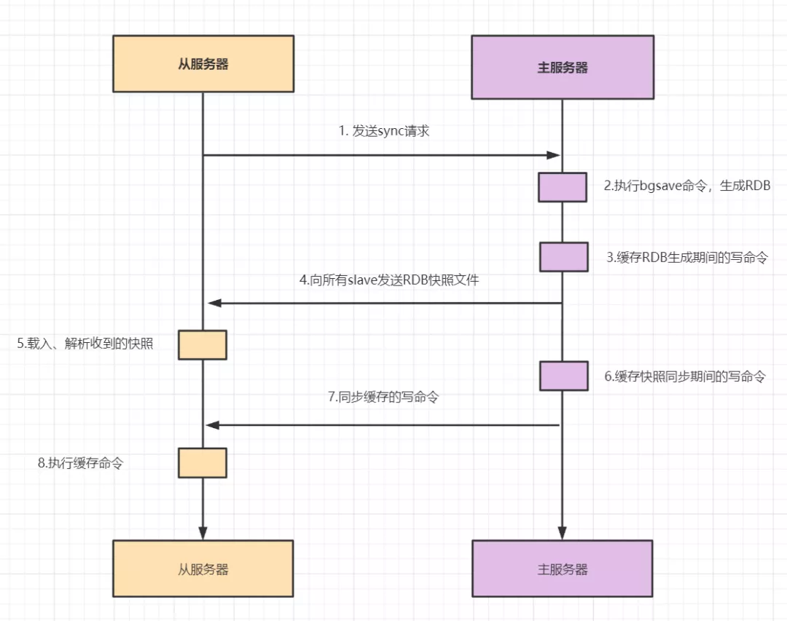

- 1.slave发送sync命令到master。
- 2.master接收到SYNC命令后，执行bgsave命令，生成RDB全量文件。
- 3.master使用缓冲区，记录RDB快照生成期间的所有写命令。
- 4.master执行完bgsave后，向所有slave发送RDB快照文件。
- 5.slave收到RDB快照文件后，载入、解析收到的快照。
- 6.master使用缓冲区，记录RDB同步期间生成的所有写的命令。
- 7.master快照发送完毕后，开始向slave发送缓冲区中的写命令;
- 8.salve接受命令请求，并执行来自master缓冲区的写命令


redis2.8版本之后，已经使用**psync来替代sync**，因为sync命令非常消耗系统资源，psync的效率更高。

slave与master全量同步之后，master上的数据，如果再次发生更新，就会触发**增量复制**。


当master节点发生数据增减时，就会触发replicationFeedSalves()函数，接下来在 Master节点上调用的每一个命令会使用replicationFeedSlaves()来同步到Slave节点。执行此函数之前呢，master节点会判断用户执行的命令是否有数据更新，如果有数据更新的话，并且slave节点不为空，就会执行此函数。这个函数作用就是：**把用户执行的命令发送到所有的slave节点**，让slave节点执行。流程如下：

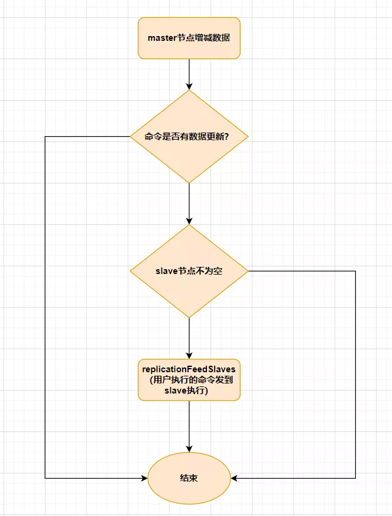


### 哨兵模式


主从模式中，一旦主节点由于故障不能提供服务，需要人工将从节点晋升为主节点，同时还要通知应用方更新主节点地址。显然，多数业务场景都不能接受这种故障处理方式。Redis从2.8开始正式提供了Redis Sentinel（哨兵）架构来解决这个问题。

**哨兵模式**，由一个或多个Sentinel实例组成的Sentinel系统，它可以监视所有的Redis主节点和从节点，并在被监视的主节点进入下线状态时，**自动将下线主服务器属下的某个从节点升级为新的主节点**。但是呢，一个哨兵进程对Redis节点进行监控，就可能会出现问题（**单点问题**），因此，可以使用多个哨兵来进行监控Redis节点，并且各个哨兵之间还会进行监控。

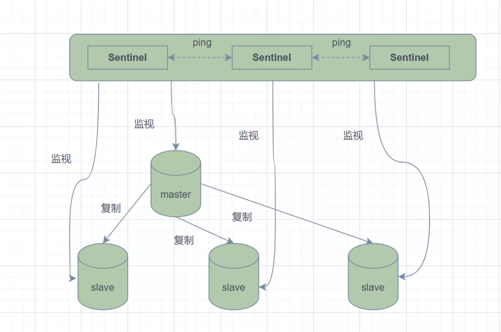

Sentinel哨兵模式

简单来说，哨兵模式就三个作用：

- 发送命令，等待Redis服务器（包括主服务器和从服务器）返回监控其运行状态；
- 哨兵监测到主节点宕机，会自动将从节点切换成主节点，然后通过发布订阅模式通知其他的从节点，修改配置文件，让它们切换主机；
- 哨兵之间还会相互监控，从而达到高可用。


**故障切换的过程是怎样的呢**

>假设主服务器宕机，哨兵1先检测到这个结果，系统并不会马上进行 failover 过程，仅仅是哨兵1主观的认为主服务器不可用，这个现象成为主观下线。当后面的哨兵也检测到主服务器不可用，并且数量达到一定值时，那么哨兵之间就会进行一次投票，投票的结果由一个哨兵发起，进行 failover 操作。切换成功后，就会通过发布订阅模式，让各个哨兵把自己监控的从服务器实现切换主机，这个过程称为客观下线。这样对于客户端而言，一切都是透明的。


哨兵的工作模式如下：

1. 每个Sentinel以每秒钟一次的频率向它所知的Master，Slave以及其他Sentinel实例发送一个 PING命令。
2. 如果一个实例（instance）距离最后一次有效回复 PING 命令的时间超过 down-after-milliseconds 选项所指定的值， 则这个实例会被 Sentinel标记为主观下线。
3. 如果一个Master被标记为主观下线，则正在监视这个Master的所有 Sentinel 要以每秒一次的频率确认Master的确进入了主观下线状态。
4. 当有足够数量的 Sentinel（大于等于配置文件指定的值）在指定的时间范围内确认Master的确进入了主观下线状态， 则Master会被标记为客观下线。
5. 在一般情况下， 每个 Sentinel 会以每10秒一次的频率向它已知的所有Master，Slave发送 INFO 命令。
6. 当Master被 Sentinel 标记为客观下线时，Sentinel 向下线的 Master 的所有 Slave 发送 INFO 命令的频率会从 10 秒一次改为每秒一次
7. 若没有足够数量的 Sentinel同意Master已经下线， Master的客观下线状态就会被移除；若Master 重新向 Sentinel 的 PING 命令返回有效回复， Master 的主观下线状态就会被移除。

说白了哨兵的分布式一致性算法使用 raft 共识算法。


### Cluster集群模式


哨兵模式基于主从模式，实现读写分离，它还可以自动切换，系统可用性更高。但是它每个节点存储的数据是一样的，浪费内存，并且不好在线扩容。因此，Cluster集群应运而生，它在Redis3.0加入的，实现了Redis的**分布式存储**。对数据进行分片，也就是说**每台Redis节点上存储不同的内容**，来解决在线扩容的问题。并且，它也提供复制和故障转移的功能。


#### Cluster集群节点的通讯


一个Redis集群由多个节点组成，**各个节点之间是怎么通信的呢**？通过**Gossip协议**！

Redis Cluster集群通过Gossip协议进行通信，节点之前不断交换信息，交换的信息内容包括节点出现故障、新节点加入、主从节点变更信息、slot信息等等。常用的Gossip消息分为4种，分别是：ping、pong、meet、fail。


>meet消息：通知新节点加入。消息发送者通知接收者加入到当前集群，meet消息通信正常完成后，接收节点会加入到集群中并进行周期性的ping、pong消息交换。
>
>ping消息：集群内交换最频繁的消息，集群内每个节点每秒向多个其他节点发送ping消息，用于检测节点是否在线和交换彼此状态信息。
>
>pong消息：当接收到ping、meet消息时，作为响应消息回复给发送方确认消息正常通信。pong消息内部封装了自身状态数据。节点也可以向集群内广播自身的pong消息来通知整个集群对自身状态进行更新。
>
>fail消息：当节点判定集群内另一个节点下线时，会向集群内广播一个fail消息，其他节点接收到fail消息之后把对应节点更新为下线状态。

特别的，每个节点是通过**集群总线(cluster bus)** 与其他的节点进行通信的。通讯时，使用特殊的端口号，即对外服务端口号加10000。例如如果某个node的端口号是6379，那么它与其它nodes通信的端口号是 16379。nodes 之间的通信采用特殊的二进制协议。


#### Hash Slot插槽算法


既然是分布式存储，Cluster集群使用的分布式算法是**一致性Hash**嘛？并不是，而是**Hash Slot插槽算法**。

插槽算法把整个数据库被分为16384个slot（槽），每个进入Redis的键值对，根据key进行散列，分配到

这16384插槽中的一个。使用的哈希映射也比较简单，用CRC16算法计算出一个16 位的值，再对16384取模。数据库中的每个键都属于这16384个槽的其中一个，集群中的每个节点都可以处理这16384个槽。

集群中的每个节点负责一部分的hash槽，比如当前集群有A、B、C个节点，每个节点上的哈希槽数 =16384/3，那么就有：

- 节点A负责0~5460号哈希槽
- 节点B负责5461~10922号哈希槽
- 节点C负责10923~16383号哈希槽


#### Redis Cluster集群


Redis Cluster集群中，需要确保16384个槽对应的node都正常工作，如果某个node出现故障，它负责的slot也会失效，整个集群将不能工作。

因此为了保证高可用，Cluster集群引入了主从复制，一个主节点对应一个或者多个从节点。当其它主节点 ping 一个主节点 A 时，如果半数以上的主节点与 A 通信超时，那么认为主节点 A 宕机了。如果主节点宕机时，就会启用从节点。

在Redis的每一个节点上，都有两个玩意，一个是插槽（slot），它的取值范围是0~16383。另外一个是cluster，可以理解为一个集群管理的插件。当我们存取的key到达时，Redis 会根据CRC16算法得出一个16 bit的值，然后把结果对16384取模。酱紫每个key都会对应一个编号在 0~16383 之间的哈希槽，通过这个值，去找到对应的插槽所对应的节点，然后直接自动跳转到这个对应的节点上进行存取操作。

虽然数据是分开存储在不同节点上的，但是对客户端来说，整个集群Cluster，被看做一个整体。客户端端连接任意一个node，看起来跟操作单实例的Redis一样。当客户端操作的key没有被分配到正确的node节点时，Redis会返回转向指令，最后指向正确的node，这就有点像浏览器页面的302 重定向跳转。


#### ~~故障转移~~


## 分布式下redis如何保证线程安全


在分布式环境下，保证 Redis 的线程安全性主要涉及到以下几个方面：

1. **Redis 原子性操作：** Redis 提供了一些原子性的操作，例如 SETNX（SET if Not eXists）、INCR（自增）、DECR（自减）等。这些操作是原子的，可以保证在多线程或多节点环境下的线程安全性。
2. **事务：** Redis 支持事务，可以将多个命令封装在一个事务中，通过 MULTI 和 EXEC 命令来执行。事务中的所有命令将按顺序执行，并在 EXEC 时进行提交。事务的执行是原子的，要么全部执行成功，要么全部执行失败，这有助于保证多个命令之间的一致性。
3. **分布式锁：** 在分布式环境中，为了保证对某一资源的独占访问，可以使用分布式锁。常见的实现方式包括使用 Redis 的 SETNX 命令或者使用 RedLock 等算法。通过获取分布式锁，可以确保在一段时间内只有一个线程能够执行特定的操作，从而保证线程安全性。
4. **Watch-Multi-Exec 事务：** Redis 支持 Watch-Multi-Exec 模式，通过 WATCH 命令监视一个或多个键，然后在 EXEC 命令执行时检查这些键是否发生变化。如果有变化，则事务不会执行。这可以用于在多线程环境下保证某些操作的原子性。

需要注意的是，虽然 Redis 在单节点上提供了这些原子性和事务的机制，但在分布式环境中，还需要考虑网络延迟、分布式锁的一致性等问题。


## 使用过Redis分布式锁嘛？有哪些注意点呢？

**分布式锁**，是控制分布式系统不同进程共同访问共享资源的一种锁的实现。秒杀下单、抢红包等等业务场景，都需要用到分布式锁，我们项目中经常使用Redis作为分布式锁。

选了Redis分布式锁的几种实现方法，大家来讨论下，看有没有啥问题哈。


- 命令setnx + expire分开写
- setnx + value值是过期时间
- set的扩展命令（set ex px nx）
- set ex px nx + 校验唯一随机值,再删除


###  命令setnx + expire分开写

```
if（jedis.setnx(key,lock_value) == 1）{ //加锁
    expire（key，100）; //设置过期时间
    try {
        do something  //业务请求
    }catch(){
  }
  finally {
       jedis.del(key); //释放锁
    }
}
```

如果执行完setnx加锁，正要执行expire设置过期时间时，进程crash掉或者要重启维护了，那这个锁就“长生不老”了，**别的线程永远获取不到锁**啦，所以分布式锁**不能**这么实现。


### setnx + value值是过期时间

```java
long expires = System.currentTimeMillis() + expireTime; //系统时间+设置的过期时间
String expiresStr = String.valueOf(expires);

// 如果当前锁不存在，返回加锁成功
if (jedis.setnx(key, expiresStr) == 1) {
        return true;
} 
// 如果锁已经存在，获取锁的过期时间
String currentValueStr = jedis.get(key);

// 如果获取到的过期时间，小于系统当前时间，表示已经过期
if (currentValueStr != null && Long.parseLong(currentValueStr) < System.currentTimeMillis()) {

     // 锁已过期，获取上一个锁的过期时间，并设置现在锁的过期时间（不了解redis的getSet命令的小伙伴，可以去官网看下哈）
    String oldValueStr = jedis.getSet(key_resource_id, expiresStr);

    if (oldValueStr != null && oldValueStr.equals(currentValueStr)) {
         // 考虑多线程并发的情况，只有一个线程的设置值和当前值相同，它才可以加锁
         return true;
    }
}

//其他情况，均返回加锁失败
return false;
}
```

笔者看过有开发小伙伴是这么实现分布式锁的，但是这种方案也有这些**缺点**：

- 过期时间是客户端自己生成的，分布式环境下，每个客户端的时间必须同步。
- 没有保存持有者的唯一标识，可能被别的客户端释放/解锁。
- 锁过期的时候，并发多个客户端同时请求过来，都执行了jedis.getSet()，最终只能有一个客户端加锁成功，但是该客户端锁的过期时间，可能被别的客户端覆盖。


### set的扩展命令（set ex px nx）（注意可能存在的问题）

```java
if（jedis.set(key, lock_value, "NX", "EX", 100s) == 1）{ //加锁
    try {
        do something  //业务处理
    }catch(){
  }
  finally {
       jedis.del(key); //释放锁
    }
}

```

这个方案可能存在这样的问题：

- 锁过期释放了，业务还没执行完。
- 锁被别的线程误删。


### set ex px nx + 校验唯一随机值,再删除


```java
if（jedis.set(key, uni_request_id, "NX", "EX", 100s) == 1）{ //加锁
    try {
        do something  //业务处理
    }catch(){
  }
  finally {
       //判断是不是当前线程加的锁,是才释放
       if (uni_request_id.equals(jedis.get(key))) {
        jedis.del(key); //释放锁
        }
    }
}
```

在这里，判断当前线程加的锁和释放锁是不是一个原子操作。如果调用jedis.del()释放锁的时候，可能这把锁已经不属于当前客户端，**会解除他人加的锁**。

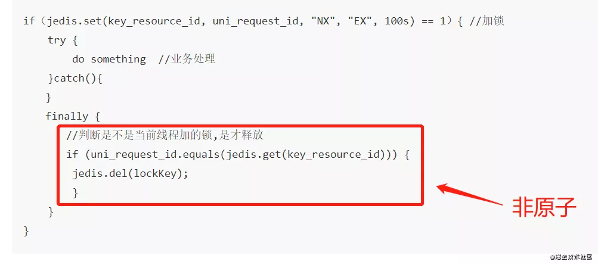

一般也是用**lua脚本**代替。lua脚本如下：

```
if redis.call('get',KEYS[1]) == ARGV[1] then 
   return redis.call('del',KEYS[1]) 
else
   return 0
end
```

这种方式比较不错了，一般情况下，已经可以使用这种实现方式。但是存在**锁过期释放了，业务还没执行完的问题**（实际上，估算个业务处理的时间，一般没啥问题了）。


## 使用过Redisson嘛？说说它的原理


分布式锁可能存在锁过期释放，**业务没执行完的问题**。有些小伙伴认为，稍微把锁过期时间设置长一些就可以啦。其实我们设想一下，是否可以给获得锁的线程，开启一个定时守护线程，每隔一段时间检查锁是否还存在，存在则对锁的过期时间延长，防止锁过期提前释放。

当前**开源框架Redisson**就解决了这个分布式锁问题。我们一起来看下Redisson底层原理是怎样的吧：

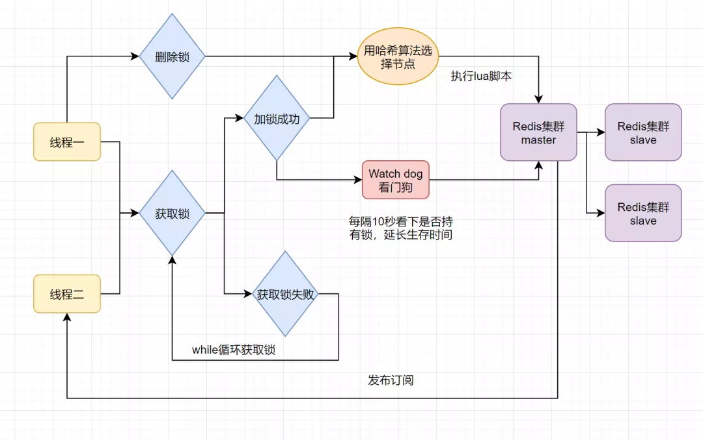

只要线程一加锁成功，就会启动一个watch dog看门狗，它是一个后台线程，会每隔10秒检查一下，如果线程1还持有锁，那么就会不断的延长锁key的生存时间。因此，Redisson就是使用watch dog解决了**锁过期释放，业务没执行完**问题。


## 什么是Redlock算法


Redis一般都是集群部署的，假设数据在主从同步过程，主节点挂了，Redis分布式锁可能会有**哪些问题**呢？一起来看些这个流程图：

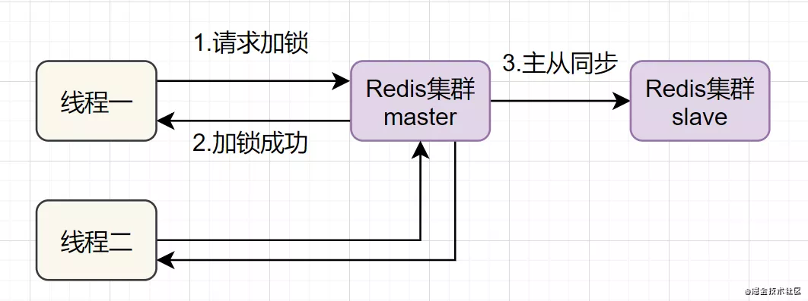

如果线程一在Redis的master节点上拿到了锁，但是加锁的key还没同步到slave节点。恰好这时，master节点发生故障，一个slave节点就会升级为master节点。线程二就可以获取同个key的锁啦，但线程一也已经拿到锁了，锁的安全性就没了。

为了解决这个问题，Redis作者 antirez提出一种高级的分布式锁算法：**Redlock**。Redlock核心思想是这样的：

>搞多个Redis master部署，以保证它们不会同时宕掉。并且这些master节点是完全相互独立的，相互之间不存在数据同步。同时，需要确保在这多个master实例上，是与在Redis单实例，使用相同方法来获取和释放锁。

我们假设当前有5个Redis master节点，在5台服务器上面运行这些Redis实例。

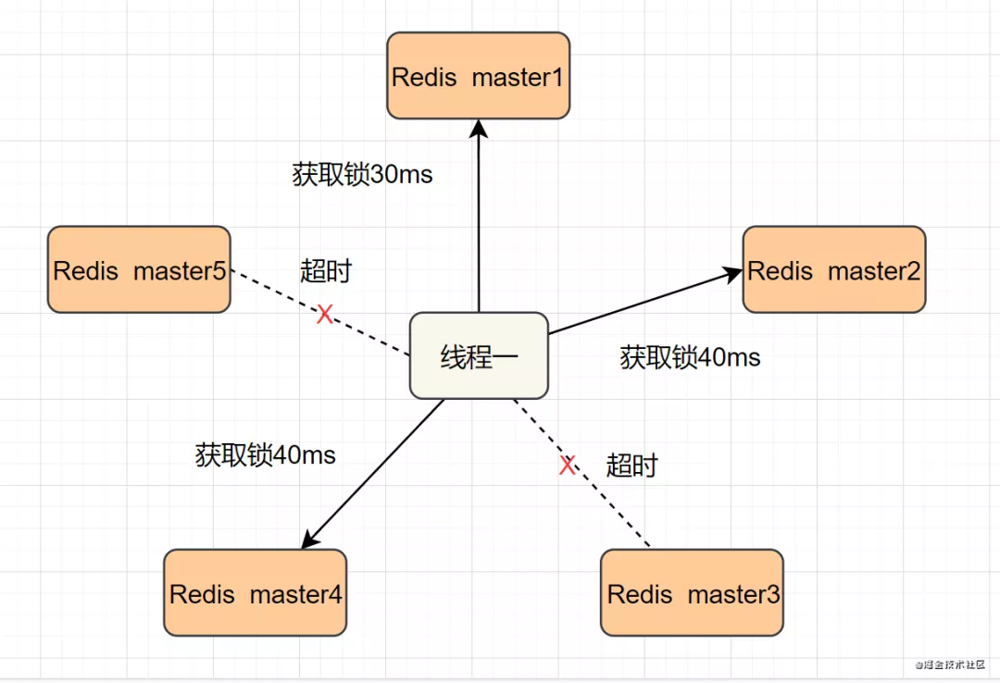

RedLock的实现步骤:如下

>1.获取当前时间，以毫秒为单位。
>
>2.按顺序向5个master节点请求加锁。客户端设置网络连接和响应超时时间，并且超时时间要小于锁的失效时间。（假设锁自动失效时间为10秒，则超时时间一般在5-50毫秒之间,我们就假设超时时间是50ms吧）。如果超时，跳过该master节点，尽快去尝试下一个master节点。
>
>3.客户端使用当前时间减去开始获取锁时间（即步骤1记录的时间），得到获取锁使用的时间。当且仅当超过一半（N/2+1，这里是5/2+1=3个节点）的Redis master节点都获得锁，并且使用的时间小于锁失效时间时，锁才算获取成功。（如上图，10s> 30ms+40ms+50ms+4m0s+50ms）
>
>如果取到了锁，key的真正有效时间就变啦，需要减去获取锁所使用的时间。
>
>如果获取锁失败（没有在至少N/2+1个master实例取到锁，有或者获取锁时间已经超过了有效时间），客户端要在所有的master节点上解锁（即便有些master节点根本就没有加锁成功，也需要解锁，以防止有些漏网之鱼）。

简化下步骤就是：

- 按顺序向5个master节点请求加锁
- 根据设置的超时时间来判断，是不是要跳过该master节点。
- 如果大于等于三个节点加锁成功，并且使用的时间小于锁的有效期，即可认定加锁成功啦。
- 如果获取锁失败，解锁！


## Redis的跳跃表

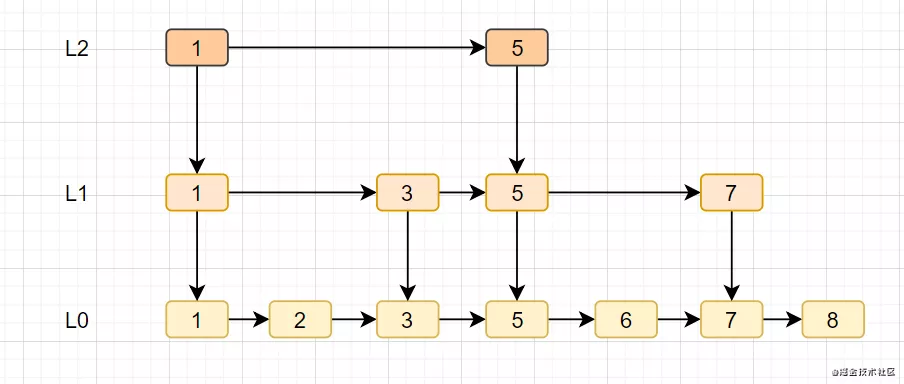

跳跃表

- 跳跃表是有序集合zset的底层实现之一
- 跳跃表支持平均**O（logN）**,最坏 O（N）复杂度的节点查找，还可以通过顺序性操作批量处理节点。
- 跳跃表实现由**zskiplist和zskiplistNode**两个结构组成，其中zskiplist用于保存跳跃表信息（如表头节点、表尾节点、长度），而zskiplistNode则用于表示跳跃表节点。
- 跳跃表就是在链表的基础上，增加多级索引提升查找效率。


## MySQL与Redis 如何保证双写一致性

- 缓存延时双删
- 删除缓存重试机制
- 读取biglog异步删除缓存


### 延时双删


## Redis 事务机制


Redis通过**MULTI、EXEC、WATCH**等一组命令集合，来实现事务机制。事务支持一次执行多个命令，一个事务中所有命令都会被序列化。在事务执行过程，会按照顺序串行化执行队列中的命令，其他客户端提交的命令请求不会插入到事务执行命令序列中。

简言之，Redis事务就是**顺序性、一次性、排他性**的执行一个队列中的一系列命令。

Redis执行事务的流程如下：

- 开始事务（MULTI）
- 命令入队
- 执行事务（EXEC）、撤销事务（DISCARD ）

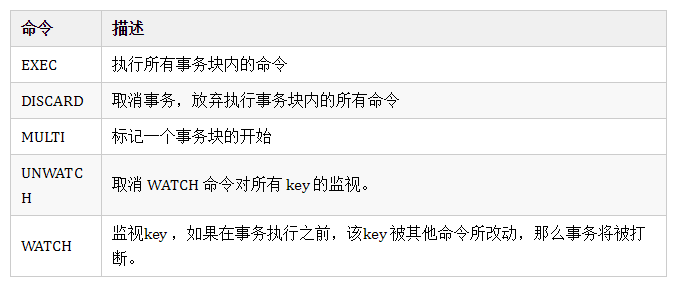


## 布隆过滤器


应对**缓存穿透**问题，我们可以使用**布隆过滤器**。布隆过滤器是什么呢？

布隆过滤器是一种占用空间很小的数据结构，它由一个很长的二进制向量和一组Hash映射函数组成，它用于检索一个元素是否在一个集合中，空间效率和查询时间都比一般的算法要好的多，缺点是有一定的误识别率和删除困难。

**布隆过滤器原理是？**假设我们有个集合A，A中有n个元素。利用**k个哈希散列**函数，将A中的每个元素**映射**到一个长度为a位的数组B中的不同位置上，这些位置上的二进制数均设置为1。如果待检查的元素，经过这k个哈希散列函数的映射后，发现其k个位置上的二进制数**全部为1**，这个元素很可能属于集合A，反之，**一定不属于集合A**。

来看个简单例子吧，假设集合A有3个元素，分别为{**d1,d2,d3**}。有1个哈希函数，为**Hash1**。现在将A的每个元素映射到长度为16位数组B。


我们现在把d1映射过来，假设Hash1（d1）= 2，我们就把数组B中，下标为2的格子改成1，如下：


我们现在把**d2**也映射过来，假设Hash1（d2）= 5，我们把数组B中，下标为5的格子也改成1，如下：


接着我们把**d3**也映射过来，假设Hash1（d3）也等于 2，它也是把下标为2的格子标1：

因此，我们要确认一个元素dn是否在集合A里，我们只要算出Hash1（dn）得到的索引下标，只要是0，那就表示这个元素**不在集合A**，如果索引下标是1呢？那该元素**可能**是A中的某一个元素。因为你看，d1和d3得到的下标值，都可能是1，还可能是其他别的数映射的，布隆过滤器是存在这个**缺点**的：会存在**hash碰撞**导致的假阳性，判断存在误差。

如何**减少这种误差**呢？

- 搞多几个哈希函数映射，降低哈希碰撞的概率
- 同时增加B数组的bit长度，可以增大hash函数生成的数据的范围，也可以降低哈希碰撞的概率

我们又增加一个Hash2**哈希映射**函数，假设Hash2（d1）=6,Hash2（d3）=8,它俩不就不冲突了嘛，如下：


即使存在误差，我们可以发现，布隆过滤器并**没有存放完整的数据**，它只是运用一系列哈希映射函数计算出位置，然后填充二进制向量。如果**数量很大的话**，布隆过滤器通过极少的错误率，换取了存储空间的极大节省，还是挺划算的。

目前布隆过滤器已经有相应实现的开源类库啦，如**Google的Guava类库**，Twitter的 Algebird 类库，信手拈来即可，或者基于Redis自带的Bitmaps自行实现设计也是可以的。


