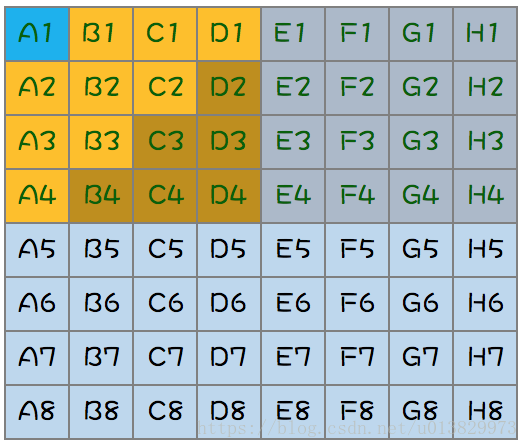

# 场景与智力题

> 重要的过程，复杂的题也需要一步一步来！


## 64匹马，8赛道，找出最快的4匹最少要几次?

11次




## 先后手问题，N张牌，两个人轮流拿，每次拿1或者2张，先手必赢还是后手必赢

这个问题是一个典型的博弈论问题，涉及到两个人在拿牌的过程中是否有必胜策略。我们可以用动态规划和归纳法来分析。

1. **基础情况**：
   - 如果只有1张牌，先手只能拿1张，先手必赢。
   - 如果有2张牌，先手可以直接拿完所有牌，先手必赢。
2. **推广到一般情况**：
   - 设`dp[i]`表示当前剩下`i`张牌时，先手是否有必胜策略。
   - 初始条件：`dp[1] = true`，`dp[2] = true`。
   - 状态转移：对于剩余`i`张牌，如果先手拿1张，剩下的情况是`dp[i-1]`；如果先手拿2张，剩下的是`dp[i-2]`。如果`dp[i-1]`和`dp[i-2]`中有一个是`false`，说明先手可以让对手进入一个“必败”状态，则`dp[i] = true`。
3. **一般化判断**：
   - `dp[i] = !dp[i-1] || !dp[i-2]`。如果存在一种选择可以让对手进入一个失败的状态，那么当前状态就是“先手必赢”。
4. **结论**：
   - 通过构建`dp`数组，遍历所有`i`从1到`N`，可以得出当`N`为任意自然数时是“先手必赢”还是“后手必赢”。
   - 直观地看，如果`N % 3 == 0`，则先手在最优策略下无法避免失败，后手必赢；否则，先手必赢。

通过这种分析方法，我们可以确定先手或后手的胜负策略。


## 一个有1亿url的文件，如何找出重复的url


### 方法一：基于哈希集合（内存足够时）


**原理：**

使用 `HashSet` 存储出现过的 URL，若再次出现则记录为重复。


**Java 示例：**

```java
Set<String> seen = new HashSet<>();
Set<String> duplicates = new HashSet<>();

try (BufferedReader reader = new BufferedReader(new FileReader("urls.txt"))) {
    String line;
    while ((line = reader.readLine()) != null) {
        if (!seen.add(line)) {
            duplicates.add(line);
        }
    }
}

// 输出重复的 URL
for (String dup : duplicates) {
    System.out.println(dup);
}
```

**⚠️ 内存要求：**

- 每个 URL 平均 100 字节，1 亿个约占 **10GB+**。
- 可行于 16G+ 内存环境，且 URL 不太长。


### 方法二：外部排序 + 单次遍历（推荐）


**原理：**

1. 对大文件进行**外部排序**（使用磁盘临时文件进行排序）。
2. 排序后，相同的 URL 会挨在一起，顺序读取时即可检测重复。


**步骤：**

1. 使用系统工具（如 Linux `sort`）：

```bash
sort urls.txt > sorted_urls.txt
```

1. 用程序扫描重复项：

```java
try (BufferedReader reader = new BufferedReader(new FileReader("sorted_urls.txt"))) {
    String prev = null;
    String line;
    while ((line = reader.readLine()) != null) {
        if (line.equals(prev)) {
            System.out.println("Duplicate: " + line);
        }
        prev = line;
    }
}
```

**优点：**

- 几乎不占用内存，适合超大文件。
- 排序开销是一次性的，可复用。


### 方法三：分桶处理 + 哈希计数（低内存下也能跑）


**原理：**

1. 将 URL 按 hash 分成多个桶（例如 1000 个小文件）。
2. 每个小文件单独内存去重（因为文件小了）。


**Java 实现思路：**

```java
int bucketNum = 1000;
BufferedWriter[] writers = new BufferedWriter[bucketNum];

// 初始化输出桶
for (int i = 0; i < bucketNum; i++) {
    writers[i] = new BufferedWriter(new FileWriter("bucket_" + i + ".txt"));
}

// 分桶
try (BufferedReader reader = new BufferedReader(new FileReader("urls.txt"))) {
    String line;
    while ((line = reader.readLine()) != null) {
        int hash = Math.abs(line.hashCode()) % bucketNum;
        writers[hash].write(line);
        writers[hash].newLine();
    }
}

for (BufferedWriter writer : writers) {
    writer.close();
}

// 然后对每个 bucket 文件进行方法一中的去重
```


## 何从 100 亿 URL 中找出相同的 URL


### 题目描述

给定 a、b 两个文件，各存放 50 亿个 URL，每个 URL 各占 64B，内存限制是 4G。请找出 a、b 两个文件共同的 URL。


### **解答思路**

每个 URL 占 64B，那么 50 亿个 URL占用的空间大小约为 320GB。

> 5, 000, 000, 000 * 64B ≈ 5GB * 64 = 320GB

由于内存大小只有 4G，因此，我们不可能一次性把所有 URL 加载到内存中处理。对于这种类型的题目，一般采用分治策略 ，即：把一个文件中的 URL 按照某个特征划分为多个小文件，使得每个小文件大小不超过 4G，这样就可以把这个小文件读到内存中进行处理了。

思路如下 ：

首先遍历文件 a，对遍历到的 URL 求 `hash(URL) % 1000` ，根据计算结果把遍历到的 URL 存储到 `a0, a1, a2, ..., a999`，这样每个大小约为 300MB。使用同样的方法遍历文件 b，把文件 b 中的 URL 分别存储到文件 `b0, b1, b2, ..., b999` 中。这样处理过后，所有可能相同的 URL 都在对应的小文件中，即 a0 对应 `b0, ..., a999` 对应 b999，不对应的小文件不可能有相同的 URL。那么接下来，我们只需要求出这 1000 对小文件中相同的 URL 就好了。

接着遍历 ai( i∈[0,999] )，把 URL 存储到一个 HashSet 集合中。然后遍历 bi 中每个 URL，看在 HashSet 集合中是否存在，若存在，说明这就是共同的 URL，可以把这个 URL 保存到一个单独的文件中。


### 方法总结

分而治之，进行哈希取余；对每个子文件进行 HashSet 统计。


## 100GB 的文本文件，统计其中每个单词的出现次数

给定一个大小超过 100GB 的文本文件，设计一个高效的算法统计其中每个单词的出现次数。

要求如下： 1. 内存限制：仅使用 1GB 内存

### **阶段一：拆分阶段（分桶）**

将大文件按照**哈希分桶**拆分成多个小文件，确保相同单词会被写入同一个小文件：

```java
int BUCKET_COUNT = 1000;
BufferedWriter[] writers = new BufferedWriter[BUCKET_COUNT];

// 初始化多个桶文件
for (int i = 0; i < BUCKET_COUNT; i++) {
    writers[i] = new BufferedWriter(new FileWriter("bucket_" + i + ".txt"));
}

try (BufferedReader reader = new BufferedReader(new FileReader("bigfile.txt"))) {
    String line;
    while ((line = reader.readLine()) != null) {
        String[] words = line.split("\\W+"); // 分词
        for (String word : words) {
            if (!word.isEmpty()) {
                int hash = Math.abs(word.hashCode() % BUCKET_COUNT);
                writers[hash].write(word);
                writers[hash].write('\n');
            }
        }
    }
}

// 关闭所有 writer
for (BufferedWriter w : writers) {
    w.close();
}
```

------

### **阶段二：局部统计（每个桶分别统计）**

对每个 `bucket_*.txt` 文件，在**内存中构建 HashMap** 统计单词频次，并写入 `bucket_*.count`：

```java
Map<String, Integer> freq = new HashMap<>();
try (BufferedReader reader = new BufferedReader(new FileReader("bucket_0.txt"))) {
    String line;
    while ((line = reader.readLine()) != null) {
        freq.put(line, freq.getOrDefault(line, 0) + 1);
    }
}

// 写入结果
try (BufferedWriter writer = new BufferedWriter(new FileWriter("bucket_0.count"))) {
    for (Map.Entry<String, Integer> entry : freq.entrySet()) {
        writer.write(entry.getKey() + "\t" + entry.getValue());
        writer.write('\n');
    }
}
```

> 每个桶只包含大约 `100GB / 1000 = 100MB` 数据，内存足够加载。