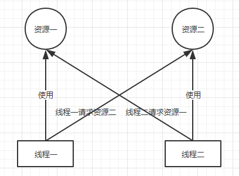

# 多线程并发


## 高并发编程基础知识


### **那并发（Concurrency）和并行（Parallelism）的区别**

**并行性是指两个或多个事件在同一时刻发生。而并发性是指连个或多个事件在同一时间间隔内发生。**

在多道程序环境下，并发性是指在一段时间内宏观上有多个程序在同时运行，但在单处理机环境下（一个处理器），每一时刻却仅能有一道程序执行，故微观上这些程序只能是分时地交替执行。例如，在1秒钟时间内，0-15ms程序A运行；15-30ms程序B运行；30-45ms程序C运行；45-60ms程序D运行，因此可以说，在1秒钟时间间隔内，宏观上有四道程序在同时运行，但微观上，程序A、B、C、D是分时地交替执行的。

如果在计算机系统中有多个处理机，这些可以并发执行的程序就可以被分配到多个处理机上，实现并发执行，即利用每个处理机处理一个可并发执行的程序。这样，多个程序便可以同时执行。以此就能提高系统中的资源利用率，增加系统的吞吐量。


### 线程和进程的区别

1. 进程是一个 “执行中的程序”，是系统进行资源分配和调度的一个独立单位；
2. 线程是进程的一个实体，一个进程中拥有多个线程，线程之间共享地址空间和其它资源（所以通信和同步等操作线程比进程更加容易）；
3. 线程上下文的切换比进程上下文切换要快很多。
   - （1）进程切换时，涉及到当前进程的 CPU 环境的保存和新被调度运行进程的 CPU 环境的设置。
   - （2）线程切换仅需要保存和设置少量的寄存器内容，不涉及存储管理方面的操作。


### **进程间如何通讯？线程间如何通讯？**

进程间通讯依靠 IPC 资源，例如管道（pipes）、套接字（sockets）等；

线程间通讯依靠 JVM 提供的 API，例如 wait()、notify()、notifyAll() 等方法，线程间还可以通过共享的主内存来进行值的传递。


### 什么是阻塞（Blocking）和非阻塞（Non-Blocking）

阻塞和非阻塞通常用来形容多线程间的相互影响。比如一个线程占用了临界区资源，那么其他所有需要这个而资源的线程就必须在这个临界区中进行等待。等待会导致线程挂起，这种情况就是阻塞。此时，如果占用资源的线程一直不愿意释放资源，那么其他所有阻塞在这个临界区上的线程都不能工作。

非阻塞的意思与之相反，它强调没有一个线程可以妨碍其他线程执行。所有的线程都会尝试不断前向执行。


### 什么是死锁（Deadlock）、饥饿（Starvation）和活锁（Livelock）

死锁、饥饿和活锁都属于多线程的活跃性问题，如果发现上述几种情况，那么相关线程可能就不再活跃，也就说它可能很难再继续往下执行了。



1. 死锁应该是最糟糕的一种情况了，它表示两个或者两个以上的进程在执行过程中，由于竞争资源或者由于彼此通信而造成的一种阻塞的现象，若无外力作用，它们都将无法推进下去。此时称系统处于死锁状态或系统产生了死锁，这些永远在互相等待的进程称为死锁进程。

2. 饥饿是指某一个或者多个线程因为种种原因无法获得所需要的资源，导致一直无法执行。比如：

   - 它的线程优先级可能太低，而高优先级的线程不断抢占它需要的资源，导致低优先级的线程无法工作。
   - 另外一种可能是，某一个线程一直占着关键资源不放，导致其他需要这个资源的线程无法正常执行，这种情况也是饥饿的一种。

   与死锁相比，饥饿还是有可能在未来一段时间内解决的（比如高优先级的线程已经完成任务，不再疯狂的执行）

3. 进程（或线程）并没有被阻塞，它们在不断地改变状态以避免阻塞，但最终无法取得进展。与死锁不同，活锁中的进程在执行过程中一直在不断尝试，但由于彼此之间的交互或竞争条件，它们一直无法成功完成。解决活锁的问题通常需要设计更复杂的算法或采用更智能的策略，以确保系统在解决竞争条件时能够取得进展。


### 多线程产生死锁的 4 个必要条件

1. 互斥条件：一个资源每次只能被一个线程使用；
2. 请求与保持条件：一个线程因请求资源而阻塞时，对已获得的资源保持不放；
3. 不剥夺条件：进程已经获得的资源，在未使用完之前，不能强行剥夺；
4. 循环等待条件：若干线程之间形成一种头尾相接的循环等待资源关系。


### **如何避免死锁**

1. **死锁检测和恢复：**
   - 实施死锁检测机制，定期检查系统中是否存在死锁。一旦检测到死锁，系统可以采取措施进行恢复，如中断某个线程或回滚一些操作。
   - 死锁检测一般涉及图论中的循环检测算法，例如银行家算法。
2. **资源有序性：**
   - 引入资源有序性，即规定所有线程按照相同的顺序请求资源。这样可以减小死锁的概率，但也可能导致性能下降。
3. **超时机制：**
   - 在请求资源时引入超时机制。如果一个线程在一定时间内无法获取到所需资源，就释放已经占有的资源，并回退一些步骤，以避免死锁。
4. **加锁顺序：**
   - 规定加锁的顺序，所有线程都按照相同的顺序获取锁。这样可以降低死锁的概率。
5. **避免事务中的多资源加锁：**
   - 在事务中，尽量避免同时持有多个资源的锁，以减小死锁的可能性。
6. **使用事务隔离级别：**
   - 选择合适的事务隔离级别，避免使用过高的隔离级别，因为高隔离级别可能增加死锁的风险。
7. **合理设计数据库索引：**
   - 在数据库中合理设计索引，以减小事务等待资源的时间，从而减小死锁的概率。
8. **定期优化和监控：**
   - 定期监控系统中的资源使用情况，通过优化数据库查询、减小事务时长等方式来预防死锁。


### 如何指定多个线程的执行顺序

面试官会给你举个例子，如何让 10 个线程按照顺序打印 0123456789？

1. 设定一个 orderNum，每个线程执行结束之后，更新 orderNum，指明下一个要执行的线程。并且唤醒所有的等待线程。
2. 在每一个线程的开始，要 while 判断 orderNum 是否等于自己的要求值！！不是，则 wait，是则执行本线程。

```java
class PrintNumber implements Runnable {
    private static final Object lock = new Object();
    private static int currentNumber = 0;

    @Override
    public void run() {
        while (currentNumber < 10) {
            synchronized (lock) {
                // 判断当前线程是否应该打印
                if (currentNumber % 10 == Integer.parseInt(Thread.currentThread().getName())) {
                    System.out.println(Thread.currentThread().getName());
                    currentNumber++;
                    lock.notifyAll();  // 唤醒其他等待的线程
                } else {
                    try {
                        lock.wait();  // 当前线程等待
                    } catch (InterruptedException e) {
                        e.printStackTrace();
                    }
                }
            }
        }
    }

    public static void main(String[] args) {
        PrintNumber printNumber = new PrintNumber();

        for (int i = 0; i < 10; i++) {
            new Thread(printNumber, Integer.toString(i)).start();
        }
    }
}
```


### Java 中线程有几种状态

六种（查看 Java 源码也可以看到是 6 种），并且某个时刻 Java 线程只能处于其中的一个状态。


> 注意：从 NEW 状态出发后，线程不能再回到 NEW 状态，同理，处于 TERMINATED 状态的线程也不能再回到 RUNNABLE 状态。


## 高并发编程-JUC 包

> 在 Java 5.0 提供了 java.util.concurrent（简称 JUC ）包，在此包中增加了在并发编程中很常用的实用工具类，用于定义类似于线程的自定义子系统，包括线程池、异步 IO 和轻量级任务框架。


### sleep( ) 和 wait( n)、wait( ) 的区别

1. sleep 方法：是 Thread 类的静态方法，当前线程将睡眠 n 毫秒，线程进入阻塞状态。当睡眠时间到了，会解除阻塞，进行可运行状态，等待 CPU 的到来。睡眠不释放锁（如果有的话）；
2. wait 方法：是 Object 的方法，必须与 synchronized 关键字一起使用，线程进入阻塞状态，当 notify 或者 notifyall 被调用后，会解除阻塞。但是，只有重新占用互斥锁之后才会进入可运行状态。睡眠时，释放互斥锁。


### synchronized 关键字：

底层实现：

1. 进入时，执行 monitorenter，将计数器 +1，释放锁 monitorexit 时，计数器-1；
2. 当一个线程判断到计数器为 0 时，则当前锁空闲，可以占用；反之，当前线程进入等待状态。

含义：（monitor 机制）

Synchronized 是在加对象锁。对象锁是一种重量锁（monitor），synchronized 的锁机制会根据线程竞争情况在运行时会有偏向锁（单一线程）、轻量锁（多个线程访问 synchronized 区域）、对象锁（重量锁，多个线程存在竞争的情况）、自旋锁等。

> 该关键字是一个几种锁的封装。


### volatile 关键字

该关键字可以保证可见性不保证原子性。volatile主要有以下两个功能：

- 保证变量的**内存可见性**
- 禁止volatile变量与普通变量**重排序**（JSR133提出，Java 5 开始才有这个“增强的volatile内存语义”）


### ReentrantLock

ReentrantLock是Lock的实现类，是一个互斥的同步器，在多线程高竞争条件下，ReentrantLock比synchronized有更加优异的性能表现。


### Lock和Synchronized的区别

**用法比较**

- Lock必须手动获取与释放锁，而synchronized不需要手动释放和开启锁
- Lock只适用于代码块锁，而synchronized可用于修饰方法、代码块等

**特性比较**

 ReentrantLock的优势体现在：

- ~~具备尝试非阻塞地获取锁的特性：当前线程尝试获取锁，如果这一时刻锁没有被其他线程获取到，则成功获取并持有锁~~
- 能被**中断**地获取锁的特性：与synchronized不同，获取到锁的线程能够响应中断，当获取到锁的线程被中断时，中断异常将会被抛出，同时锁会被释放
-   **超时获取锁**的特性：在指定的时间范围内获取锁；如果截止时间到了仍然无法获取锁，则返回
-  **ReentrantLock**可以设置`公平性（fairness）`
- **定义条件（Condition）**：`ReentrantLock` 可以通过 `newCondition` 方法创建与之关联的条件对象。条件对象用于在某个条件满足或者发生变化时，通知等待的线程。与 `synchronized` 不同，`ReentrantLock` 提供了多个条件，可以更灵活地控制线程的等待和通知。


### volatile和atomic的区别

1. **原子性：**
   - `volatile` 保证了可见性，即一个线程修改了变量的值，其他线程能够立即看到修改后的值。但 `volatile` 不能保证复合操作的原子性，例如递增操作（i++）。
   - 原子类（如 `AtomicInteger`、`AtomicLong` 等）提供了一些特定操作的原子性保证，可以确保一些常见操作的原子执行，例如递增、递减等。
2. **原子类的操作：**
   - 原子类提供了一些高级的原子操作，这些操作不仅保证了可见性，还保证了操作的原子性。例如，在 `AtomicInteger` 中，`incrementAndGet()` 方法是原子的。
   - `volatile` 只提供了可见性，对于复合操作，需要通过其他手段（如加锁）来保证原子性。
3. **内存语义：**
   - `volatile` 关键字保证了变量的写操作对其他线程的可见性，但并不提供原子性保证。
   - 原子类通过使用底层的 CAS（Compare-And-Swap）操作，保证了对变量的读取、修改和写入的原子性。
4. **适用场景：**
   - `volatile` 适用于简单的变量的读写场景，例如标识位、状态标志等。
   - 原子类适用于需要执行一些常见的原子操作的场景，例如计数器的递增、递减等。


### **volatile 用途**

1. ~~一种实践是用 volatile 修饰 long 和 double 变量，使其能按原子类型来读写。double 和 long 都是64位宽，因此对这两种类型的读是分为两部分的，第一次读取第一个 32 位，然后再读剩下的 32 位，这个过程不是原子的，但 Java 中 volatile 型的 long 或 double 变量的读写是原子的。~~

2. 在保证内存可见性这一点上，volatile有着与锁相同的内存语义，所以可以作为一个“轻量级"的锁来使用。但由于volatile仅仅保证对单个volatile变量的读/写具有原子性，而锁可以保证整个临界区代码的执行具有原子性。所以在功能上，锁比volatile更强大;在性能上，volatile更有优势。

   ```java
   public class VolatileDemo {
       int a = 0;
       volatile boolean flag = false;
   
       public void writer() {
           a = 1;  // step 1
           flag = true;   // step 2
       }
   
       public void reader() {
           if (flag) {          // step 3
               System.out.println(a);  // step 4
           }
       }
   }
   
   ```

3. volatile 修复符的另一个作用是提供内存屏障（memory barrier），例如在分布式框架中的应用。简单的说，就是当你写一个 volatile 变量之前，Java 内存模型会插入一个写屏障（write barrier），读一个 volatile 变量之前，会插入一个读屏障（read barrier）。意思就是说，在你写一个 volatile 域时，能保证任何线程都能看到你写的值，同时，在写之前，也能保证任何数值的更新对所有线程是可见的，因为内存屏障会将其他所有写的值更新到缓存。

   ```java
   public class Singleton {  
       private volatile static Singleton singleton;  
       private Singleton (){}  
       public static Singleton getSingleton() {  
       if (singleton == null) {  
           synchronized (Singleton.class) {  
           if (singleton == null) {  
               singleton = new Singleton();  
           }  
           }  
       }  
       return singleton;  
       }  
   }  
   ```


### ThreadLocal（线程局部变量）

ThreadLocal提供了线程的局部变量，每个线程都可以通过set()和get()来对这个局部变量进行操作，但不会和其他线程的局部变量进行冲突，实现了线程的数据隔离。

简要言之：往ThreadLocal中填充的变量属于当前线程，该变量对其他线程而言是隔离的。

ThreadLocal 内部实现机制：

1. 每个线程内部都会维护一个类似 HashMap 的对象，称为 ThreadLocalMap，里边会包含若干了 Entry（K-V 键值对），相应的线程被称为这些 Entry 的属主线程；
2. Entry 的 Key 是一个 ThreadLocal 实例，Value 是一个线程特有对象。Entry 的作用即是：为其属主线程建立起一个 ThreadLocal 实例与一个线程特有对象之间的对应关系；
3. Entry 对 Key 的引用是弱引用；Entry 对 Value 的引用是强引用。


#### 内存泄漏

在线程池中使用` ThreadLocal` 为什么可能导致`内存泄露呢`？原因就出在线程池中线程的存活时间太长，往往都是和程序同生共死的，这就意味着 Thread 持有的 ThreadLocalMap一直都不会被回收，再加上 `ThreadLocalMap` 中的 `Entry `对 ThreadLocal `是弱引用（WeakReference）`，所以只要 ThreadLocal **结束了自己的生命周期**是可以被回收掉的。但是 Entry 中的` Value `却是被 Entry `强引用的`，所以即便 Value 的生命周期结束了，Value 也是无法被回收的，从而导致内存泄露。


### 线程池有了解吗

Java.util.concurrent.ThreadPoolExecutor 类就是一个线程池。客户端调用 ThreadPoolExecutor.submit(Runnable task) 提交任务，线程池内部维护的工作者线程的数量就是该线程池的线程池大小，有 3 种形态：

> - 当前线程池大小 ：表示线程池中实际工作者线程的数量；
> - 最大线程池大小 （maxinumPoolSize）：表示线程池中允许存在的工作者线程的数量上限；
> - 核心线程大小 （corePoolSize ）：表示一个不大于最大线程池大小的工作者线程数量上限。

1. 如果运行的线程少于 corePoolSize，则 Executor 始终首选添加新的线程，而不进行排队；
2. 如果运行的线程等于或者多于 corePoolSize，则 Executor 始终首选将请求加入队列，而不是添加新线程；
3. 如果无法将请求加入队列，即队列已经满了，则创建新的线程，除非创建此线程超出 maxinumPoolSize， 在这种情况下，任务将被拒绝。


#### **我们为什么要使用线程池**

1. 减少创建和销毁线程的次数，每个工作线程都可以被重复利用，可执行多个任务。
2. 可以根据系统的承受能力，调整线程池中工作线程的数目，防止因为消耗过多的内存，而把服务器累趴下（每个线程大约需要 1 MB 内存，线程开的越多，消耗的内存也就越大，最后死机）


#### **核心线程池内部实现了解吗**

对于核心的几个线程池，无论是 newFixedThreadPool() 方法，newSingleThreadExecutor() 还是 newCachedThreadPool() 方法，虽然看起来创建的线程有着完全不同的功能特点，但其实内部实现均使用了 ThreadPoolExecutor 实现，其实都只是 ThreadPoolExecutor 类的封装。

为何 ThreadPoolExecutor 有如此强大的功能呢？我们可以来看一下 ThreadPoolExecutor 最重要的构造函数：

```java
    public ThreadPoolExecutor(int corePoolSize,
                              int maximumPoolSize,
                              long keepAliveTime,
                              TimeUnit unit,
                              BlockingQueue<Runnable> workQueue,
                              ThreadFactory threadFactory,
                              RejectedExecutionHandler handler)
```

- corePoolSize：指定了线程池中的线程数量
- maximumPoolSize：指定了线程池中的最大线程数量
- keepAliveTime：当线程池线程数量超过 corePoolSize 时，多余的空闲线程的存活时间。即，超过了 corePoolSize 的空闲线程，在多长时间内，会被销毁。
- unit: keepAliveTime 的单位。
- workQueue：任务队列，被提交但尚未被执行的任务。
- threadFactory：线程工厂，用于创建线程，一般用默认的即可。
- handler：拒绝策略。当任务太多来不及处理，如何拒绝任务。


#### ThreadPoolExecutor各个参数如何合理设置

**对于 CPU 密集型计算：**

多线程本质上是提升多核 CPU 的利用率，所以对于一个 4 核的 CPU，每个核一个线程，理论上创建 4 个线程就可以了，再多创建线程也只是增加线程切换的成本。所以，**对于 CPU 密集型的计算场景，理论上“线程的数量 =CPU 核数”就是最合适的**。不过在工程上，**线程的数量一般会设置为“CPU 核数 +1”**，这样的话，当线程因为偶尔的内存页失效或其他原因导致阻塞时，这个额外的线程可以顶上，从而保证 CPU 的利用率。

**最佳线程数 =CPU 核数 + 1**


**对于 I/O 密集型的计算：**

最佳线程数 =CPU 核数 * [ 1 +（I/O 耗时 / CPU 耗时）]

在平常的应用场景中，我们常常遇不到这两种极端情况，那么碰上一些常规的业务操作，比如，通过一个线程池实现向用户定时推送消息的业务（就是我咋知道你是属于那种计算），我们又该如何设置线程池的数量呢？

**此时我们可以参考以下公式来计算线程数：**

```
线程数 =N（CPU 核数）*（1+WT（线程等待时间）/ST（线程时间运行时间））
```


我们可以通过 **JDK 自带的工具** `VisualVM `来查看 `WT/ST` 比例，以下例子是基于运行纯 CPU 运算的例子，我们可以看到：

```
WT（线程等待时间）= 36788ms [线程运行总时间] - 36788ms[ST（线程时间运行时间）]= 0
线程数 =N（CPU 核数）*（1+ 0 [WT（线程等待时间）]/36788ms[ST（线程时间运行时间）]）= N（CPU 核数）
```

这跟我们之前通过 CPU 密集型的计算公式 N+1 所得出的结果差不多。

综合来看，我们可以根据自己的业务场景，从“N+1”和“2N”两个公式中选出一个适合的，计算出一个大概的线程数量，之后通过实际压测，逐渐往“增大线程数量”和“减小线程数量”这两个方向调整，然后观察整体的处理时间变化，最终确定一个具体的线程数量。


### 创建线程有哪几种方式？

有两种创建线程的方法：一是实现Runnable接口，然后将它传递给Thread的构造函数，创建一个Thread对象;二是直接继承Thread类。


#### **两种方式有什么区别呢**

1. 继承方式:
   - （1）Java中类是单继承的,如果继承了Thread了,该类就不能再有其他的直接父类了.
   - （2）从操作上分析,继承方式更简单,获取线程名字也简单.(操作上,更简单)
   - （3）从多线程共享同一个资源上分析,继承方式不能做到.
2. 实现方式:
   - （1）Java中类可以多实现接口,此时该类还可以继承其他类,并且还可以实现其他接口(设计上,更优雅).
   - （2）从操作上分析,实现方式稍微复杂点,获取线程名字也比较复杂,得使用Thread.currentThread()来获取当前线程的引用.
   - （3）从多线程共享同一个资源上分析,实现方式可以做到(是否共享同一个资源).


### run() 方法和 start() 方法有什么区别

start() 方法会新建一个线程并让这个线程执行 run() 方法；而直接调用 run() 方法知识作为一个普通的方法调用而已，它只会在当前线程中，串行执行 run() 中的代码。


### 你怎么理解线程优先级

Java 中的线程可以有自己的优先级。优先极高的线程在竞争资源时会更有优势，更可能抢占资源，当然，这只是一个概率问题。如果运行不好，高优先级线程可能也会抢占失败。

由于线程的优先级调度和底层操作系统有密切的关系，在各个平台上表现不一，并且这种优先级产生的后果也可能不容易预测，无法精准控制，比如一个低优先级的线程可能一直抢占不到资源，从而始终无法运行，而产生饥饿（虽然优先级低，但是也不能饿死它啊）。因此，在要求严格的场合，还是需要自己在应用层解决线程调度的问题。

在 Java 中，使用 1 到 10 表示线程优先级，一般可以使用内置的三个静态标量表示：

```java
public final static int MIN_PRIORITY = 1;
public final static int NORM_PRIORITY = 5;
public final static int MAX_PRIORITY = 10;
```

数字越大则优先级越高，但有效范围在 1 到 10 之间，默认的优先级为 5 。


### 在 Java 中如何停止一个线程

JDK 1.0 本来有一些像 stop()，suspend() 和 resume() 的控制方法但是由于潜在的死锁威胁因此在后续的 JDK 版本中他们被弃用了，之后 Java API 的设计者就没有提供一个兼容且线程安全的方法来停止任何一个线程。

当 run() 或者 call() 方法执行完的时候线程会自动结束，如果要手动结束一个线程，你可以用 volatile 布尔变量来退出 run() 方法的循环或者是取消任务来中断线程。


### 多线程中的忙循环是什么

忙循环就是程序员用循环让一个线程等待，不像传统方法 wait(),sleep() 或yield() 它们都放弃了 CPU 控制权，而忙循环不会放弃 CPU，它就是在运行一个空循环。这么做的目的是为了保留 CPU 缓存。

在多核系统中，一个等待线程醒来的时候可能会在另一个内核运行，这样会重建缓存，为了避免重建缓存和减少等待重建的时间就可以使用它了。


### 10 个线程和 2 个线程的同步代码，哪个更容易写？

从写代码的角度来说，两者的复杂度是相同的，因为同步代码与线程数量是相互独立的。但是同步策略的选择依赖于线程的数量，因为越多的线程意味着更大的竞争，所以你需要利用同步技术，如锁分离，这要求更复杂的代码和专业知识。


### 你是如何调用 wait（）方法的？使用 if 块还是循环？为什么？

wait() 方法应该在循环调用，因为当线程获取到 CPU 开始执行的时候，其他条件可能还没有满足，所以在处理前，循环检测条件是否满足会更好。下面是一段标准的使用 wait 和 notify 方法的代码：

```java
// The standard idiom for using the wait method
synchronized (obj) {
while (condition does not hold)
obj.wait(); // (Releases lock, and reacquires on wakeup)
... // Perform action appropriate to condition
}
```


### ~~用 wait-notify 写一段代码来解决生产者-消费者问题~~

这是常考的基础类型的题，只要记住在同步块中调用 wait() 和 notify()方法，如果阻塞，通过循环来测试等待条件。

```java
import java.util.Vector;
import java.util.logging.Level;
import java.util.logging.Logger;

/**
 * Java program to solve Producer Consumer problem using wait and notify
 * method in Java. Producer Consumer is also a popular concurrency design pattern.
 *
 * @author Javin Paul
 */
public class ProducerConsumerSolution {

    public static void main(String args[]) {
        Vector sharedQueue = new Vector();
        int size = 4;
        Thread prodThread = new Thread(new Producer(sharedQueue, size), "Producer");
        Thread consThread = new Thread(new Consumer(sharedQueue, size), "Consumer");
        prodThread.start();
        consThread.start();
    }
}

class Producer implements Runnable {

    private final Vector sharedQueue;
    private final int SIZE;

    public Producer(Vector sharedQueue, int size) {
        this.sharedQueue = sharedQueue;
        this.SIZE = size;
    }

    @Override
    public void run() {
        for (int i = 0; i < 7; i++) {
            System.out.println("Produced: " + i);
            try {
                produce(i);
            } catch (InterruptedException ex) {
                Logger.getLogger(Producer.class.getName()).log(Level.SEVERE, null, ex);
            }

        }
    }

    private void produce(int i) throws InterruptedException {

        // wait if queue is full
        while (sharedQueue.size() == SIZE) {
            synchronized (sharedQueue) {
                System.out.println("Queue is full " + Thread.currentThread().getName()
                                    + " is waiting , size: " + sharedQueue.size());

                sharedQueue.wait();
            }
        }

        // producing element and notify consumers
        synchronized (sharedQueue) {
            sharedQueue.add(i);
            sharedQueue.notifyAll();
        }
    }
}

class Consumer implements Runnable {

    private final Vector sharedQueue;
    private final int SIZE;

    public Consumer(Vector sharedQueue, int size) {
        this.sharedQueue = sharedQueue;
        this.SIZE = size;
    }

    @Override
    public void run() {
        while (true) {
            try {
                System.out.println("Consumed: " + consume());
                Thread.sleep(50);
            } catch (InterruptedException ex) {
                Logger.getLogger(Consumer.class.getName()).log(Level.SEVERE, null, ex);
            }

        }
    }

    private int consume() throws InterruptedException {
        // wait if queue is empty
        while (sharedQueue.isEmpty()) {
            synchronized (sharedQueue) {
                System.out.println("Queue is empty " + Thread.currentThread().getName()
                                    + " is waiting , size: " + sharedQueue.size());

                sharedQueue.wait();
            }
        }

        // Otherwise consume element and notify waiting producer
        synchronized (sharedQueue) {
            sharedQueue.notifyAll();
            return (Integer) sharedQueue.remove(0);
        }
    }
}

Output:
Produced: 0
Queue is empty Consumer is waiting , size: 0
Produced: 1
Consumed: 0
Produced: 2
Produced: 3
Produced: 4
Produced: 5
Queue is full Producer is waiting , size: 4
Consumed: 1
Produced: 6
Queue is full Producer is waiting , size: 4
Consumed: 2
Consumed: 3
Consumed: 4
Consumed: 5
Consumed: 6
Queue is empty Consumer is waiting , size: 0
```


### ~~用 Java 写一个线程安全的单例模式（Singleton）~~

有多种方法，但重点掌握的是双重校验锁。

1.饿汉式单例

饿汉式单例是指在方法调用前，实例就已经创建好了。下面是实现代码：

```smali
public class Singleton {

    private static Singleton instance = new Singleton();

    private Singleton (){}

    public static Singleton getInstance() {
        return instance;
    }
}
```

2.加入 synchronized 的懒汉式单例

所谓懒汉式单例模式就是在调用的时候才去创建这个实例，我们在对外的创建实例方法上加如 synchronized 关键字保证其在多线程中很好的工作：

```smali
public class Singleton {    

    private static Singleton instance;    

    private Singleton (){}    

    public static synchronized Singleton getInstance() {    
        if (instance == null) {    
            instance = new Singleton();    
    }    
    return instance;    
    }    
}  
```

3.使用静态内部类的方式创建单例

这种方式利用了 classloder 的机制来保证初始化 instance 时只有一个线程，它跟饿汉式的区别是：饿汉式只要 Singleton 类被加载了，那么 instance 就会被实例化（没有达到 lazy loading 的效果），而这种方式是 Singleton 类被加载了，instance 不一定被初始化。只有显式通过调用 getInstance() 方法时才会显式装载 SingletonHoder 类，从而实例化 singleton

```csharp
public class Singleton {

    private Singleton() {
    }

    private static class SingletonHolder {// 静态内部类  
        private static Singleton singleton = new Singleton();
    }

    public static Singleton getInstance() {
        return SingletonHolder.singleton;
    }
}
```

4.**双重校验锁**

为了达到线程安全，又能提高代码执行效率，我们这里可以采用DCL的双检查锁机制来完成，代码实现如下：

```csharp
public class Singleton {  
  
    private static Singleton singleton;  

    private Singleton() {  
    }  

    public static Singleton getInstance(){  
        if (singleton == null) {  
            synchronized (Singleton.class) {  
                if (singleton == null) {  
                    singleton = new Singleton();  
                }  
            }  
        }  
        return singleton;  
    }  
} 
```

这种是用双重判断来创建一个单例的方法，那么我们为什么要使用两个if判断这个对象当前是不是空的呢 ？因为当有多个线程同时要创建对象的时候，多个线程有可能都停止在第一个if判断的地方，等待锁的释放，然后多个线程就都创建了对象，这样就不是单例模式了，所以我们要用两个if来进行这个对象是否存在的判断。

5.使用 static 代码块实现单例

静态代码块中的代码在使用类的时候就已经执行了，所以可以应用静态代码块的这个特性的实现单例设计模式。

```smali
public class Singleton{  
       
    private static Singleton instance = null;  
       
    private Singleton(){}  
  
    static{  
        instance = new Singleton();  
    }  
      
    public static Singleton getInstance() {   
        return instance;  
    }   
}  
```

6.使用枚举数据类型实现单例模式

枚举enum和静态代码块的特性相似，在使用枚举时，构造方法会被自动调用，利用这一特性也可以实现单例：


```csharp
public class ClassFactory{   
      
    private enum MyEnumSingleton{  
        singletonFactory;  
          
        private MySingleton instance;  
          
        private MyEnumSingleton(){//枚举类的构造方法在类加载是被实例化  
            instance = new MySingleton();  
        }  
   
        public MySingleton getInstance(){  
            return instance;  
        }  
    }   
   
    public static MySingleton getInstance(){  
        return MyEnumSingleton.singletonFactory.getInstance();  
    }  
}  
```


参考链接：https://segmentfault.com/a/1190000040267161

