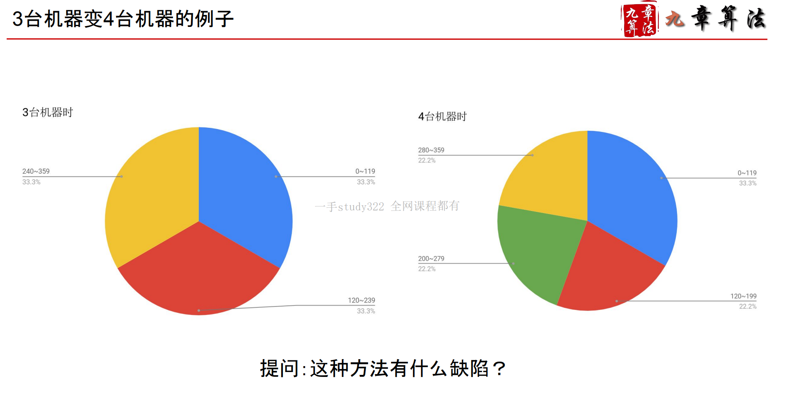
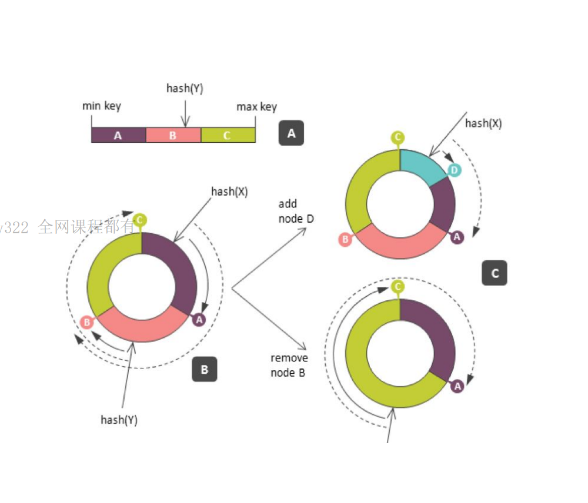

# 数据库拆分与一致性哈希算法

## 为什么使用分库分表

传统的将数据集中存储至单一数据节点的解决方案，在**性能、可用性和运维成本**这三方面已经难于满足互联网的海量数据场景。

1. 性能

   >从性能方面来说，由于关系型数据库大多采用 B+ 树类型的索引，在数据量超过阈值的情况下，索引深度的增加也将使得磁盘访问的 IO 次数增加，进而导致查询性能的下降。
   >
   >同时，高并发访问请求也使得集中式数据库成为系统的最大瓶颈。

2. 可用性

   >从可用性的方面来讲，服务化的无状态型，能够达到较小成本的随意扩容，这必然导致系统的最终压力都落在数据库之上。而单一的数据节点，或者简单的主从架构，已经越来越难以承担。数据库的可用性，已成为整个系统的关键。

3. 运维成本

   >从运维成本方面考虑，当一个数据库实例中的数据达到阈值以上，对于 DBA 的运维压力就会增大。数据备份和恢复的时间成本都将随着数据量的大小而愈发不可控。一般来讲，单一数据库实例的数据的阈值在 1TB 之内，是比较合理的范围。

**那么为什么不选择 NoSQL 呢**

在传统的关系型数据库无法满足互联网场景需要的情况下，将数据存储至原生支持分布式的 NoSQL 的尝试越来越多。 但 NoSQL 对 SQL 的不兼容性以及生态圈的不完善，使得它们在与关系型数据库的博弈中始终无法完成致命一击，而关系型数据库的地位却依然不可撼动。

## 什么是分库分表

数据分片，指按照某个维度将存放在单一数据库中的数据分散地存放至多个数据库或表中以达到提升性能瓶颈以及可用性的效果。数据分片的有效手段是对关系型数据库进行**分库和分表**。

- 分库和分表均可以有效的避免由数据量超过可承受阈值而产生的查询瓶颈。除此之外，分库还能够用于有效的分散对数据库单点的访问量。
- 分表虽然无法缓解数据库压力，但却能够提供尽量将分布式事务转化为本地事务的可能，一旦涉及到跨库的更新操作，分布式事务往往会使问题变得复杂。
- 使用多主多从的分片方式，可以有效的避免数据单点，从而提升数据架构的可用性。

通过分库和分表进行数据的拆分来使得各个表的数据量保持在阈值以下，以及对流量进行疏导应对高访问量，是应对高并发和海量数据系统的有效手段。数据分片的拆分方式又分为垂直分片和水平分片。

### **垂直分片**

按照业务拆分的方式称为垂直分片，又称为纵向拆分，它的核心理念是专库专用。 在拆分之前，一个数据库由多个数据表构成，每个表对应着不同的业务。而拆分之后，则是按照业务将表进行归类，分布到不同的数据库中，从而将压力分散至不同的数据库。

下图展示了根据业务需要，将用户表和订单表垂直分片到不同的数据库的方案：

垂直分片往往需要对架构和设计进行调整。通常来讲，是来不及应对互联网业务需求快速变化的；而且，它也并无法真正的解决单点瓶颈。 垂直拆分可以缓解数据量和访问量带来的问题，但无法根治。如果垂直拆分之后，表中的数据量依然超过单节点所能承载的阈值，则需要水平分片来进一步处理。

垂直拆分的优点：

- 库表职责单一，复杂度降低，易于维护。
- 单库或单表压力降低。 相互之间的影响也会降低。

垂直拆分的缺点：

- 部分表关联无法在数据库级别完成，需要在程序中完成。
- 单表大数据量仍然存在性能瓶颈。
- 单表或单库高热点访问依旧对 DB 压力非常大。
- 事务处理相对更为复杂，需要分布式事务的介入。
- 拆分达到一定程度之后，扩展性会遇到限制。

### **水平分片**

水平分片又称为横向拆分。 相对于垂直分片，它不再将数据根据业务逻辑分类，而是通过某个字段（或某几个字段），根据某种规则将数据分散至多个库或表中，每个分片仅包含数据的一部分。

例如：根据主键分片，偶数主键的记录放入 0 库（或表），奇数主键的记录放入 1 库（或表）

水平分片从理论上突破了单机数据量处理的瓶颈，并且扩展相对自由，是分库分表的标准解决方案。

水平拆分的优点：

- 解决单表单库大数据量和高热点访问性能遇到瓶颈的问题。
- 应用程序端整体架构改动相对较少。
- 事务处理相对简单。
- 只要切分规则能够定义好，基本上较难遇到扩展性限制。

水平拆分缺点：

- 拆分规则相对更复杂，很难抽象出一个能够满足整个数据库的切分规则。
- 后期数据的维护难度有所增加，人为手工定位数据更困难。
- 产品逻辑将变复杂。比如按年来进行历史数据归档拆分，这个时候在页面设计上就需要约束用户必须要先选择年，然后才能进行查询。

###  **总结？**

- 数据表垂直拆分：单表复杂度。
- 数据库垂直拆分：功能拆分。
- 水平拆分
  - 分表：解决单表大数据量问题。
  - 分库：为了解决单库性能问题。

## 什么是分布式主键

分布式主键的实现方案有很多，可以看看 [《谈谈 ID》](http://www.iocoder.cn/Architecture/talk-about-global-id/) 的总结。

一般来说，目前采用 SnowFlake 的居多，可以看看 [《Sharding-JDBC 源码分析 —— 分布式主键》](http://www.iocoder.cn/Sharding-JDBC/distributed-id/?vip) 的源码的具体实现，比较简单。

## 分片键的选择

分库分表后，分片键的选择非常重要。一般来说，有如下两种：

- 信息表，使用id 进行分片。例如说，文章、商品信息等等。
- 业务表，使用user_id 进行分片。例如说，订单表、支付表等。
- 日志表，使用create_time 进行分片。例如说，访问日志、登陆日志等等。

### **分片算法的选择**

选择好分片键之后，还需要考虑分片算法。一般来说，有如下两种：

- 取余分片算法。例如说，有四个库，那么 user_id 为 10 时，分到第10 % 4 = 2个库。
  - 当然，如果分片键是字符串，则需要先进行 hash 的方式，转换成整形，这样才可以取余。
  - 当然，如果分片键是整数，也可以使用 hash 的方式。
- 范围算法。
  - 例如说，时间范围。

上述两种算法，各有优缺点。

- 对于取余来说：
  - 好处，可以平均分配每个库的数据量和请求压力。
  - 坏处，在于说扩容起来比较麻烦，会有一个数据迁移的过程，之前的数据需要重新计算 hash 值重新分配到不同的库或表。

- 对于 range 来说：
  - 好处，扩容的时候很简单，因为你只要预备好，给每个月都准备一个库就可以了，到了一个新的月份的时候，自然而然，就会写新的库了。
  - 缺点，但是大部分的请求，都是访问最新的数据。实际生产用 range，要看场景。

###  **如果查询条件不带分片键，怎么办**

当查询不带分片键时，则中间件一般会扫描所有库表，然后聚合结果，然后进行返回。

对于大多数情况下，如果每个库表的查询速度还可以，返回结果的速度也是不错的。具体，胖友可以根据自己的业务进行测试。

### **使用 user_id 分库分表后，使用 id 查询怎么办**

有四种方案。

1. 不处理

   正如在 [「如果查询条件不带分片键，怎么办？」](http://svip.iocoder.cn/database-sharding/Interview/#) 问题所说，如果性能可以接受，可以不去处理。当然，前提是这样的查询不多，不会给系统带来负担。

2. 映射关系

   创建映射表，只有 id、user_id 两列字段。使用 id 查询时，先从映射表获得 id 对应的 user_id ，然后再使用 id + user_id 去查询对应的表。

   当然，随着业务量的增长，映射表也会越来越大，后续也可能需要进行分库分表。

   对于这方式，也可以有一些优化方案。

   - 映射表改成缓存到 Redis 等 KV 缓存中。当然，需要考虑如果 Redis 持久化的情况。
   - 将映射表缓存到内存中，减少一次到映射表的查询。

3. 基因 id

   分库基因：假如通过 user_id 分库，分为 8 个库，采用 user_id % 8 的方式进行路由，此时是由 user_id 的最后 3bit 来决定这行 User 数据具体落到哪个库上，那么这 3bit 可以看为分库基因。那么，如果我们将这 3 bit 参考类似 Snowflake 的方式，融入进入到 id 

   > 艿艿：这里的 3 bit 只是举例子，实际需要考虑自己分多少库表，来决定到底使用多少 bit 。

   上面的映射关系的方法需要额外存储映射表，按非 user_id 字段查询时，还需要多一次数据库或 Cache 的访问。通过基因 id ，就可以知道数据所在的库表。

   详细说明，可以看看 [《用 uid 分库，uname 上的查询怎么办？》](http://www.10tiao.com/html/249/201704/2651960032/1.html) 文章。

   目前，可以从 [《大众点评订单系统分库分表实践》](https://tech.meituan.com/dianping_order_db_sharding.html) 文章中，看到大众点评订单使用了基因 id 。

4. 多 sharding column

   具体的内容，可以参考 [《分库分表的正确姿势，你 GET 到了么？》](https://yq.aliyun.com/articles/641529) 。当然，这种方案也是比较复杂的方案。

## 分库分表中间件

在将数据库进行分库分表之后，我们一般会引入分库分表的中间件，使之能够达到如下目标。

>尽量透明化分库分表所带来的影响，让使用方尽量像使用一个数据库一样使用水平分片之后的数据库集群，这是分库分表的主要设计目标。

###  **分库分表的实现方式**

目前，市面上提供的分库分表的中间件，主要有两种实现方式：

- Client 模式
- Proxy 模式

### **分库分表中间件**

比较常见的包括：

- Cobar
- MyCAT
- Atlas
- TDDL
- Sharding Sphere

1）Cobar

阿里 b2b 团队开发和开源的，属于 Proxy 层方案。

早些年还可以用，但是最近几年都没更新了，基本没啥人用，差不多算是被抛弃的状态吧。而且不支持读写分离、存储过程、跨库 join 和分页等操作。

2）MyCAT

基于 Cobar 改造的，属于 Proxy 层方案，支持的功能非常完善，而且目前应该是非常火的而且不断流行的数据库中间件，社区很活跃，也有一些公司开始在用了。但是确实相比于 Sharding Sphere 来说，年轻一些，经历的锤炼少一些。

3）Atlas

360 开源的，属于 Proxy 层方案，以前是有一些公司在用的，但是确实有一个很大的问题就是社区最新的维护都在 5 年前了。所以，现在用的公司基本也很少了。

4）TDDL

淘宝团队开发的，属于 client 层方案。支持基本的 crud 语法和读写分离，但不支持 join、多表查询等语法。目前使用的也不多，因为还依赖淘宝的 diamond 配置管理系统。

5）Sharding Sphere

Sharding Sphere ，可能是目前最好的开源的分库分表解决方案，目前已经进入 Apache 孵化。

Sharding Sphere 提供三种模式：

>关于每一种模式的介绍，可以看看 [《ShardingSphere > 概览》](http://shardingsphere.io/document/current/cn/overview/)

- Sharding-JDBC
- Sharding-Proxy
- Sharding-Sidecar 计划开发中。

其中，Sharding-JDBC 属于 client 层方案，被大量互联网公司所采用。例如，当当、京东金融、中国移动等等。

### ~~如何选择~~

综上，现在其实建议考量的，就是 Sharding Sphere ，这个可以满足我们的诉求。

Sharding Sphere 的 Sharding-JDBC 方案，这种 Client 层方案的**优点在于不用部署，运维成本低，不需要代理层的二次转发请求，性能很高**，但是如果遇到升级啥的需要各个系统都重新升级版本再发布，各个系统都需要**耦合** sharding-jdbc 的依赖。

> 据艿艿了解到，例如阿里、美团内部，更多使用的是 Client 模式。

Sharding Sphere 的 Sharding-Proxy 方案，这种 Proxy 层方案，可以解决我们平时查询数据库的需求。我们只需要连接一个 Sharding-Proxy ，就可以查询分库分表中的数据。另外，如果我们有跨语言的需求，例如 PHP、GO 等，也可以使用它。

## 分库分表之后，有哪些问题

虽然数据分片解决了性能、可用性以及单点备份恢复等问题，但分布式的架构在获得了收益的同时，也引入了新的问题。

- 面对如此散乱的分库分表之后的数据，应用开发工程师和数据库管理员对数据库的操作变得异常繁重就是其中的重要挑战之一。他们需要知道数据需要从哪个具体的数据库的分表中获取。

- 另一个挑战则是，能够正确的运行在单节点数据库中的 SQL ，在分片之后的数据库中并不一定能够正确运行。

  - 例如，分表导致表名称的修改，或者分页、排序、聚合分组等操作的不正确处理。
  - 例如，跨节点 join 的问题。

- **跨库事务**也是分布式的数据库集群要面对的棘手事情。

  - 合理采用分表，可以在降低单表数据量的情况下，尽量使用本地事务，善于使用同库不同表可有效避免分布式事务带来的麻烦。

    >要达到这个效果，需要尽量把同一组数据放到同一组 DB 服务器上。
    >
    >例如说，将同一个用户的订单主表，和订单明细表放到同一个库，那么在创建订单时，还是可以使用相同本地事务。

    

  - 在不能避免跨库事务的场景，有些业务仍然需要保持事务的一致性。而基于 XA 的分布式事务由于在并发度高的场景中性能无法满足需要，并未被互联网巨头大规模使用，他们大多采用最终一致性的柔性事务代替强一致事务。

  - 分布式全局唯一 ID 。

    - 在单库单表的情况下，直接使用数据库自增特性来生成主键ID，这样确实比较简单。
    - 在分库分表的环境中，数据分布在不同的分表上，不能再借助数据库自增长特性。需要使用全局唯一 ID，例如 UUID、GUID等 。

## ~~如何迁移到分库分表~~

一般来说，会有三种方式：

- 1、停止部署法。
- 2、双写部署法，基于业务层。
- 3、双写部署法，基于 binlog 。

具体的详细方案，可以看看如下两篇文章：

- [《数据库分库分表后，如何部署上线？》](http://www.iocoder.cn/Fight/After-the-database-sharding-how-to-deploy-online/)
- [《【面试宝典】如何把单库数据迁移到分库分表？》](http://www.chaiguanxin.com/articles/2018/11/11/1541923418699.html)
- [《分库分表的面试题3》](https://www.cnblogs.com/daiwei1981/p/9416068.html)

另外，这是另外一个比较相对详细的【双写部署法，基于业务层】的过程：

- 双写 ，老库为主。读操作还是读老库老表，写操作是双写到新老表。
- 历史数据迁移 dts + 新数据对账校验（job） + 历史数据校验。
- 切读：读写以新表为主，新表成功就成功了。
- 观察几天，下掉写老库操作。

另外，飞哥的 [《不停机分库分表迁移》](https://www.jianshu.com/p/223d71421f49) 文章，也非常推荐看看。

🦅 **如何设计可以动态扩容缩容的分库分表方案？**

可以参看 [《如何设计可以动态扩容缩容的分库分表方案？》](https://github.com/doocs/advanced-java/blob/master/docs/high-concurrency/database-shard-dynamic-expand.md) 文章。简单的结论是：

- 提前考虑好容量的规划，避免扩容的情况。
- 如果真的需要扩容，走上述的 [「如何迁移到分库分表？」](http://svip.iocoder.cn/database-sharding/Interview/#) 提到的方案。

## ~~如何解决分布式事务~~

目前市面上，分布式事务的解决方案还是蛮多的，但是都是基于一个前提，需要保证本地事务。**那么，就对我们在分库分表时，就有相应的要求：数据在分库分表时，需要保证一个逻辑中，能够形成本地事务**。举个例子，创建订单时，我们会插入订单表和订单明细表，那么：

- 如果我们基于这两个表的 id 进行分库分表，将会导致插入的记录被分到不同的库表中，因为创建下单可以购买 n 个商品，那么就会有 1 条订单记录和 n 条 订单明细记录。而这 n 条订单明细记录无法和 1 条订单记录分到一个库表中。

- 如果我们基于这两个表的 user_id 进行分库分表，那么插入的记录被分到相同的库表中。

  > 艿艿：这也是为什么业务表一般使用 user_id 进行分库分表的原因之一。

可能会有胖友有疑问，为什么一定要形成本地事务？在有了本地事务的基础上，通过使用分布式事务的解决方案，协调多个本地事务，形成最终一致性。另外，😈 本地事务在这个过程中，能够保证万一执行失败，再重试时，不会产生脏数据。

## 一致性哈希算法

引用自维基百科：“一致性哈希是一种特殊的哈希，当调整哈希表大小并使用一致性哈希时，平均只需要重新映射 k/n 个键，其中 k 是键的数量，并且n 是槽的数量。相比之下，在大多数传统哈希表中，数组槽数量的变化会导致几乎所有键都被重新映射。

Horizontal Sharding 的秘密武器 无论是 SQL 还是 NoSQL 都可以用这个方法进行 Sharding 

注：大部分 NoSQL 都帮你实现好了这个算法，帮你自动 Sharding 

很多 SQL 数据库也逐渐加入 Auto-scaling 的机制了，也开始帮你做 自动的 Sharding 

**一个简单的一致性Hash算法** 

• 将 key 模一个很大的数，比如 360 • 将 360 分配给 n 台机器，每个机器负责一段区间 

• 区间分配信息记录为一张表存在 Web Server 上 

• 新加一台机器的时候，在表中选择一个位置插入，匀走相邻两台机器的一部分数据 

**比如 n 从 2 变化到 3，只有 1/3 的数据移动**

### 这种方法有什么缺陷

**缺陷1 数据分布不均匀** 

因为算法是“将数据最多的相邻两台机器均匀分为三台” 

比如，3台机器变4台机器时，无法做到4台机器均匀分布 

**缺陷2 迁移压力大** 

新机器的数据只从两台老机器上获取 

导致这两台老机器负载过大 

### 哈希函数 Hash Function

http://www.lintcode.com/problem/hash-function 

将任意类型的 key 转换为一个 0~size-1 的整数 在 Consistent Hashing 中，一般取 size = 2^64 

很多哈希算法可以保证不同的 key 算得相同的 hash 值的概率等于 **宇宙爆炸的概率** 

### 一致性哈希算法 Consistent Hashing

- 将取模的底数从 360 拓展到 2^64
- 将 0~2^64-1 看做一个很大的圆环(Ring)
- 将数据和机器都通过 hash function 换算到环上的一个点
  - 数据取 key / row_key 作为 hash key
  - 机器取MAC地址，或者机器固定名字如 database01，或者固定的 IP 地址
- 每个数据放在哪台机器上，取决于在 Consistent Hash Ring 上**顺时针**碰到的下一个机器节点

#### 虚拟节点 Virtual Node

- 引入分身的概念（Virtual nodes)
- 一个实体机器（Real node) 对应若干虚拟机器（Virtual Node）
  - 通常是 1000 个
  - 分身的KEY可以用**实****体机器的**KEY+**后****缀**的形式
    - 如 database01-0001
    - 好处是直接按格式去掉后缀就可以得到实体机器
- 用一个数据结构存储这些 virtual nodes
  - 支持快㏿的查询比某个数大的最小数
    - 即顺时针碰到的下一个 virtual nodes
  - 哪种数据结构可以支持？

### ~~疑问~~

**新增一台机器** 

创建对应的 1000 个分身 db99-000 ~ 999 

加入到 virtuals nodes 集合中 

问：该从哪些机器迁移哪些数据到新机器上？

Consistent Hashing 

http://www.lintcode.com/problem/consistent-hashing-ii/ 

哈希函数 Hash Function 

http://www.lintcode.com/problem/hash-function 

