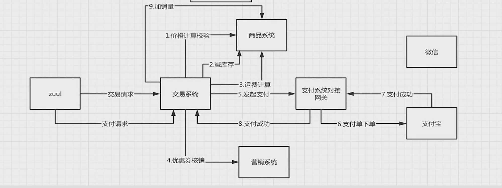
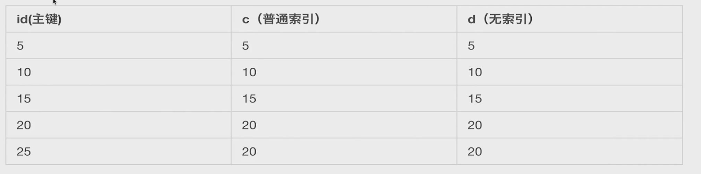
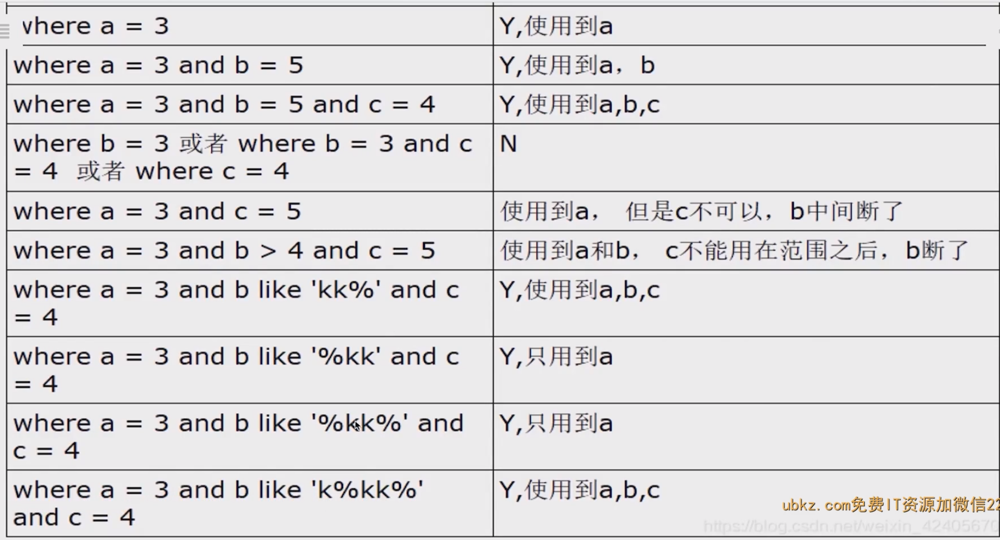

 


# 一面上半场——项目业务架构介绍


## 自我介绍


自我介绍是形塑第一印象的关键，也是你一上来可以掌握主动权的机会


**要点**

- 简短有力 3-4 分钟较好
- 内容要有结构性：经历简介、项目经历、技术总结
- 凸显能力：技术经验能力、学习思考能能力


### 介绍的内容


- 经历简介

  个人信息，教育背景，职业生涯，工作年限

  >例如：我叫什么名字，哪个大学毕业，之前呆过两家公司，一家是北京比利信息信息技术，主要从事视频流媒体平台的开发，一家是纬创软件有限公司。我有3年的java工作经验。经历简介十几秒内可以说完。

- 项目经历

  电商项目：微服务，领域模型驱动设计，结果产出，qps,高并发场景，担当什么？

  >在两年多的时间中，我主要负责了电视流媒体的一个服务拆分项目，使用微服务相关的技术，去做领域驱动模型的设计做业务的产出，在应对不断变化和迭代的需求过程当中，我采用了领域模型驱动的设计方式来应对不断变化的需求，保证核心系统的稳定。 通过拆分服务和领域重构减少了80%的代码(产出)。我担任了项目的主要代码开发人员的角色。
  >
  >有时也维护go语言开发的微服务。
  >
  
- 技能总结

  你的技术栈、开发语言、主要框架、中间件（存储、微服务相关、大数据、部署相关），业余时间学习or最新学习

  >我在微服务架构中使用了sprinnnigboot ，springcloud 全家桶，使用到了存储相关的redis和事件相关的rabbitmq。
  >
  >在部署方面我们使用docker + swarm 自动化运维工具。我最近在学es和geo及其他业务场景。


## 一面模拟面试


提问

- 介绍下你做的项目
- 你项目的业务场景，系统架构，工作职责分别是什么样的
- 你的项目中有哪些亮点，你是如何处理和解决这些难点问题的


### 聊聊项目


既然你主要做的是电商方向，详细聊聊你做的电商项目吧？


要点

- 项目场景介绍
- 系统架构方案
- 你负责了哪块


### 项目场景介绍


项目做了什么

- B2C的电商平台：标准的电商场景
- 既要有全局思维的广度，又要有局部思维的深度


```
MyCoolTv项目是一个视频流媒体平台，提供用户观看短视频，直播，电影，投屏等功能。我在项目中主要做了服务拆分重构以及视频服务（上传，转码，cdn）上云等功能。


我主要开发的系统：
重构原来的运营和后台模块：基于领域模型驱动
短视频模块
视频服务从私有云迁移到aliyun(混合云)
```


MycoolTV基础模块

- 视频上传模块
- 视频转码模块
- 视频下发模块


MycoolTV应用模块

- 运营模块（根据视频做业务的开发）
- 栏目、版权等模块
- pms等协议对接


### 系统架构方案


**分维度介绍**

系统架构：体现整体部署架构，选型思考

业务架构：业务场景引入进来做业务架构设计


#### 系统架构


- 流量入口
- 服务治理
- 数据选型


#### 业务架构


- 商品系统：商品详情页查询
- 交易系统：下单支付流程


##### **商品查询交互**


##### 商品的领域模型

- 商品基础
- 品牌
- 类目
- 库存
- 详情描述
- 销量
- 价格
- 运费


##### 交易的领域模型


- 业务单
- 主子商品单
- 支付单
- 营销工具





### 你负责了哪块


**分维度阐述**

- 普通一线研发
- 系统负责人
- 架构师


**普通一线研发**

- 快速理解需求，产出代码
- 如何充分单元测试，快速上线

>单元测试实在是用的少啊


**系统负责人**

- 对系统的边界职责是否清晰
- 系统稳定性考虑：连接池、监控，限流做了吗


**架构师**

- 整个链路在电商场景中的位置
- 未来的扩展性
- 如何发现瓶颈，快速解决


# 一面下半场——项目业务问题解决


## 你在项目中遇到了什么问题？怎么解决的


**什么样的问题是难解决的**

- 常见问题 or 偏门问题
- 正常问题 or 踩坑问题

面试官主要想看下你做的内容的深度实操经验以及你解决问题的思考和手段


### 交易一致性问题


- 重复支付
- 超时退问题


#### **重复支付**


**支付系统因为各种原因重复回调**

考察点：幂等方法


**伪防重**

并发场景下无法做到防重


**悲观锁**


**乐观锁**


针对悲观锁来说，它的这个操作会被整个block在事务的运行过程当中，而乐观锁只有在update 的时候被block。

因此借助mysql悲观锁和乐观锁的方法来做到防重且支持幂等的操作。


#### 超时退问题


- 如何回滚内容
- 回滚失败如何解决
- 重复回滚如何预防

**考察点:分布式事务、流水号应用，重试方式**


## 你有没有遇到过java 程序崩溃的问题？如何排查？


## 你有什么问题吗？


- 背景：一面的面试官和你职级相同
- 信息了解：最好的了解实际工作和细节的机会
- 坦诚表现：对岗位的表现浓厚兴趣


#  二面基本——扎实的基础能力


扎实的基础能力将成为用人者是否录用你的根本

- java语言基础
- 数据库基础
- 缓存基础
- 消息队列基础
- 网络及操作系统基础


## 自我介绍


二面一般是你未来的leader

**要点**

- 简短有力3-4分钟较好

- 内容要有结构性：经验简介、项目经历、技术总结

- 凸显能力：技术基础能力扎实，喜欢探究原理

  >凸显能力：什么消息队列、jdk、框架等源码


## 模拟面试


基础提问维度

- java语言
- 数据库
- 缓存
- 消息队列
- 网络及操作系统


### Java语言方向


- 数据结构
- 多线程高并发
- IO相关


#### 数据结构


**1、ArrayList 和 LinkedList 区别**

```
ArrayList  使用数组实现，LinkedList  使用链表实现。 

ArrayList 内部使用数组实现的，内部是以一块完整的内存连续结构来做ArrayList 的完整实现，因此查找是非常快的，只需要下标去做内存偏移的寻址即可。

添加删除的时间复杂度为O(N)

线程不安全。

迭代删除可以使用iterator.remove()方法。

LinkedList是List和Deque接口的双向链表的实现。其顺序访问非常高效，而随机访问效率比较低。
```


**2、HashMap 的内存结构、ConcurrentHashMap 的加锁力度**

```
在JDK1.6中，HashMap采用数组+链表实现，即使用链表处理冲突，同一hash值的链表都存储在一个链表里。
但是当位于一个数组中的元素较多，即hash值相等的元素较多时，通过key值依次查找的效率较低。

而JDK1.8中，HashMap采用数组+链表+红黑树实现，当链表长度超过阈值8时，将链表转换为红黑树，这样大大减少了查找时间。
HashMap是线程不安全的，其主要体现：
1.在jdk1.7中，在多线程环境下，扩容时会造成环形链或数据丢失。
2.在jdk1.8中，在多线程环境下，会发生数据覆盖的情况。

在 JDK1.7中，ConcurrentHashMap 是一个 Segment 数组，Segment 通过继承ReentrantLock 来进行加锁，所以每次需要加锁的操作锁住的是一个 segment，这样只要保证每个 Segment 是线程安全的，也就实现了全局的线程安全。
在1.8版本以前，ConcurrentHashMap采用分段锁的概念，使锁更加细化。
但是1.8已经改变了这种思路，而是利用CAS+Synchronized来保证并发更新的安全，当然底层采用数组（Node数组）+链表+红黑树的存储结构。针对首个节点进行加锁操作，而不是segment，进一步减少线程冲突。
```


**3、LinkedHashMap 的加工**

```
那就是 LinkedHashMap 直接继承自HashMap ，这也就说明了上文中我们说到的 HashMap 一切重要的概念 LinkedHashMap 都是拥有的，这就包括了，hash 算法定位 hash 桶位置，哈希表由数组和单链表构成，并且当单链表长度超过 8 的时候转化为红黑树，扩容体系，这一切都跟 HashMap 一样。那么除了这么多关键的相同点以外，LinkedHashMap 比 HashMap 更加强大，这体现在：

LinkedHashMap 内部维护了一个双向链表，解决了 HashMap 不能随时保持遍历顺序和插入顺序一致的问题
LinkedHashMap 元素的访问顺序也提供了相关支持，也就是我们常说的 LRU（最近最少使用）原则。

```


**4、TreeMap的有序性**

```
Java TreeMap实现了SortedMap接口，也就是说会按照key的大小顺序对Map中的元素进行排序，key大小的评判可以通过其本身的自然顺序(natural ordering)，也可以通过构造时传入的比较器(Comparator)。TreeMap底层通过红黑树(Red-Black tree)实现，也就意味着containsKey(), get(), put(), remove()都有着log(n)的时间复杂度。其具体算法实现参照了《算法导论》。
TreeSet是对TreeMap的简单包装，对TreeSet的函数调用都会转换成合适的TreeMap方法。
```


**5、HashSet及LinkedHashSet 的内部结构**

```
HashSet 内部使用 HashMap 存储元素，对应的键值对的键为 Set 的存储元素，值为一个默认的 Object 对象。
HashSet 通过存储元素的 hashCode 方法和 equals 方法来确定元素是否重复。
LinkedHashSet 继承自 HashSet,其实现依赖于 LinkedHashMap 内部的数据存储结构。
```


#### 多线程高并发


**1、线程池的核心参数及结构**

**ThreadPoolExecutor:**

**coreSize:核心线程数**

**maxSize:最大线程数**

**queueSize:等待队列数**

**keepAliveTime:空闲线程多久被销毁**

**handler: 拒绝策略**

```
使用线程池要注意些什么

考虑到 ThreadPoolExecutor 的构造函数实在是有些复杂，所以 Java 并发包里提供了一个线程池的静态工厂类 Executors，利用 Executors 你可以快速创建线程池。不过目前大厂的编码规范中基本上都不建议使用 Executors 了，所以这里我就不再花篇幅介绍了。

不建议使用 Executors 的最重要的原因是：Executors 提供的很多方法默认使用的都是无界的 LinkedBlockingQueue，高负载情境下，无界队列很容易导致 OOM，而 OOM 会导致所有请求都无法处理，这是致命问题。所以**强烈建议使用有界队列**。

使用有界队列，当任务过多时，线程池会触发执行拒绝策略，线程池默认的拒绝策略会 throw RejectedExecutionException 这是个运行时异常，对于运行时异常编译器并不强制 catch 它，所以开发人员很容易忽略。因此**默认拒绝策略要慎重使用**。如果线程池处理的任务非常重要，建议自定义自己的拒绝策略；并且在实际工作中，自定义的拒绝策略往往和降级策略配合使用。
```


**2、synchronized 和 ReentrantLock**

```
关键字和非关键字
ReentrantLock可以支持”公平锁“和”非公平锁“。
ReentrantLock 还提供了条件 Condition ，对线程的等待、唤醒操作更加详细和灵活，所以在多个条件变量和高度竞争锁的地方，ReentrantLock 更加适合
ReentrantLock 支持中断处理
```


**3、三种锁**

Java 6 为了减少获得锁和释放锁带来的性能消耗，引入了“偏向锁”和“轻量级锁“。在Java 6 以前，所有的锁都是”重量级“锁。所以在Java 6 及其以后，一个对象其实有四种锁状态，它们级别由低到高依次是：
无锁状态
偏向锁状态
轻量级锁状态
重量级锁状态

几种锁会随着竞争情况逐渐升级，锁的升级很容易发生，但是锁降级发生的条件会比较苛刻，锁降级发生在Stop The World期间，当JVM进入安全点的时候，会检查是否有闲置的锁，然后进行降级。

**总结锁的升级流程**
每一个线程在准备获取共享资源时： 第一步，检查MarkWord里面是不是放的自己的ThreadId ,如果是，表示当前线程是处于 “偏向锁” 。
第二步，如果MarkWord不是自己的ThreadId，锁升级，这时候，用CAS来执行切换，新的线程根据MarkWord里面现有的ThreadId，通知之前线程暂停，之前线程将Markword的内容置为空。
第三步，两个线程都把锁对象的HashCode复制到自己新建的用于存储锁的记录空间，接着开始通过CAS操作， 把锁对象的MarKword的内容修改为自己新建的记录空间的地址的方式竞争MarkWord。
第四步，第三步中成功执行CAS的获得资源，失败的则进入自旋 。
第五步，自旋的线程在自旋过程中，成功获得资源(即之前获的资源的线程执行完成并释放了共享资源)，则整个状态依然处于 轻量级锁的状态，如果自旋失败 。
第六步，进入重量级锁的状态，这个时候，自旋的线程进行阻塞，等待之前线程执行完成并唤醒自己。


 **各种锁的优缺点对比**

下表来自《Java并发编程的艺术》：

| 锁       | 优点                                                         | 缺点                                             | 适用场景                             |
| -------- | ------------------------------------------------------------ | ------------------------------------------------ | ------------------------------------ |
| 偏向锁   | 加锁和解锁不需要额外的消耗，和执行非同步方法比仅存在纳秒级的差距。 | 如果线程间存在锁竞争，会带来额外的锁撤销的消耗。 | 适用于只有一个线程访问同步块场景。   |
| 轻量级锁 | 竞争的线程不会阻塞，提高了程序的响应速度。                   | 如果始终得不到锁竞争的线程使用自旋会消耗CPU。    | 追求响应时间。同步块执行速度非常快。 |
| 重量级锁 | 线程竞争不使用自旋，不会消耗CPU。                            | 线程阻塞，响应时间缓慢。                         | 追求吞吐量。同步块执行速度较长。     |


**4、CopyOnWrite 容器**

读快照

写副本并替换

CopyOnWrite容器即**写时复制的容器**,当我们往一个容器中添加元素的时候，不直接往容器中添加，而是将当前容器进行copy，复制出来一个新的容器，然后向新容器中添加我们需要的元素，最后将原容器的引用指向新容器。

**优点**： CopyOnWriteArrayList经常被用于“读多写少”的并发场景，是因为CopyOnWriteArrayList无需任何同步措施，大大增强了读的性能。在Java中遍历线程非安全的List(如：ArrayList和 LinkedList)的时候，若中途有别的线程对List容器进行修改，那么会抛出ConcurrentModificationException异常。CopyOnWriteArrayList由于其"读写分离"，遍历和修改操作分别作用在不同的List容器，所以在使用迭代器遍历的时候，则不会抛出异常。

**缺点**： 第一个缺点是CopyOnWriteArrayList每次执行写操作都会将原容器进行拷贝了一份，数据量大的时候，内存会存在较大的压力，可能会引起频繁Full GC（ZGC因为没有使用Full GC）。比如这些对象占用的内存比较大200M左右，那么再写入100M数据进去，内存就会多占用300M。

第二个缺点是CopyOnWriteArrayList由于实现的原因，写和读分别作用在不同新老容器上，在写操作执行过程中，读不会阻塞，但读取到的却是老容器的数据。


**5、volatile 关键字**

在Java中，volatile关键字有特殊的内存语义。volatile主要有以下两个功能：

- 保证变量的**内存可见性**

- 禁止volatile变量与普通变量**重排序**（JSR133提出，Java 5 开始才有这个“增强的volatile内存语义”）

  

**6、Java内存模型**

Java线程之间的通信由Java内存模型（简称JMM）控制，从抽象的角度来说，JMM定义了线程和主内存之间的抽象关系。JMM的抽象示意图如图所示：


从图中可以看出： 1. 所有的共享变量都存在主内存中。 2. 每个线程都保存了一份该线程使用到的共享变量的副本。 3. 如果线程A与线程B之间要通信的话，必须经历下面2个步骤： 1. 线程A将本地内存A中更新过的共享变量刷新到主内存中去。 2. 线程B到主内存中去读取线程A之前已经更新过的共享变量。

**所以，线程A无法直接访问线程B的工作内存，线程间通信必须经过主内存。**

注意，根据JMM的规定，**线程对共享变量的所有操作都必须在自己的本地内存中进行，不能直接从主内存中读取**。

线程B并不是直接去主内存中读取共享变量的值，而是先在本地内存B中找到这个共享变量，发现这个共享变量已经被更新了，然后本地内存B去主内存中读取这个共享变量的新值，并拷贝到本地内存B中，最后线程B再读取本地内存B中的新值。

那么怎么知道这个共享变量的被其他线程更新了呢？这就是JMM的功劳了，也是JMM存在的必要性之一。**JMM通过控制主内存与每个线程的本地内存之间的交互，来提供内存可见性保证**。

> Java中的volatile关键字可以保证多线程操作共享变量的可见性以及禁止指令重排序，synchronized关键字不仅保证可见性，同时也保证了原子性（互斥性）。在更底层，JMM通过内存屏障来实现内存的可见性以及禁止重排序。为了程序员的方便理解，提出了happens-before，它更加的简单易懂，从而避免了程序员为了理解内存可见性而去学习复杂的重排序规则以及这些规则的具体实现方法。这里涉及到的所有内容后面都会有专门的章节介绍。


**7、happens-before**

在Java中，有以下天然的happens-before关系：

- 程序顺序规则：一个线程中的每一个操作，happens-before于该线程中的任意后续操作。
- 监视器锁规则：对一个锁的解锁，happens-before于随后对这个锁的加锁。
- olatile变量规则：对一个volatile域的写，happens-before于任意后续对这个volatile域的读。
- 传递性：如果A happens-before B，且B happens-before C，那么A happens-before C。
- start规则：如果线程A执行操作ThreadB.start()启动线程B，那么A线程的ThreadB.start（）操作happens-before于线程B中的任意操作、
- join规则：如果线程A执行操作ThreadB.join（）并成功返回，那么线程B中的任意操作happens-before于线程A从ThreadB.join()操作成功返回。


**8、AQS**

**AQS**是`AbstractQueuedSynchronizer`的简称，即`抽象队列同步器`


**9、CAS与原子操作**

**悲观锁：**

悲观锁就是我们常说的锁。对于悲观锁来说，它总是认为每次访问共享资源时会发生冲突，所以必须对每次数据操作加上锁，以保证临界区的程序同一时间只能有一个线程在执行。

**乐观锁：**

乐观锁又称为“无锁”，顾名思义，它是乐观派。乐观锁总是假设对共享资源的访问没有冲突，线程可以不停地执行，无需加锁也无需等待。而一旦多个线程发生冲突，乐观锁通常是使用一种称为CAS的技术来保证线程执行的安全性。

由于无锁操作中没有锁的存在，因此不可能出现死锁的情况，也就是说**乐观锁天生免疫死锁**。

乐观锁多用于“读多写少“的环境，避免频繁加锁影响性能；而悲观锁多用于”写多读少“的环境，避免频繁失败和重试影响性能。

CAS的全称是：比较并交换（Compare And Swap）。在CAS中，有这样三个值：

- V：要更新的变量(var)
- E：预期值(expected)
- N：新值(new)

比较并交换的过程如下：

判断V是否等于E，如果等于，将V的值设置为N；如果不等，说明已经有其它线程更新了V，则当前线程放弃更新，什么都不做。

所以这里的**预期值E本质上指的是“旧值”**。


#### javaIO


- BIO
- NIO
- AIO

BIO就是: blocking IO。服务器一次只能处理一个客户端请求，当处理完成并返回后(或者异常时)，才能进行第二次请求的处理。很显然，这样的处理方式在高并发的情况下，是不能采用的。

NIO 常常被叫做非阻塞 IO，主要是因为 NIO 在网络通信中的非阻塞特性被广泛使用。

NIO 实现了 IO 多路复用中的 Reactor 模型，一个线程 Thread 使用一个选择器 Selector 通过轮询的方式去监听多个通道 Channel 上的事件，从而让一个线程就可以处理多个事件。

AIO 叫做`异步非阻塞`的 I/O，引入了异步通道的概念，采用了 Proactor 模式


### 数据库


- 事务ACID特性
- 索引调优


#### 不同的读写方式


- 当前读
- 快照读


**三种情况**

version =2 提交了，这时select *.....for update 可以读到最新的值

version = 2 回滚了，这时读到version =  1 这条记录

version = 2事务比较长，for update（当前读） 这个操作就会被阻塞，因为要去竞争id=1的这条记录的锁。


update delete 本质上也是需要先做当前读之后，才能做update delete 的更新和删除

insert 需要注意间隙锁

>只要是设计记录的写操作，或者是读当前的，都会被定义为当前读。
>
>而没有带任何写操作，也没有在读操作中打上for update 标签的，仍然会被定义为快照读。


#### 当前读的锁机制


- 行锁
- 表锁
- 间隙锁


~~间隙锁只会影响insert~~



**问题：当一个当前读的操作是做c = 10的操作，除了在c =10 这条记录上加上行锁，还会有别的操作吗？**

答：由于c 是普通索引，因此它只需要锁定自己本身，它需要锁定c=10的行，而不需要锁定其它的内容。

但是mysql 在可重复读的实现当中，不是这样操作的。在Mysql中，当我在普通索引列上使用了当前读的操作，除了会对索引列上加上行锁，还会对索引列的前后加上间隙锁，也就是5-10的区间和10-15的区间，全部都会被锁定住，但是5和15不会受影响。

因此它本质上来说会对等值操作的上下加上间隙锁，防止insert的成功。比如有另一个事务也要insert c = 10

这样的一条记录的时候。


我们强烈推荐使用唯一索引。因为在做唯一索引的时候，假设这一列不是普通索引，而是和主键一样的唯一索引，就不会产出间隙锁,select * from ... where c =10 for update 的操作都会退化为对c = 10 的行锁。


#### 事务隔离做不好会产生


- 脏读：读到还未提交的内容
- 不可重复读：两次读读到更新后的数据
- 幻读：两次读读到新增的数据


运用事务隔离性可以完美的组织起来刚才说的当前读和快照读加锁处理的机制。 


#### 事务的隔离级别


- 读未提交：脏读，不可重复读，幻读
- 读已提交：不可重复度，幻读
- 可重复读：幻读（mysql 可解决）
- 串行化


**mysql 在可重复读隔离级别下怎么解决脏读，不可重复读，幻读？**


**解决脏读**

快照读：读的是快照版本，解决了脏读

当前读：加锁机制保证脏读问题不存在


**解决不可重复读**

我们要重申一点，所有的隔离级别都是要么是当前读，要么是快照读。不能一会当前读一会快照读。

快照读：读的是快照版本，解决了不可重复读。

当前读：由于事务的关系，所有的当前读操作都需要争抢对应record的行锁，于是乎对应的当前读的操作其实就是会把所有的操作演变为串行化的能力。


**解决幻读**

快照读：读的是快照版本，解决了幻读。

当前读：间隙锁起了作用，比如 select * from id = 1 for update,这个时候如果id = 1 记录不存在的话，我们读不到这条记录，这时候 insert 插入进来的时候，发现id=1 这个位置产生了间隙锁，因此这个insert 操作不会发生成功。自然要等到当前读的事务回滚或提交之后，这个insert 才会进来。


其实本质上来说，事务的隔离界别对应的隔离级别的控制保证不会出现幻读，不可重复读，脏读的问题，本质上还是依靠上面说的不同的读写方式，借助于读快照记录当前我读到的对应记录的额version来决定我下次还是读到它。并且借助当前读的锁的机制保证所有的读操作都是串行化。


#### 索引类型分类


- B+树
- Hash


比如说我去查找3，很容易查找到对应的叶子结点。以此类推，我要做一些范围查询，比如我查找5到6，我们首先查找最小值5，然后查找6无需走根节点的遍历，而是通过兄弟节点的查找就可以发现它的下一个兄弟节点是7，自然6这个元素不存在。很容易框定范围查询的条件。

因此B+树在做等值查询性能非常优秀，并且它也可以借助兄弟指针去完成between、in以及><等等的范围查询。

Hash 索引优势在于：当做等值查询的时候查询效率是非常高的，可以近乎于O(1)的特性，但是无法做范围查询。


#### 索引形态分类


- 聚簇索引
- 非聚簇索引


我们可以清晰的看到，由于数据只有一份，它必须跟着某一个索引去走，因此在所有的数据库设计的当中，所谓的聚簇索引往往只有一个，而非聚簇索引可以有无穷多个。


#### 索引优化 


**面试官：你有没有线上调试过索引优化相关的问题？以及索引优化的策略是什么样的？以及索引失效的原因有哪些**

> 有


- **经常被查询**的**区分度高**的列做索引
- 最左原则
- 回盘排序
- 覆盖索引
- 下表驱动大表




假设执行select * from  where c =20 order by d 就会产生问题，必须通过c列找到id=20以及25这两条数据本身，并且在磁盘当中查询d列的数据，然后去做磁盘内存级别的排序。如果说filesort内存排序的量非常大，

有可能还会使用磁盘，因此order by 就有可能成为这条sql 语句的瓶颈。

我们可以对c列和d列建立联合索引。


#### 索引调优 explain


- system：仅一行
- const： 主键or唯一键的常量等值查询
- eq_ref：主键or唯一键的扫描或关联查询
- ref：非唯一索引的常量等值查询
- range： 索引的范围查询
- index: 索引全查询
- all： 遍历表查询

优化到至少range范围。

> eq_ref 和 range 区别


### 缓存redis 基础能力


- 数据结构
- 高性能及原子性原因


#### 数据结构


- string
- hash
- list
- set
- zset

zset 的结构？跳表+压缩表

> 你用过哪些redis的数据结构？跳表是啥？


#### 数据持久化


- rdb
- aof


#### 缓存淘汰策略


- lru:最近最少使用的淘汰

  allkeys:所有  volatile:设置过期时间的

- ttl:从已设置过期时间中挑选将要过期的淘汰

- random:数据中随机淘汰

  allkeys:所有  volatile:设置过期时间的

- no-enviction: 禁止驱逐，直接报错

> redis默认是？


#### 单线程及原子性


- setnx

  为什么能够保证原子性


### 消息队列


- 消息队列集群的结构，常见的名词
- 消息确认机制


#### rocketmq 为例看结构


#### 消息消费确认


- ack
- offset


### 网络及操作系统


- select 和 epoll
- http协议进阶
- 进程、线程、协程知识


#### select 和 epoll 的区别


- 数量上限
- 轮询 or 回调


> nginx  epoll


#### https加密


- 非对称运算
- 对称运算


1.对称加密（共享密匙加密）：客户端和服务器公用一个密匙用来对消息加解密，这种方式称为对称加密。客户端和服务器约定好一个加密的密匙。客户端在发消息前用该密匙对消息加密，发送给服务器后，服务器再用该密匙进行解密拿到消息。

对称加密的优点：

- 对称加密解决了http中消息保密性的问题

对称加密的缺点：

- 对称加密虽然保证了消息保密性，但是因为客户端和服务器共享一个密匙，这样就使得密匙特别容易泄露。
- 因为密匙泄露风险较高，所以很难保证消息来源的可靠性、消息的完整性和准确性。


非对称加密（公有密匙加密）：既然对称加密中，密匙那么容易泄露，那么我们可以采用一种非对称加密的方式来解决。

采用非对称加密时，客户端和服务端均拥有一个公有密匙和一个私有密匙。公有密匙可以对外暴露，而私有密匙只有自己可见。


#### http 2.0


- 二进制传输
- 多路复用
- 服务端推送
- Http/2使用报头压缩

节约带宽的基本手段就是压缩，在 HTTP/1 里只能压缩 body，**而 HTTP/2 则可以用**
**HPACK 算法压缩 header**，这对高流量的网站非常有价值，有数据表明能节省大概
5%~10% 的流量，这是实实在在的“真金白银”。

“优先级”可以让客户端告诉服务器，哪个文件更重要，更需要优先传输，服务器就可以调
高流的优先级，合理地分配有限的带宽资源，让高优先级的 HTML、图片更快地到达客户
端，尽早加载显示。

“服务器推送”也是降低延迟的有效手段，它不需要客户端预先请求，服务器直接就发给客
户端，这就省去了客户端解析 HTML 再请求的时间。

**Http/2是完全多路复用的，而非有序并阻塞的。**


# 二面进阶——应用程序提高性能


## 制约程序性能的根源


常用的性能评估指标

- 并发：同一时间多少请求访问
- TPS：transaction per second
- QPS：query per second
- 耗时：端到端耗时，服务耗时，应用程序耗时
- 95线：95%的请求落在什么范围内
- 99线： 99%的请求落在什么范围内


## 将应用程序优化到极致


### JVM 内存结构


**jdk8之前**


- 程序计数器（线程私有）

  计数器记录的是虚拟机字节码指令的地址（当前指令的地址）

- java虚拟机栈

  线程私有的。每个方法在执行的时候也会创建一个栈帧，存储了局部变量、操作数、动态链接、方法返回地址。

- 本地方法栈

  和虚拟机栈类似，主要为虚拟机使用到的Native 方法服务。

- 堆

  被所有线程共享的一块内存区域，在虚拟机启动的时候创建，用于存放对象实例。

- 方法区

  用于存储已经被虚拟机加载的类信息、常量、静态变量等。


**jdk8之后**


- 元数据区

  替代永久代，存放类信息、常量、静态变量等，字符串在1.7开始放到了堆中。

因此，我们再也不会面临永久代porSize（没听清）不足导致的困扰。


### GC算法


- 标记-清除
  - 优点：简单
  - 缺点：碎片化
- 复制
  - 优点：吞吐量高，无碎片化
  - 缺点：空间利用率低
- 标记-整理
  - 优点：兼顾了空间和时间问题
  - 缺点：效率非最优 


### 分代回收


- 年轻代： 1 Eden 2 Survivor 复制算法
- 老年代：标记整理

**回收策略总览**


**串行与并行**


**CMS**


CMS被定义为 Concurrent Mark-Sweep Collector,之所以有着得天独厚的优势主要原因在于这里，我们不管采取Serial 还是 Parallel，中间都会有一个 stop the world 的时间，因此这个stop the world 的时间就决定了吞吐量可以优化到什么样的情况。 

CMS提供了这样一个并发标记整理的策略，首先是Initial Mark阶段，用来标记当时堆的快照状态下GC root 的根，这个阶段是 stop the world 的时间，但是这个时间很短，因为它只标记一些根对象。

然后进行并发标记的阶段，在并发标记阶段可以通过之前标记的根对象继续递归遍历老年代，这段时间是可以和我们应用程序并行的。

然后进行Remark 阶段，这个Remark阶段叫做二次标记阶段，这个阶段也是需要stop the world 的，主要是处理这个过程当中发生改变的一些数据。 这段remark 的时间也很短。最后进入到清理阶段，这个过程也是可以和我们的应用程序并发执行的。


### G1


jdk 1.9 之后被设置为默认的垃圾收集器。


假设我们要收集四块区域，需要100ms 的时间，那我们的G1就会去判断对哪块内存回收的收益最高，优先收集这一块，然后判断一旦到达了时间就不去做垃圾收集，这是G1的第一个优势，也就是说可以控制垃圾收集器的时间。

第二个优势在于本质上来说是一种用空间换时间的想法。其实CMS最大的劣势是Remark过程当中的扫描问题，虽然说我们经过了并发标记，并发预清理和可中止的并发预处理等几个阶段，是的重新标记阶段的时间尽可能缩小，但是仍免不了做这几个阶段去浪费CPU去做往根路径递归的寻址。G1本质上来说把内存划分为不同的region区块，在每一个区块当中，其实保存了一个remember set,它是以及记忆集合。这个记忆集合内管理了每个单元自己所有内存使用的gc root状态。也就是说每个单元在做内存对象分配的时候，就已经知道了内存内的现状，每个对象分别指向了哪一个对象。于是在做真正意义上的remark 的时候，我们并不需要做跨区的remark。


### jvm 内存大小的取舍


### GC优化


- 将进入老年代的对象减少到最低
- yong gc: 40ms内
- major gc: stop the world 时间总和100ms内
- full gc: 尽可能少，且时间在1s内

除了cms和g1外，其余的major gc = full gc


#### **GC策略开启参数**


#### CMS Full GC条件


- Promotion failure: 由于内存碎片导致的晋升空间不足
- Concurrent mode failed: 还未完成cms又触发了下一次major gc


#### CMS 调优


#### G1参数调优


#### 调优Best pratise


多分析线上case,并设置不同的内存大小观察gc日志，寻找最佳策略


### 日志优化


- 同步日志/异步日志
- 日志归档时间
- 日志大小拆分


### 池化策略


- Idle数量

虽然说我们没有一个固定的公式，但是我们可以有一个技术维度的评估，在IO密集型应用，一般来说我们核心线程的数量是CPU*2。如果是计算密集型应用，往往CPU数和线程数是一致的（CPU核数+1）。


## 提高数据库的读写性能


### 单机数据库


- 查询优化
- 批量写
- 索引优化
- innodb相关优化


#### 查询优化


- 主键查询 千万条记录 1-10ms
- 唯一索引 千万条记录 10-100ms
- 非唯一索引 千万条记录 100-1000ms
- 无索引 百万条记录 100ms+


#### 批量写


#### INNODB单机配置优化


### 读写分离


- 一主多从
- 读库延迟问题处理
- 主从切换管理


### 分库分表


- 垂直拆分
- 水平拆分
- 多主多从


比如我们可以将User表和User_Collect 表垂直拆分到一个数据库内，本质原因就是因为我们的用户表和用户收藏表是会有join查询的。因此把相关性强的带join的表放在同一个数据库内，仍然可以使用join语句去做对应的操作，有的同学可能对join语句比较害怕，认为所有的操作都不应该带join,其实并没有这样的说法，只要我们join按照小表驱动大表，并且不要有三层以上的join做三张表以上关联的join做操作，完全是合法的。并且许多操作我们不用join也只能用子查询的方式，那join操作会给我们做特殊的sql优化，所以说用join操作，只要你用得好还是可以的。并且，我们要将带join操作的表不能去做跨库的join,这个是跨库拆分。

然后我们看下水平拆分，水平拆分主要有三种拆法。

**比如Order_info表**

1. 第一种：user_id%mod

   > 优点：分区条件设置的足够合理，可以无限制的去做这个切分。
   >
   > 但是也会带来这样一个问题，随着数据量的增长，我们是否还会有user_id这个维度的查询。比如有一天商家进来看自己的订单，我们要通过seller_id去做这样的一个查询，那这个时候我们就需要在不同Order_info 分区之间去做路由，去做最终的unit,那一种方式就是牺牲强一致性，而保证最终一致。什么意思呢，用户这个维度看自己的订单是非常重要的，它需要立马能看到，所以我们仍然按照user_id维度去做Order_info的分库分表，但是当所有user_id维度的Order_info做分库分表之后的所有的更新操作我们需要实时的通过消息队列同步一份，同步到以seller_id为维度的分库分表的另一个Order_info_s 对应的这条记录当中。
   >
   > 接下来我们来看第二个问题：由于我们的系统没法很好的快速的预判我们系统规模的增量。假设我们今天拆分了100个库，对应有100张表，未来当100张表达到瓶颈的时候，我们要拆分更多的库的时候，我们所有的数据都要发生迁移，并且做重新的mod,这种样子的方案并不是说不可接受，而是我们需要做解决很多双写、 异步同步等等这样的问题，费时费力。

2. 第二种：以时间戳维度

   >比如以一个月为单位去做分库分表
   >
   >缺点：数据查询只能按日期做拆分，更比较要命的是以user_id来查询的话，可能会跨多个数据库。因此时间戳这个维度往往适用在一些增量的时间戳维度的查询逻辑里面。

3. 第三种：mater data

   > 只能按id分库分表，通过es等查出来id


## 应对缓存问题


### 穿透，击穿，雪崩


- 穿透：数据不存在
- 击穿：同一数据库击穿到数据库
- 雪崩：不同的数据击穿到数据库


### 缓存脏数据问题


- 脏读产生的原因
- 脏读如何避免

>结论 缓存脏读无法避免，尽量保证数据的valid,以及加超时时间


### 多级缓存


- 前台
- 中台
- 后台


## 如何优化网络瓶颈


### 网络瓶颈的根源


公网：带宽，出口调用量

内网：带宽，出口调用量


### 解决网络带宽的方法


- 分压
- 压缩


#  二面深入——微服务和架构认知


## DDD


### 为什么重构

- 大泥球，各种各样的业务功能杂糅在一起，不论是从应用名还是目录都无法确认该应用的功能边界。这种大泥球形态的杂糅不仅造成业务边界的不清晰，维护困难，也加大了系统崩溃的风险，你永远不知道哪个业务方会突然写出一个bug从而影响应用上的所有功能。以及引入新的技术栈困难（需要拆分解耦）
- 接口膨胀，业务逻辑都耦合在一起
- 各个service互相调用，service 的方法难以改动，只好新增方法。


### 服务划分

**我们可以用三步来划定领域模型和微服务的边界。**

第一步：在事件风暴中梳理业务过程中的用户操作、事件以及外部依赖关系等，根据这些要素梳理出领域实体等领域对象。

第二步：根据领域实体之间的业务关联性，将业务紧密相关的实体进行组合形成聚合，同时确定聚合中的聚合根、值对象和实体。

第三步：根据业务及语义边界等因素，将一个或者多个聚合划定在一个限界上下文内，形成领域模型。在这个图里，限界上下文之间的边界是第二层边界，这一层边界可能就是未来微服务的边界，不同限界上下文内的领域逻辑被隔离在不同的微服务实例中运行，物理上相互隔离，所以是物理边界，边界之间用实线来表示。


### 领域模型


在领域驱动设计（DDD）中，充血型模型是一种常见的设计模式，相对于贫血型模型（Anemic Domain Model），它具有一些优势：

1. **封装性强：** 充血型模型封装了数据和行为，将数据和操作它们的行为封装在一个对象内部。这样可以保护数据的完整性，避免外部直接访问数据而导致的不一致性。
2. **高内聚性：** 充血型模型将相关的数据和行为组织在一起，使得对象更加内聚。这种高内聚性有助于模块化设计和维护，提高代码的可读性和可维护性。
3. **行为驱动：** 充血型模型强调对象的行为，而不只是数据。对象不仅仅是数据的容器，还包含了操作这些数据的方法。这种行为驱动的设计使得领域逻辑更加清晰和易于理解。
4. **避免过度依赖服务层：** 在贫血型模型中，往往会将大部分的业务逻辑放在服务层中，导致服务层变得臃肿。而充血型模型将业务逻辑封装在领域对象中，减少了对服务层的依赖，使得系统更加解耦，易于扩展和维护。
5. **更加自然的领域建模：** 充血型模型更符合领域驱动设计的核心理念，即将业务逻辑直接映射到领域对象中。这种模型更贴近真实世界的概念和业务流程，使得领域建模更加自然和直观。

综上所述，充血型模型在DDD中具有封装性强、高内聚性、行为驱动、避免过度依赖服务层以及更加自然的领域建模等优势，能够帮助开发者设计出更加清晰、可维护和可扩展的系统。


**贫血模型**指的是领域对象中只有数据，没有行为。

**充血型模型**，领域对象里既包含数据，也包含行为。


### 聚合根

聚合根的主要目的是为了避免由于复杂数据模型缺少统一的业务规则控制，而导致聚合、实体之间数据不一致性的问题。首先它作为实体本身，拥有实体的**属性**和**业务行为**，实现自身的业务逻辑。

聚合根在领域驱动设计（DDD）中起着至关重要的作用，它是整个领域模型的核心，并承担着以下几个重要的责任和作用：

1. **定义边界**: 聚合根定义了领域内部的边界，它将一组相关的实体和值对象聚合在一起，形成一个整体。聚合根负责管理其内部的对象，并保证这些对象之间的一致性和完整性。
2. **保持内聚性**: 聚合根内部的对象之间具有高度的内聚性，它们共同组成了一个逻辑单元，共同实现了某个业务概念或功能。通过定义聚合根，可以将相关的对象组织在一起，使得代码更具可读性和可维护性。
3. **维护一致性**: 聚合根负责维护其内部对象之间的一致性。它通过封装内部状态和行为，提供了一组严格定义的操作方法，外部代码只能通过聚合根暴露的接口来修改内部状态，从而确保数据的一致性和完整性。
4. **实现业务规则**: 聚合根内部包含了业务规则和约束条件，它负责执行这些规则，并保证业务逻辑的正确性。通过封装业务规则，聚合根确保数据的有效性，并防止不符合业务规则的操作发生。
5. **提供事务边界**: 聚合根定义了领域内部的事务边界，它是数据的一致性和完整性的保障。对聚合根的修改应该是一个原子操作，要么全部成功，要么全部失败，这样可以避免数据的不一致性和脏数据的产生。

从**众多实体**中选出适合作为**对象管理者**的根实体，也就是**聚合根**。判断一个实体是否是聚合根，你可以结合以下场景分析:

是否有独立的生命周期?

是否有全局唯一ID?                            （实体肯定有ID）

是否可以创建或修改其它对象?          (修改其它实体)

>在简单场景下，ORM框架能够方便的持久化我们的领域模型


### 领域事件

领域事件是解耦微服务的关键

聚合之间的领域事件是为了保证同一个微服务内聚合之间的数据一致性，记住：是在同一个微服务内。
它会增加开发的复杂度，应尽量少用，**通过应用层的应用服务也能实现**。
**微服务之间的领域事件，可以采用异步方式来实现，减轻微服务之间直接调用的压力。**


### DDD分层架构

约束DDD分层架构中各层的职责。


## 通过看源代码来解决百度不到的问题

你有解决过哪些有挑战的问题 ，如何解决的

- 查问题
- 搜百度
- 自行源代码解决


### Jedis TooManyClusterRedirectionsException


- 太多重定向


>其实很多情况下，我们看源代码仅仅只需要在查问题的时候掐头去尾，查看关键流程是不是我们的配置或者框架的bug的问题。


## SpringBoot 框架关键点讲解


**读源码的前提**

- 先会用框架
- 官方文档要吃透


**如何看源代码**

- 先看框架架构
- 再看启动流程
- 最后看执行方法


## 高效的限流，灵活的熔断


### 你是如何解决微服务的异常问题的


- 限流
- 熔断


### 限流的维度


- 接口限流
- 总限流


### 限流的单位


- 限并发
- 限QPS/TPS


### 限流的分类


- 单机限流
- 集群限流


#### 单机版限流


使用令牌桶或者一些工具类（如 guava RaterLimiter）


#### 集群版限流


使用redis 呗。示例待补充。


### 熔断的本质


- 失败率触发
- 失败总次数触发


### 熔断的恢复


- 半恢复
- 半转全


## 360度微服务监控


### 监控常用维度


- 接口
- DB
- redis
- 硬件（CPU,IO,Wait,网卡）
- ......


### 监控指标


- 接口 TPS/QPS , AVG 耗时，95线，99线，99.99线
- CPU load average
- Memory 占用
- IO wait
- 网卡占用


### 监控工具


- Cat
- Zabbix


### 只有这些就够了吗？


- 客户端监控（客户端埋点，上报数据）


## 二面雷点与坑


### 性能优化设计


- 全面性的思考问题，先简单说面，然后深入说点，在扩展到面
- **避免不擅长的领域**

>面试官：你做过哪些性能优化的调优和设计
>
>我：我做过性能优化的一些调优，主要分为JVM应用程序相关、数据库存储相关、网络瓶颈相关，然后各举一个例子，总后总结下完成这个服务集群的调优


### 微服务


- 从应用入手讲解原理
- 通过case 挖掘你的价值


# 三面上半场——容器化云原生安全监控


## 自我介绍的额外价值挖掘


### 三面的人是谁

 

- 到达三面已经基本通过了基础关卡
- **部门负责人**
- 三面的人往往注重你的潜力以及未来的可能


### 如何自我介绍


- 技术栈，项目介绍一笔带过
- 着重说你的积累，例如 ：开源项目贡献，公众号等，主要是凸显你的与众不同，挖掘你的额外价值


## 保证系统安全的行为


### 背景

- 大厂都有安全部
- 上线前的折磨和上线后的痛苦


### SQL注入的原理是什么，如何预防


### XSS跨站点脚本攻击


- 反射型
- 存储型
- 预防：
  1. 做输入校验，替换
  2. 设置cookie为http-only访问方式


### CSRF跨站点请求攻击


- 触发跨站请求
- 预防
  1. cookie hash
  2. web token


### 文件上传漏洞


绕过后缀检测策略，上传恶意文件并执行

预防：

1. 严谨判断文件类型
2. 设置文件上传路径不可执行


## 容器化部署


### Docker 的核心技术是什么


- NameSpace 命名空间，隔离进程，用户、网络、IPC以及UTS等的基础
- CGrroups 控制组限制硬件资源
- UnionFS 做了镜像管理


### 容器docker 与虚拟机的区别


- 进程与系统的区别


### 改造应用变成docker部署


略


### docker容器化改造：SpringBoot


略


## 云原生


### 云原生是什么


**云原生 =  微服务 + Devops + 持续交付 + 容器化**

> 会经历比较痛苦的环节，因为企业的成本是需要控制的，不可能有与一个专业的团队专门搭建这一套云原生体系。


### 云原生的优势


- 自动化
- 模糊开发，测试，运维的边界
- 成本，弹性


### kurbernetes


> 目前使用的docker swarm


#### 自动扩缩容


# 三面下半场——大数据算法


## 大数据知识脉络


### MapReduce


### HDFS


### Hive


### spark


### hbase


## 大数据应用


使用hive解决资损核对问题


## 对开发来说算法意味着什么


# HR面

你觉得你是一个什么样的人


## 三面雷点提示


- 是添砖加瓦，不是本末倒置
- 有时间深入学习


# 为啥从美团外包离职

“在美团买菜的那个部门，工作节奏非常快，尤其是需求开发频率高，团队和领导层也对项目有很高的期待。虽然在这个过程中我学到了很多，但由于工作节奏和压力较大，我觉得自己的节奏和部门的高强度需求有些不匹配，最终决定离职。

当时领导反馈我的工作效率不够快，但实际上我在两周内完成了1800行代码的开发。经过冷静思考，我意识到这个岗位的要求和我的个人节奏并不完全契合，因此做出了离职的决定。”


# 疑问

2. es
6. 分库分表后的事务
7. 单元测试
8. 3-9 3-10 jvm
10. 令牌桶算法（qps/tps 你会吗？？？）


>源码-稍后再看
>
>6-5 ---6-9
>
>6-10--6--14

