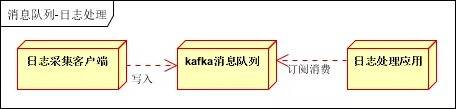

# 消息队列

## 消息队列有哪些使用场景

- 应用解耦
- 异步处理
- 流量削峰
- 消息通讯
- 日志处理

## 消息队列有几种消费语义

一共有三种，分别如下：

1. 消息至多被消费一次（At most once）: 消息可能会丢失，但绝不重传。
2. 消息至少被消费一次（At least once）：消息可以重传，但绝不丢失
3. 消息仅被消费一次（Exactly once）： 每一条消息只被传递一次。

为了支持上面3种消费语义，可以分3个阶段，考虑消息队列系统中Producer、Message Broker、Consumer需要满足的条件。

### 消息至多被消费一次

该语义是最容易满足的，特点是整个消息队列吞吐量大，实现简单。适合能容忍丢消息的场景。

- Producer 发送消息到 Message Broker 阶段
  - Producer 发消息给Message Broker 时，不要求 Message Broker 对接收到的消息响应确认，Producer 也不用关心 Message Broker 是否收到消息了。
- Message Broker 存储/转发阶段
  - 对 Message Broker 的存储不要求持久性。
  - 转发消息时，也不用关心 Consumer 是否真的收到了。
- Consumer 消费阶段
  - Consumer 从 Message Broker 中获取到消息后，可以从 Message Broker 删除消息。
  - 或 Message Broker 在消息被 Consumer 拿去消费时删除消息，不用关心 Consumer 最后对消息的消费情况如何。

### **消息至少被消费一次**

适合不能容忍丢消息，允许重复消费的任务。

- Producer 发送消息到 Message Broker 阶段
  - Producer 发消息给 Message Broker ，Message Broker 必须响应对消息的确认。
- Message Broker 存储/转发阶段
  - Message Broker 必须提供持久性保障。
  - 转发消息时，Message Broker 需要 Consumer 通知删除消息，才能将消息删除。
- Consumer消费阶段
  - Consumer 从 Message Broker 中获取到消息，必须在消费完成后，Message Broker上的消息才能被删除。

### **消息仅被消费一次**

适合对消息消费情况要求非常高的任务，实现较为复杂。

在这里需要考虑一个问题，就是这里的“仅被消费一次”指的是如下哪种场景：

- Message Broker 上存储的消息被 Consumer 仅消费一次。
- Producer 上产生的消息被 Consumer 仅消费一次。

① Message Broker 上存储的消息被 Consumer 仅消费一次

- Producer 发送消息到 Message Broker 阶段
  - Producer 发消息给 Message Broker 时，不要求 Message Broker 对接收到的消息响应确认，Producer 也不用关心Message Broker 是否收到消息了。
- Message Broker 存储/转发阶段
  - Message Broker 必须提供持久性保障
  - 并且，每条消息在其消费队列里有唯一标识（这个唯一标识可以由 Producer 产生，也可以由 Message Broker 产生）。
- Consumer 消费阶段
  - Consumer 从 Message Broker中获取到消息后，需要记录下消费的消息标识，以便在后续消费中防止对某个消息重复消费（比如 Consumer 获取到消息，消费完后，还没来得及从 Message Broker 删除消息，就挂了，这样 Message Broker 如果把消息重新加入待消费队列的话，那么这条消息就会被重复消费了）。

② Producer 上产生的消息被 Consumer 仅消费一次

- Producer 发送消息到 Message Broker 阶段
  - Producer 发消息给 Message Broker 时，Message Broker 必须响应对消息的确认，并且 Producer 负责为该消息产生唯一标识，以防止 Consumer 重复消费（因为 Producer 发消息给Message Broker 后，由于网络问题没收到 Message Broker 的响应，可能会重发消息给到 Message Broker ）。
- Message Broker 存储/转发阶段
  - Message Broker 必须提供持久性保障
  - 并且，每条消息在其消费队列里有唯一标识（这个唯一标识需要由Producer产生）。
- Consumer 消费阶段
  - 和【① Message Broker 上存储的消息被 Consumer 仅消费一次】相同。

------

虽然 3 种方式看起来比较复杂，但是我们会发现，是层层递进，越来越可靠。

实际生产场景下，我们是倾向第 3 种的 ② 的情况，每条消息从 Producer 保证被送达，并且被 Consumer 仅消费一次。当然，重心还是如何保证 **Consumer 仅消费一次**，虽然说，消息产生的唯一标志可以在框架层级去做排重，但是最稳妥的，还是业务层也保证消费的幂等性。

## 消息队列有几种投递方式

- push
  - 优点，就是及时性。
  - 缺点，就是受限于消费者的消费能力，可能造成消息的堆积，Broker 会不断给消费者发送不能处理的消息。
- pull
  - 优点，就是主动权掌握在消费方，可以根据自己的消息速度进行消息拉取。
  - 缺点，就是消费方不知道什么时候可以获取的最新的消息，会有消息延迟和忙等。

目前的消息队列，基于 push + pull 模式结合的方式，Broker 仅仅告诉 Consumer 有新的消息，具体的消息拉取，还是 Consumer 自己主动拉取。

### Kafka

请参阅 Kafka 文档，其中详细介绍了具体的设计决策：[推送与拉取](http://kafka.apache.org/documentation.html#design_pull)

支持拉动的观点主要有：

1. 在处理多样化消费者时，拉动效果更好（没有经纪人确定所有数据的传输速率）；
2. 消费者可以更有效地控制个人消费率；
3. 更轻松、更优化的批处理实现。

基于拉取的系统的缺点（消费者在没有可用数据时轮询数据）通过“长轮询”等待模式直到数据到达而得到一定程度的缓解。

>我们首先考虑的问题是，消费者应该从代理那里拉取数据，还是代理应该将数据推送给消费者。在这方面，Kafka 遵循一种更传统的设计，大多数消息系统都采用这种设计，即数据从生产者推送到代理，再由消费者从代理那里拉取。
>
>拉取模型对于 Kafka 来说是有意义的，因为它的数据结构方式。消息顺序位于一个分区中，允许用户利用消息实现更高的吞吐量和更有效的传递。

### Rqbbitmq

RabbitMQ 采用推送模型，并带有预取限制。这种模式非常适合低延迟消息传递。推送模型的主要目标是快速且逐个地分发消息，同时尽可能按消息在队列中到达的顺序处理消息。

>RabbitMQ 不使用拉取（pull）模式的主要原因与其设计理念和应用场景有关：
>
>1. **低延迟消息传递**：RabbitMQ 采用推送（push）模式，能够在消息到达队列后立即将其推送给消费者。这种模式特别适合低延迟的场景，确保消息能够尽快被处理。如果使用拉取模式，消费者需要周期性地查询队列，这会引入不必要的延迟。
>2. **简化消费者设计**：推送模式简化了消费者的设计。RabbitMQ 负责消息分发，消费者只需处理接收到的消息，而不必管理何时拉取消息、如何决定拉取频率等问题。这让消费者的逻辑更加简单，适合高吞吐量场景。
>3. **负载均衡与流控**：虽然是推送模式，RabbitMQ 通过 `basic.qos` 提供了预取（prefetch）机制，可以限制消费者一次接收的消息数量。这种机制结合推送模式实现了较为灵活的流控，既保证了高效的消息投递，又避免了消息堆积和消费者过载。
>4. **与 AMQP 协议的契合**：RabbitMQ 基于 AMQP 协议，而 AMQP 的设计理念之一就是面向实时性和高效的消息分发，推送模式更符合这一设计。Kafka 则不同，它面向的是高吞吐量、大数据量的日志收集和处理场景，因此更适合使用拉取（pull）模式。
>
>总体来说，RabbitMQ 的推送模式非常适合低延迟、及时处理的应用场景，而拉取模式虽然在某些情况下更加灵活，但会引入延迟和额外的复杂性，因此并不符合 RabbitMQ 的设计初衷。

参考：https://www.logicmonitor.com/blog/rabbitmq-vs-kafka

## 如何保证消费者的消费消息的幂等性

在 [「消息队列有几种消费语义？」](http://svip.iocoder.cn/MQ/Interview/#) 中，我们已经看了三种消费语义。如果要达到消费者的消费消息的幂等性，就需要**消息仅被消费一次**，且**每条消息从 Producer 保证被送达，并且被 Consumer 仅消费一次**。

那么，我们就基于这个场景，来思考下，为什么会出现消息重复的问题？

- 对于 Producer 来说

  - 可能因为网络问题，Producer 重试多次发送消息，实际第一次就发送成功，那么就会产生多条相同的消息。
  - ….

- 对于 Consumer 来说

  - 可能因为 Broker 的消息进度丢失，导致消息重复投递给 Consumer 。

  - Consumer 消费成功，但是因为 JVM 异常崩溃，导致消息的消费进度未及时同步给 Consumer 。

    >对于大多数消息队列，考虑到性能，消费进度是异步定时同步给 Broker 。

### **如何解决**

消费者实现幂等性，有两种方式：

1. 框架层统一封装。

2. 业务层自己实现。

   

① **框架层统一封装**

首先，需要有一个消息排重的唯一标识，该编号只能由 Producer 生成，例如说使用 uuid、或者其它唯一编号的算法 。

然后，就需要有一个排重的存储器，例如说：

- 使用关系数据库，增加一个排重表，使用消息编号作为唯一主键。
- 使用 KV 数据库，KEY 存储消息编号，VALUE 任一。*此处，暂时不考虑 KV 数据库持久化的问题*

那么，我们要什么时候插入这条排重记录呢？

- 在消息消费执行业务逻辑**之前**，插入这条排重记录。但是，此时会有可能 JVM 异常崩溃。那么 JVM 重启后，这条消息就无法被消费了。因为，已经存在这条排重记录。
- 在消息消费执行业务逻辑之后，插入这条排重记录。
  - 如果业务逻辑执行失败，显然，我们不能插入这条排重记录，因为我们后续要消费重试。
  - 如果业务逻辑执行成功，此时，我们可以插入这条排重记录。但是，万一插入这条排重记录失败呢？**那么，需要让插入记录和业务逻辑在同一个事务当中，此时，我们只能使用数据库**。

② **业务层自己实现**

方式很多，这个和 HTTP 请求实现幂等是一样的逻辑：

- 先查询数据库，判断数据是否已经被更新过。如果是，则直接返回消费完成，否则执行消费。
- 更新数据库时，带上数据的状态。如果更新失败，则直接返回消费完成，否则执行消费。
- …

如果胖友的系统的并发量非常大，可以使用 Zookeeper 或者 Redis 实现分布式锁，避免并发带来的问题。当然，引入一个组件，也会带来另外的复杂性：

1. 系统的并发能力下降。
2. Zookeeper 和 Redis 在获取分布式锁时，发现它们已经挂掉，此时到底要不要继续执行下去呢？嘿嘿。

**选择**

正常情况下，出现重复消息的概率其实很小，如果由框架层统一封装来实现的话，肯定会对消息系统的吞吐量和高可用有影响，所以最好还是由业务层自己实现处理消息重复的问题。

当然，这两种方式不是冲突的。可以提供不同类型的消息，根据配置，使用哪种方式。例如说：

- 默认情况下，开启【框架层统一封装】的功能。
- 可以通过配置，关闭【框架层统一封装】的功能。

当然，如果可能的话，尽可能业务层自己实现。/(ㄒoㄒ)/~~但是，实际上，很多时候，开发者不太会注意，哈哈哈哈。

## 生产者的发送消息的可靠性

不同的消息队列，其架构不同，所以实现发送消息的可靠性的方案不同。所以参见如下文章：

- RocketMQ [《精尽 RocketMQ 面试题》](http://svip.iocoder.cn/RocketMQ/Interview/) 的 [「RocketMQ 是否会弄丢数据？」](http://svip.iocoder.cn/MQ/Interview/#) 的面试题。
- RabbitMQ [《精尽 RabbitMQ 面试题》](http://svip.iocoder.cn/RabbitMQ/Interview/) 的 [「RabbitMQ 是否会弄丢数据？」](http://svip.iocoder.cn/MQ/Interview/#) 的面试题。
- Kafka [《精尽 Kafka 面试题》](http://svip.iocoder.cn/Kafka/Interview/) 的 [「Kafka 是否会弄丢数据？」](http://svip.iocoder.cn/MQ/Interview/#) 的面试题。

## 如何保证消息的顺序性

不同的消息队列，其架构不同，所以实现消息的顺序性的方案不同。所以参见如下文章：

- RocketMQ [《精尽 RocketMQ 面试题》](http://svip.iocoder.cn/RocketMQ/Interview/) 的 [「什么是顺序消息？如何实现？」](http://svip.iocoder.cn/MQ/Interview/#) 的面试题。
- RabbitMQ [《精尽 RabbitMQ 面试题》](http://svip.iocoder.cn/RabbitMQ/Interview/) 的 [「RabbitMQ 如何保证消息的顺序性？」](http://svip.iocoder.cn/MQ/Interview/#) 面试题。
- Kafka [《精尽 Kafka 面试题》](http://svip.iocoder.cn/Kafka/Interview/) 的 [「Kafka 如何保证消息的顺序性？」](http://svip.iocoder.cn/MQ/Interview/#) 的面试题。

## 消息队列如何实现高可用

不同的消息队列，其架构不同，所以实现高可用的方案不同。所以参见如下文章：

- RocketMQ [《精尽 RocketMQ 面试题》](http://svip.iocoder.cn/RocketMQ/Interview/) 的 [「如何实现 RocketMQ 高可用？」](http://svip.iocoder.cn/MQ/Interview/#) 的面试题。
- RabbitMQ [《精尽 RabbitMQ 面试题》](http://svip.iocoder.cn/RabbitMQ/Interview/) 的 [「RabbitMQ 如何实现高可用？」](http://svip.iocoder.cn/MQ/Interview/#) 的面试题。
- Kafka [《精尽 Kafka 面试题》](http://svip.iocoder.cn/Kafka/Interview/) 的 [「Kafka 如何实现高可用？」](http://svip.iocoder.cn/MQ/Interview/#) 的面试题。

## 消息队列的一般存储方式有哪些

当前业界几款主流的MQ消息队列采用的存储方式主要有以下三种方式。

### **分布式KV存储**

这类 MQ 一般会采用诸如 LevelDB 、RocksDB 和 Redis 来作为消息持久化的方式。由于分布式缓存的读写能力要优于 DB ，所以在对消息的读写能力要求都不是比较高的情况下，采用这种方式倒也不失为一种可以替代的设计方案。

消息存储于分布式 KV 需要解决的问题在于如何保证 MQ 整体的可靠性。

### **文件系统**

目前业界较为常用的几款产品（RocketMQ / Kafka / RabbitMQ）均采用的是消息刷盘至所部署虚拟机/物理机的文件系统来做持久化（刷盘一般可以分为异步刷盘和同步刷盘两种模式）。

> 刷盘指的是存储到硬盘。

消息刷盘为消息存储提供了一种高效率、高可靠性和高性能的数据持久化方式。除非部署 MQ 机器本身或是本地磁盘挂了，否则一般是不会出现无法持久化的故障问题。

### **关系型数据库 DB**

Apache下开源的另外一款MQ—ActiveMQ（默认采用的KahaDB做消息存储）可选用 JDBC 的方式来做消息持久化，通过简单的 XML 配置信息即可实现JDBC消息存储。

由于，普通关系型数据库（如 MySQL ）在单表数据量达到千万级别的情况下，其 IO 读写性能往往会出现瓶颈。因此，如果要选型或者自研一款性能强劲、吞吐量大、消息堆积能力突出的 MQ 消息队列，那么并不推荐采用关系型数据库作为消息持久化的方案。在可靠性方面，该种方案非常依赖 DB ，如果一旦 DB 出现故障，则 MQ 的消息就无法落盘存储会导致线上故障。

### **小结**

因此，综合上所述从存储效率来说，**文件系统 > 分布式 KV 存储 > 关系型数据库 DB** ，直接操作文件系统肯定是最快和最高效的，而关系型数据库 TPS 一般相比于分布式 KV 系统会更低一些（简略地说，关系型数据库本身也是一个需要读写文件 Server ，这时 MQ 作为 Client与其建立连接并发送待持久化的消息数据，同时又需要依赖 DB 的事务等，这一系列操作都比较消耗性能），所以如果追求高效的IO读写，那么选择操作文件系统会更加合适一些。但是如果从易于实现和快速集成来看，**文件系统 > 分布式 KV 存储 > 关系型数据库 DB**，但是性能会下降很多。

另外，从消息中间件的本身定义来考虑，应该尽量减少对于外部第三方中间件的依赖。一般来说依赖的外部系统越多，也会使得本身的设计越复杂，所以个人的理解是采用**文件系统**作为消息存储的方式，更贴近消息中间件本身的定义

## 消息队列有什么优缺点

缺点，主要是如下三点：

- 系统可用性降低。

  >系统引入的外部依赖越多，越容易挂掉。本来你就是 A 系统调用 BCD 三个系统的接口就好了，本来 ABCD 四个系统好好的，没啥问题，你偏加个 MQ 进来，万一 MQ 挂了咋整，MQ 一挂，整套系统崩溃的，你不就完了？**所以，消息队列一定要做好高可用**。

- 系统复杂度提高。

  >主要需要多考虑，1）消息怎么不重复消息。2）消息怎么保证不丢失。3）需要消息顺序的业务场景，怎么处理。

- 一致性问题

  >A 系统处理完了直接返回成功了，人都以为你这个请求就成功了。但是问题是，要是 B、C。D 三个系统那里，B、D 两个系统写库成功了，结果 C 系统写库失败了，咋整？你这数据就不一致了。
  >当然，这不仅仅是 MQ 的问题，引入 RPC 之后本身就存在这样的问题。**如果我们在使用 MQ 时，一定要达到数据的最终一致性**。即，C 系统最终执行完成。

## 如何使用消息队列进行日志处理

日志处理，是指将消息队列用在日志处理中，比如 Kafka 的应用，解决大量**日志传输**的问题。

- 日志采集客户端，负责日志数据采集，定时批量写入 Kafka 队列。
- Kafka 消息队列，负责日志数据的接收，存储和转发。
- 日志处理应用：订阅并消费 Kafka 队列中的日志数据。

大家最熟悉的就是 [ELK + Kafka 日志方案](http://www.demodashi.com/demo/10181.html)，如下：

- Kafka ：接收用户日志的消息队列。
- Logstash ：对接 Kafka 写入的日志，做日志解析，统一成 JSON 输出给 Elasticsearch 中。
- Elasticsearch ：实时日志分析服务的核心技术，一个 schemaless ，实时的数据存储服务，通过 index 组织数据，兼具强大的搜索和统计功能。
- Kibana ：基于 Elasticsearch 的数据可视化组件，超强的数据可视化能力是众多公司选择 ELK stack 的重要原因。

