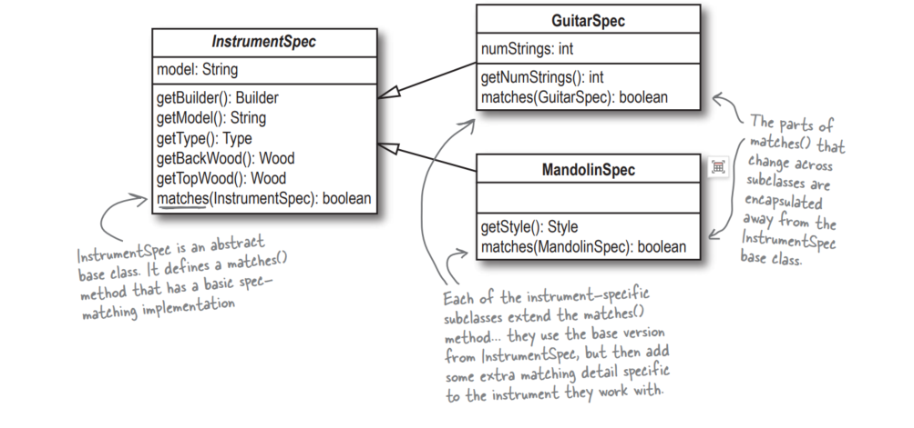
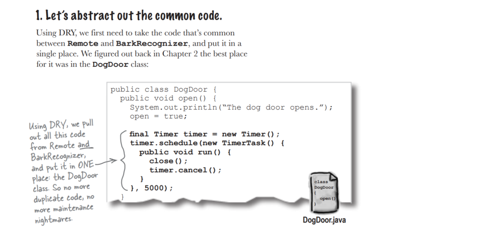

# 面向对象

## OO原则

### 封装（encapsulate）

封装让你把应用程序部件的内部工作隐藏起来，但是把部件在做什么显示的更清楚。

通过封装将程序代码中改变的部分与保持相同的部分分开。于是，改变程序代码而不会损坏其他部分就变得很容易。

### 继承（inheritance）

### 多态（polymorphism）

## 设计原则

### 开关原则（OCP）

> 类应该允许为扩展而开放，禁止为修改而关闭。

例如**InstrumentSpec**禁止为修改而关闭；其matches()方法被定义在基类中并且不会改变。

但是它允许为扩展而开放，因为所有的子类可以改变matches()的行为。

事实上它是封装（encapsulation）与抽象化（abstraction）的结合。

### 不自我重复原则（DRY）

> 通过将共同之物抽取出来并置于单一地方来避免重复的程序代码。

DRY完全关系到一个地方一个需求。抽取出重复的代码是运用DRY的好开始，但DRY的内涵可不止是如此。当你试着避免重复代码程序时，实际上也在试着确保你对应用程序中每一个功能与需求只实现一次。

DRY关系到让系统中每一个信息与行为的片段都保存在单一、合理的地方。

### 单一职责原则（SRP）

> 系统里的每一个对象应该具有单一职责，所有对象的服务都应该聚焦在实现该职责上。

事实上，SRP常常会让你的类更大。因为你不把功能分散到许多类中。许多不熟悉SRP的程序设计师会把功能分散到过多的类中。使用SRP通常导致更少的类，而这一半会让你的整个应用程序在管理与维护上简单很多。

### Liskov 替换原则（LSP）

>子类型（subtype）必须能够替换其基类型（base type）。

LSP 完全关系到设计良好的继承。当你从一个基类继承下来时，你必须能够用你的子类替换该基类且不会把事情弄糟，否则，你就错误地使用了继承。

